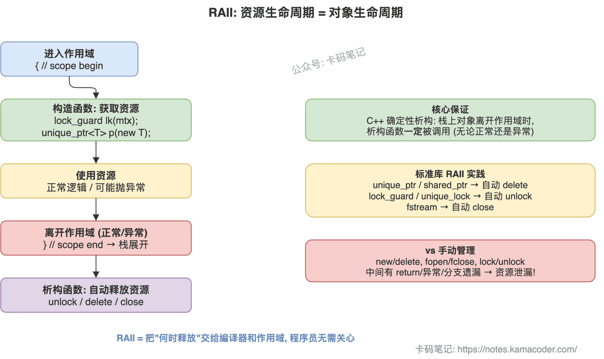

# C++ RAII机制

> 来源: https://notes.kamacoder.com/cpp/raii-mechanism.html

# `# C++ RAII机制 

面试官问"介绍一下RAII"，很多人能答出"构造获取、析构释放"，但追问"为什么析构一定会被调用""构造函数抛异常怎么办""和智能指针什么关系"，就开始含糊了。 

RAII 不是一个语法特性，而是 C++ 资源管理的核心设计哲学。把"为什么能保证释放"和"标准库怎么用它"讲清楚，这道题就稳了。 

## `# 简要回答 

RAII 的核心思想是**把资源的生命周期绑定到对象的生命周期**：构造函数获取资源，析构函数释放资源。由于 C++ 保证栈上对象离开作用域时析构函数一定被调用（即使发生异常），资源就不可能泄漏。智能指针（`unique_ptr`、`shared_ptr`）和 `lock_guard` 都是 RAII 的标准库实现。 

## `# 详细回答 

**为什么 RAII 能保证资源不泄漏** 

关键在于 C++ 的**确定性析构**：栈上对象离开作用域时，编译器保证调用析构函数，无论是正常执行完毕还是异常导致的栈展开（stack unwinding）。这和 Java/Go 的 GC 不同——GC 只管内存，不管文件句柄、锁、网络连接等非内存资源；而且 GC 的回收时机不确定，无法保证"离开作用域立即释放"。 

RAII 把"何时释放"的决策从程序员手里拿走，交给编译器和作用域规则。程序员只需要保证：构造时获取、析构时释放、禁止拷贝或正确转移所有权。 

**和手动管理的对比** 

手动管理（`new/delete`、`fopen/fclose`、`lock/unlock`）的问题是：如果获取和释放之间有任何提前 return、异常抛出、或者逻辑分支遗漏，资源就泄漏了。RAII 把释放逻辑封装在析构函数里，无论中间发生什么，只要对象在栈上，析构就一定执行。 

**标准库中的 RAII 实践** 

`unique_ptr` 管理独占所有权的堆内存，离开作用域自动 delete。`shared_ptr` 通过引用计数管理共享所有权，最后一个 shared_ptr 析构时释放资源。`lock_guard`/`unique_lock` 构造时加锁、析构时解锁，保证互斥锁不会因为异常而忘记释放。`fstream` 析构时自动关闭文件。这些都是 RAII 的典型应用。 

**RAII 类的设计要点** 

对于独占资源（文件、锁），禁止拷贝（`= delete`），允许移动（转移所有权）。对于共享资源，用引用计数。析构函数不要抛异常——如果析构中释放资源失败，只能记日志，不能抛，否则栈展开时会 `terminate`。 

 

## `# 知识拓展 

**Q：构造函数抛异常，RAII 还能工作吗？** 

如果构造函数抛异常，对象没有构造完成，析构函数不会被调用。但 C++ 保证：已经构造完成的成员变量会被正确析构。所以如果一个 RAII 类的构造函数里先获取了资源 A 再获取资源 B，获取 B 时抛异常，A 不会泄漏——前提是 A 本身也是用 RAII 管理的（比如是个 unique_ptr 成员）。这就是为什么推荐"RAII 套 RAII"的设计。 

**Q：RAII 类怎么处理拷贝？** 

看资源语义。独占资源（文件句柄、锁）→ 禁止拷贝，允许移动。共享资源 → 引用计数（shared_ptr 模式）。值语义资源（字符串、容器）→ 深拷贝。选错了会导致 double free 或者资源泄漏。 

**Q：堆上的 RAII 对象能保证释放吗？** 

不能。`new` 出来的对象如果没有 `delete`，析构函数不会被调用。所以 RAII 的正确用法是把对象放在栈上，或者用智能指针管理堆上的对象——智能指针本身在栈上，它的析构会 delete 堆上的对象。裸 `new` 是 RAII 的天敌。 

**Q：RAII 和 Go 的 defer、Python 的 with 有什么区别？** 

`defer` 和 `with` 是语法糖，需要程序员显式写释放逻辑。RAII 是隐式的——只要类设计正确，使用者完全不需要关心释放。而且 RAII 支持所有权转移（移动语义），`defer`/`with` 做不到。
