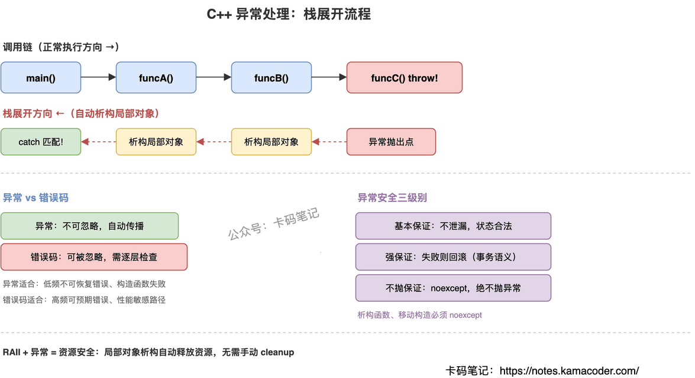

# C++ 异常处理机制

> 来源: https://notes.kamacoder.com/cpp/exception-handling.html

# `# C++ 异常处理机制 

面试官问："C++ 的异常处理机制了解吗？栈展开是怎么回事？异常和错误码怎么选？" 

异常处理是 C++ 错误处理的核心机制，很多人能说出 try-catch 的基本用法，但问到栈展开的具体过程、为什么必须按引用捕获、析构函数为什么不能抛异常，就答不清楚了。关键是理解异常的**执行流程**和它与 RAII 的配合关系。 

## `# 简要回答 

C++ 异常处理基于 `try-throw-catch` 三件套： 
  - **try 块**：定义监控范围，标记"这段代码可能出错"   - **throw**：抛出异常对象，立即终止当前函数执行   - **catch 块**：按类型匹配捕获异常，处理错误 

核心机制是**栈展开**（Stack Unwinding）：从抛出点开始，沿调用链向上逐层退出函数，途中自动调用所有局部对象的析构函数。配合 RAII，保证即使发生异常，资源也不会泄漏。 

## `# 详细回答 

**异常的执行流程** 

当 `throw` 被执行时，程序不会继续往下走，而是立即开始"栈展开"——从当前函数退出，沿着调用链一层一层往上找，直到找到一个类型匹配的 `catch` 块。这个过程中，每退出一层函数，该层所有局部对象的析构函数都会被自动调用。 

这就是异常处理的精髓：**错误处理和资源清理解耦**。你不需要在每一层手动检查错误码、手动释放资源——RAII 对象的析构函数会自动搞定。 

**异常捕获的规则** 

catch 块按顺序匹配，找到第一个类型兼容的就进入。所以派生类异常的 catch 要写在基类前面，否则永远匹配不到。`catch(...)` 能捕获所有异常，通常放在最后做兜底。 

**noexcept 的作用** 

C++11 引入 `noexcept` 说明符，告诉编译器"这个函数保证不抛异常"。编译器可以据此做优化（比如 STL 容器扩容时，如果移动构造是 noexcept 的，就用移动而不是拷贝）。如果标了 noexcept 的函数实际抛了异常，程序直接 `terminate`，不做栈展开。 

**异常安全的三个级别** 
  - **基本保证**：异常发生后，对象处于合法状态，资源不泄漏   - **强保证**：异常发生后，程序状态回滚到操作之前（要么成功，要么什么都没变）   - **不抛保证**：函数保证不抛异常（用 noexcept 标记） 

 

## `# 知识拓展 

面试官可能追问： 

**Q1: 异常和错误码怎么选？** 

错误码适合高频、可预期的错误（比如文件不存在、网络超时），开销小但容易被忽略。异常适合低频、不可恢复的错误（比如内存分配失败、违反前置条件），不会被忽略但有性能开销。实际项目中通常混用：底层库用错误码，上层业务逻辑用异常。构造函数只能用异常报告失败，这是没得选的。 

**Q2: 为什么必须按引用捕获异常？** 

按值捕获会发生对象切片——如果抛出的是派生类异常，按基类值捕获会丢失派生类信息，多态失效。按引用捕获保持多态性，而且避免了不必要的拷贝。用 `const` 引用更好，因为你通常不需要修改异常对象。 

**Q3: 析构函数为什么不能抛异常？** 

因为栈展开过程中会调用局部对象的析构函数。如果这时候析构函数又抛了异常，就出现了"异常嵌套"——C++ 标准规定这种情况直接调用 `terminate` 终止程序。所以析构函数必须标 `noexcept`，内部的异常必须自己吞掉（try-catch 包住，记录日志但不往外抛）。 

**Q4: 异常处理有什么性能开销？** 

现代编译器用"零开销异常"（zero-cost exception）实现：正常执行路径没有额外开销，只有真正抛出异常时才付出代价（栈展开、查找 catch 块）。所以异常适合处理"异常情况"——如果某个错误发生的概率很高（比如每次循环都可能触发），用错误码更合适；如果是真正的异常情况（比如内存耗尽），用异常没问题。
