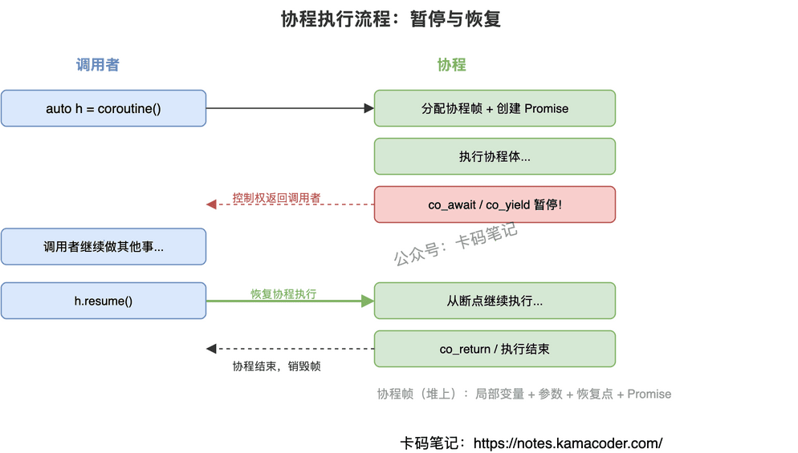

# C++20协程概念及实现

> 来源: https://notes.kamacoder.com/cpp/coroutines.html

# `# C++20协程概念及实现 

面试官问："说说 C++ 协程是什么？怎么实现的？和线程有什么区别？" 

协程是 C++20 的重头戏，但很多人只知道"可以暂停恢复的函数"就答不下去了。面试官真正想听的是：协程的执行流程是什么样的、三个核心组件各自干什么、和线程到底差在哪。 

## `# 简要回答 

协程是**能够暂停执行并在之后恢复的函数**，C++20 通过 `co_await`、`co_yield`、`co_return` 三个关键字实现。 

核心组件有三个：**Promise 对象**控制协程生命周期和返回值，**Coroutine Handle** 是恢复/销毁协程的句柄，**Awaiter** 定义 `co_await` 的等待行为。 

和线程的本质区别：线程由操作系统内核调度，切换成本高；协程由用户态程序自己调度，切换成本极低，但不能真正并行。 

## `# 详细回答 

**协程的执行流程** 

协程被调用时，不像普通函数那样一口气执行完。它的生命周期是这样的： 
  - 分配**协程帧**（堆上，存储局部变量、参数、恢复点）   - 创建 **Promise 对象**   - 调用 `promise.get_return_object()` 拿到返回给调用者的对象   - 执行协程体，遇到 `co_await` / `co_yield` 时**暂停**，控制权交还调用者   - 调用者通过 **handle.resume()** 恢复执行，或 **handle.destroy()** 销毁 

关键点在于：协程暂停时，它的整个执行状态（局部变量、执行位置）都保存在协程帧里，恢复时从断点继续，不需要重新初始化。 

**协程 vs 线程 vs 回调** 
  - **线程**：OS 内核调度，支持真正并行，但上下文切换要保存/恢复寄存器、切换栈，开销大（微秒级）   - **协程**：用户态调度，协作式多任务，切换只需要保存几个指针，开销极小（纳秒级）。但同一时刻只有一个协程在跑   - **回调**：逻辑被拆成碎片，容易回调地狱，错误处理复杂。协程用线性代码风格写异步逻辑，可读性好得多 

**适用场景** 

异步 I/O（网络请求、文件读写）、生成器（大数据集流式处理）、状态机（复杂状态转换）、游戏开发（角色行为序列）。 

 

## `# 知识拓展 

面试官可能追问： 

**Q1: 协程帧里都存了什么？** 

Promise 对象、函数参数的副本、所有局部变量、当前挂起点的位置信息。本质上就是一个堆分配的结构体，保存了协程"冻结"时的全部状态。 

**Q2: co_await 表达式的三阶段流程？** 

`await_ready()` — 检查结果是否已经就绪，就绪就不用挂起了；`await_suspend()` — 挂起协程，把 handle 交出去让别人来恢复；`await_resume()` — 恢复后拿到结果继续执行。 

**Q3: 怎么避免协程内存泄漏？** 

核心是确保 `coroutine_handle` 一定会被 destroy。实践中用 RAII 包装器（析构时自动 destroy）、在 `final_suspend` 返回 `suspend_always` 然后由持有者负责销毁、避免 handle 的循环引用。 

**Q4: 协程能替代线程吗？** 

不能。协程解决的是"异步代码写起来难看"的问题，不是并行计算的问题。CPU 密集型任务还是得用线程/线程池，协程适合 I/O 密集型场景。
