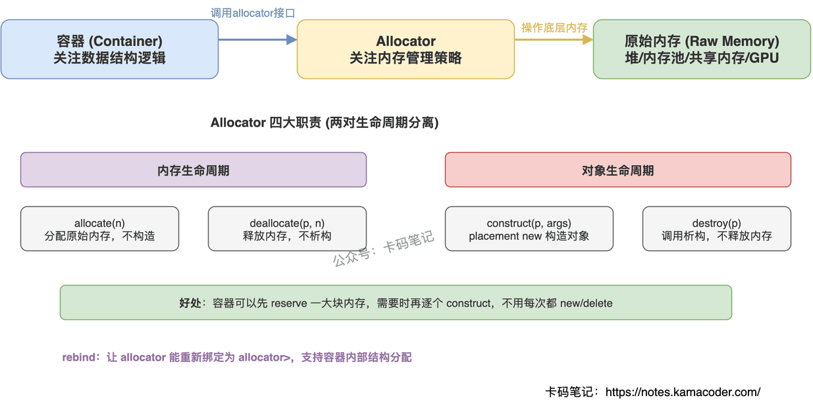

# STL 中 allocator 的作用

> 来源: https://notes.kamacoder.com/cpp/stl-allocator.html

# `# STL 中 allocator 的作用 

面试官问"allocator 是干什么的"，很多人只能说"分配内存"——这只答了四分之一。这道题的关键是把 allocator 的四个职责和"为什么要把内存管理从容器中抽出来"讲清楚。 

## `# 简要回答 

Allocator 是 STL 中负责**内存管理**的组件，核心作用是把容器的数据结构逻辑和底层内存操作**解耦**。它有四个职责：分配原始内存（allocate）、释放内存（deallocate）、在已有内存上构造对象（construct）、析构对象但不释放内存（destroy）。通过模板参数注入不同的 allocator，可以在不改容器代码的情况下切换内存策略。 

## `# 详细回答 

**四大核心职责** 
  - `allocate(n)` — 分配能容纳 n 个对象的原始内存，不调用构造函数   - `deallocate(p, n)` — 释放之前分配的内存，不调用析构函数   - `construct(p, args...)` — 在已分配的内存地址上用 placement new 构造对象   - `destroy(p)` — 调用对象的析构函数，但不释放内存 

这四步把"内存的生命周期"和"对象的生命周期"彻底分开了。容器可以先分配一大块内存（reserve），后面需要时再逐个构造对象，不用每次都 new/delete。 

**设计理念：策略模式解耦** 

容器只关心数据结构（怎么组织元素），allocator 只关心内存（从哪里拿内存、怎么还回去）。两者通过模板参数绑定，互不侵入。想换内存策略（比如从堆分配换成内存池），只需要换 allocator 类型，容器代码一行不改。 

**rebind 机制** 

容器内部不只分配用户指定类型的内存。比如 `list<int>` 内部需要分配的是节点 `_Node<int>`，不是 `int`。rebind 就是让 `allocator<int>` 能"重新绑定"为 `allocator<_Node<int>>`，这样容器内部的各种辅助结构也能用同一套内存策略。C++11 后通过 `allocator_traits` 简化了这个机制。 

 

## `# 知识拓展 

**Q：为什么不直接用 new/delete？** 

new/delete 把内存分配和对象构造绑死了，没法分开控制。容器经常需要"先占一块内存，等需要时再构造对象"（比如 vector 的 capacity > size），这就必须把两步拆开。allocator 正是干这个的。 

**Q：什么时候需要自定义 allocator？** 

四种典型场景：内存池（避免频繁 malloc/free 的开销）、共享内存（进程间通信）、GPU 内存（异构计算）、内存监控（调试内存泄漏）。日常开发中默认 allocator 够用，只有性能敏感或特殊硬件场景才需要自定义。 

**Q：自定义 allocator 有什么坑？** 

主要四个：异常安全（allocate 失败要抛 bad_alloc）、对齐要求（alignas）、容器交换/移动时的传播语义（propagate_on_container_swap 等 traits）、线程安全（多线程环境下的分配器状态）。 

**Q：C++17 对 allocator 做了什么改动？** 

C++17 废弃了 construct/destroy 成员函数，统一由 `allocator_traits` 代劳。自定义 allocator 只需要提供 allocate/deallocate，其他操作由 traits 默认实现。这大大简化了自定义 allocator 的编写。
