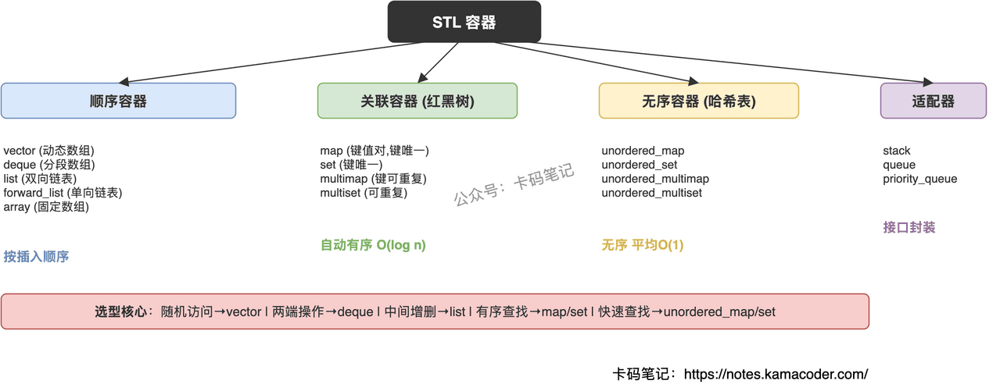

# STL 容器的分类与选型

> 来源: https://notes.kamacoder.com/cpp/stl-containers.html

# `# STL 容器的分类与选型 

面试官问"STL 容器了解哪些"，如果只是列名字，没有区分度。这道题的关键是把三大分类的**底层结构差异**和**选型依据**讲清楚——什么场景用什么容器，为什么。 

## `# 简要回答 

STL 容器分三大类加一类适配器： 

**顺序容器**：vector（动态数组）、deque（分段数组）、list（双向链表）、forward_list（单向链表）、array（固定数组）。元素按插入顺序排列。 

**关联容器**：map/multimap、set/multiset。底层红黑树，元素自动有序，操作 O(log n)。 

**无序容器**：unordered_map/unordered_multimap、unordered_set/unordered_multiset。底层哈希表，无序，平均 O(1)。 

**容器适配器**：stack、queue、priority_queue。不是独立容器，是对底层容器的接口封装。 

## `# 详细回答 

**顺序容器——按插入顺序存储** 

核心区别在于内存布局和操作效率： 
  - **vector**：连续内存，随机访问 O(1)，尾部插入均摊 O(1)，中间插入 O(n)。最常用，缓存友好。   - **deque**：分段连续，两端插入 O(1)，随机访问 O(1)，中间插入 O(n)。适合两端都要操作的场景。   - **list**：双向链表，任意位置插入/删除 O(1)（已知位置），不支持随机访问。迭代器不失效。   - **forward_list**：单向链表，比 list 省一个指针的空间，只能单向遍历。   - **array**：编译期固定大小，零开销替代 C 数组，不能扩容。 

**关联容器——自动有序** 

底层都是红黑树，键自动排序： 
  - **map**：键值对，键唯一。需要有序遍历或范围查询时用。   - **set**：只存键，自动去重排序。需要判断元素是否存在且要有序时用。   - **multimap/multiset**：允许重复键。 

**无序容器——哈希查找** 

底层哈希表，不保证顺序： 
  - **unordered_map**：键值对，平均 O(1) 查找/插入。只需要快速查找不需要有序时用。   - **unordered_set**：只存键，平均 O(1) 判断存在性。 

**容器适配器——接口封装** 
  - **stack**：后进先出，默认底层是 deque。   - **queue**：先进先出，默认底层是 deque。   - **priority_queue**：堆，默认底层是 vector。 

**快速选型决策** 

| 需求  推荐容器 
| 随机访问 + 尾部增删  vector 
| 两端频繁增删  deque 
| 中间频繁增删（已知位置）  list 
| 有序键值查找/范围查询  map 
| 快速查找（不需要有序）  unordered_map 
| 去重 + 有序  set 
| 去重 + 快速判断存在  unordered_set 

 

## `# 知识拓展 

**Q：vector 和 deque 怎么选？** 

默认用 vector。只有当需要频繁在头部插入/删除时才考虑 deque。vector 内存完全连续，缓存性能更好，且可以用 `data()` 拿裸指针传给 C API。deque 做不到这两点。 

**Q：map 和 unordered_map 怎么选？** 

需要有序（范围查询、按序遍历）用 map；只需要快速查找用 unordered_map。数据量小时 map 可能更快（红黑树常数小），数据量大时 unordered_map 优势明显。 

**Q：什么时候用 list？** 

现代 C++ 中 list 的使用场景很少。只有两种情况值得用：一是需要在中间频繁插入/删除且已持有迭代器；二是需要插入/删除后其他迭代器不失效。其他场景 vector 几乎总是更快（缓存局部性优势太大）。 

**Q：容器适配器和容器有什么区别？** 

适配器不是独立的数据结构，只是限制了底层容器的接口。stack 禁止随机访问只暴露 push/pop/top，底层默认是 deque 但可以换成 vector 或 list。适配器的意义是语义约束——告诉使用者"这里只能后进先出"。
