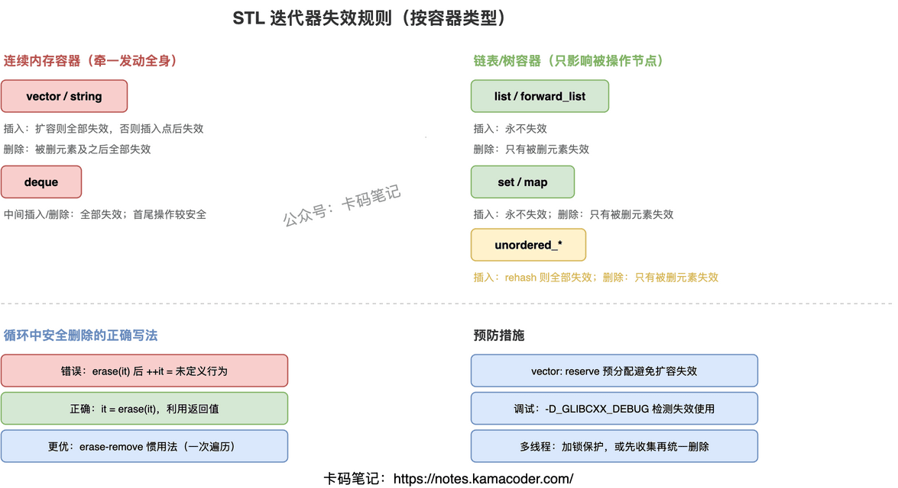

# STL 迭代器失效

> 来源: https://notes.kamacoder.com/cpp/iterator-invalidation.html

# `# STL 迭代器失效 

面试官问："什么情况下迭代器会失效？vector 和 list 的失效规则有什么区别？" 

迭代器失效是 STL 使用中最常见的 bug 来源。很多人知道"删除元素后迭代器会失效"，但问到具体哪些迭代器失效、插入时会不会失效、不同容器规则有什么区别，就说不清楚了。关键是理解**失效的根本原因**——内存地址变了。 

## `# 简要回答 

迭代器失效 = 迭代器指向的内存地址不再有效（类似悬垂指针）。失效后继续使用就是未定义行为——可能崩溃，也可能读到垃圾数据。 

失效的根本原因有三个：内存重新分配（vector 扩容）、元素位置移动（vector 中间删除导致后续元素前移）、节点被销毁（list/map 删除节点）。 

不同容器规则不同，核心区别在于底层数据结构：连续内存（vector）牵一发动全身，链表/树结构（list/map）只影响被操作的节点。 

## `# 详细回答 

**vector/string（连续内存）** 

插入：如果触发扩容（size > capacity），所有迭代器全部失效（因为整块内存被重新分配到新地址）。如果没扩容，插入点之后的迭代器失效（元素后移了）。 

删除：被删元素及其之后的所有迭代器失效（后续元素前移，地址变了）。删除点之前的迭代器不受影响。 

**deque（分段连续内存）** 

插入：在首尾插入不会使迭代器失效（但引用可能失效）；在中间插入，所有迭代器失效。 

删除：在首尾删除，只有被删元素的迭代器失效；在中间删除，所有迭代器失效。 

**list/forward_list（链表）** 

插入：永远不会使任何迭代器失效（新节点插入不影响已有节点的地址）。 

删除：只有被删除元素的迭代器失效，其他迭代器完全不受影响。 

**set/map（红黑树）** 

插入：永远不会使任何迭代器失效。 

删除：只有被删除元素的迭代器失效。 

**unordered_set/unordered_map（哈希表）** 

插入：如果触发 rehash（负载因子超过阈值），所有迭代器全部失效。不触发 rehash 则不失效。 

删除：只有被删除元素的迭代器失效。 

 

## `# 知识拓展 

面试官可能追问： 

**Q1: 循环中删除 vector 元素的正确写法？** 

错误写法：`for(auto it = v.begin(); it != v.end(); ++it) { if(条件) v.erase(it); }`——erase 后 it 已失效，再 ++it 就是未定义行为。正确写法：`it = v.erase(it)`，erase 返回下一个有效迭代器，不满足条件时才 `++it`。更优雅的写法是 erase-remove 惯用法：`v.erase(std::remove_if(v.begin(), v.end(), 条件), v.end())`，一次遍历搞定。 

**Q2: 为什么 vector 扩容会导致所有迭代器失效？** 

因为 vector 的内存是连续的。扩容时，它会 new 一块更大的内存，把所有元素拷贝/移动过去，然后 delete 旧内存。所有迭代器本质上是指向旧内存的指针，旧内存被释放后就全部变成悬垂指针了。如果提前 `reserve` 足够容量，插入时就不会扩容，也就不会因扩容导致失效。 

**Q3: 多线程环境下怎么处理迭代器失效？** 

STL 容器本身不是线程安全的。多线程同时读写同一个容器，即使不考虑迭代器失效，也是数据竞争（未定义行为）。解决方案：用互斥锁保护容器的所有读写操作；或者用读写锁（多读单写）；或者避免在遍历时修改容器——先收集要删除的元素，遍历结束后统一删除。 

**Q4: 如何调试迭代器失效问题？** 

GCC 的调试模式（`-D_GLIBCXX_DEBUG`）会在运行时检查迭代器有效性，失效后使用会直接抛异常而不是静默产生未定义行为。MSVC 的 Debug 模式默认开启迭代器调试。AddressSanitizer（`-fsanitize=address`）也能检测到部分迭代器失效导致的内存访问错误。
