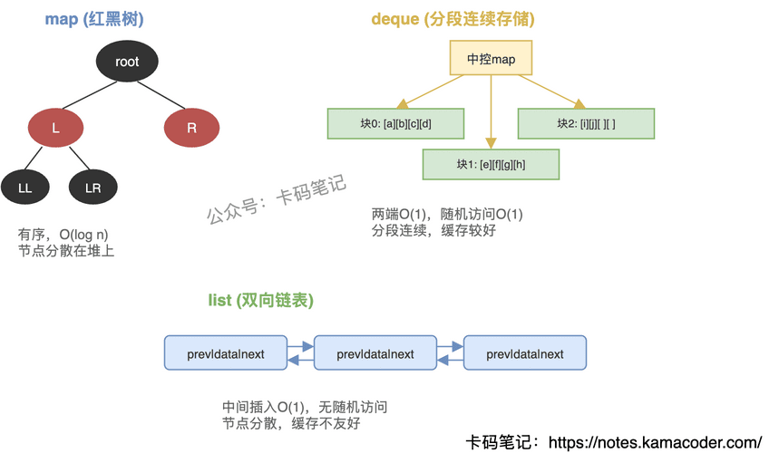

# map、deque、list 的底层实现

> 来源: https://notes.kamacoder.com/cpp/stl-container-implementation.html

# `# map、deque、list 的底层实现 

面试官问"map、deque、list 底层是怎么实现的"，很多人只能说出"红黑树、数组、链表"——这只是开头。追问"deque 的随机访问怎么做到 O(1)"或"为什么 list 的缓存性能差"就答不上来了。 

## `# 简要回答 

**map**：底层是红黑树（自平衡二叉搜索树），键有序，插入/删除/查找都是 O(log n)。unordered_map 底层是哈希表，无序，平均 O(1)。 

**deque**：底层是"分段连续存储"——一个中控数组（map）指向多个固定大小的缓冲区块。两端插入 O(1)，随机访问 O(1)（两次计算：块索引 + 块内偏移）。 

**list**：底层是双向链表，每个节点存前驱指针、后继指针和数据。任意位置插入/删除 O(1)（已知位置时），但不支持随机访问，遍历才能定位。 

## `# 详细回答 

**map（红黑树）** 

红黑树保证最长路径不超过最短路径的两倍，所有操作 O(log n)。键自动有序（按 `<` 运算符或自定义比较器）。插入/删除不会导致其他迭代器失效——这是树结构的天然优势。unordered_map 用哈希表，桶+链表（或桶+红黑树），平均 O(1) 但最坏 O(n)，rehash 时所有迭代器失效。 

**deque（分段连续存储）** 

核心结构：一个指针数组（中控 map），每个指针指向一个固定大小的连续缓冲区。push_front/push_back 只需在当前块的前/后填充，块满了就分配新块并在中控 map 中加一个指针。随机访问：先算目标在第几个块（偏移量 / 块大小），再算块内位置（偏移量 % 块大小），两次除法就定位了，所以是 O(1)。中间插入需要移动元素，O(n)。 

**list（双向链表）** 

每个节点独立分配，通过前驱/后继指针串联。已知迭代器位置时，插入/删除只需改指针，O(1)。但定位第 n 个元素必须从头遍历，O(n)。节点分散在堆上，缓存不友好（cache miss 多），这是 list 在现代硬件上性能差的主要原因。插入/删除不会导致其他迭代器失效。 

**选型对比** 

| 维度  map  deque  list 
| 底层结构  红黑树  分段连续数组  双向链表 
| 随机访问  不支持  O(1)  不支持 
| 两端插入  O(log n)  O(1)  O(1) 
| 中间插入  O(log n)  O(n)  O(1)(已知位置) 
| 迭代器失效  删除当前才失效  头尾插入不失效，中间插入全失效  删除当前才失效 
| 缓存友好  差  较好  差 

 

## `# 知识拓展 

**Q：为什么 deque 中间插入比 list 慢？** 

deque 中间插入需要移动元素来维持块内连续性，平均移动 n/2 个元素，还可能跨块移动。list 只需改两个指针，O(1) 恒定时间。但实际场景中，如果插入不频繁，deque 的缓存友好性带来的遍历优势远超 list。 

**Q：什么时候该用 list 而不是 deque？** 

两种情况：一是需要频繁在中间位置插入/删除（且已持有迭代器）；二是需要迭代器/指针/引用在插入删除后不失效。除此之外，现代 C++ 中 deque 甚至 vector 几乎总是比 list 快，因为缓存局部性的优势太大了。 

**Q：map 和 unordered_map 怎么选？** 

需要键有序（范围查询、按序遍历）用 map；只需要快速查找/插入用 unordered_map。unordered_map 平均更快但最坏情况差，且 rehash 时所有迭代器失效；map 稳定 O(log n)，迭代器几乎不失效。 

**Q：deque 能完全替代 vector 吗？** 

不能。deque 的内存不是完全连续的（分段连续），不能直接传给需要连续内存的 C API。vector 保证内存连续，可以用 `data()` 拿到裸指针。另外 vector 的缓存性能比 deque 更好（完全连续 vs 分段连续）。
