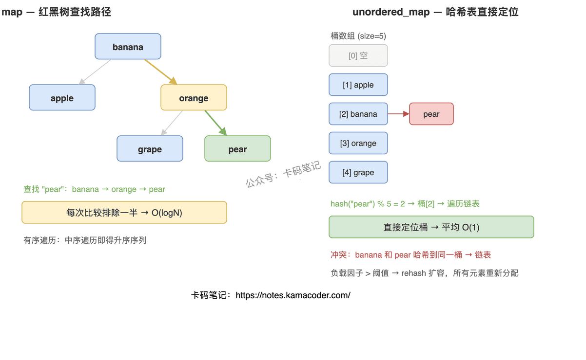

# map与unordered_map的区别和实现原理

> 来源: https://notes.kamacoder.com/cpp/map-vs-unordered-map.html

# `# map与unordered_map的区别和实现原理 

面试官问"map和unordered_map有什么区别"，大部分人能答出"一个有序一个无序"，但追问"底层结构怎么决定性能差异""什么时候该用哪个""哈希冲突怎么处理"就开始含糊了。这道题考的不是背定义，而是你对两种数据结构的理解深度。 

## `# 简要回答 

`map` 底层是红黑树，元素按 key 自动排序，增删查都是 O(logN)。`unordered_map` 底层是哈希表，元素无序，增删查平均 O(1)，最坏退化到 O(n)。需要有序遍历或范围查询用 `map`，只关心单点查找速度用 `unordered_map`。 

## `# 详细回答 

| 维度  `map`  `unordered_map` 
| 底层结构  红黑树（自平衡BST）  哈希表（桶数组 + 链表） 
| 元素顺序  按 key 升序排列  无序 
| 查找/插入/删除  O(logN) 稳定  O(1) 平均，O(n) 最坏 
| key 的要求  必须支持 `<` 比较（或自定义比较器）  必须支持 `hash` 和 `==` 
| 内存开销  每节点 3 指针 + 颜色位，结构紧凑  桶数组有空槽，预留扩容空间，整体更大 
| 迭代器失效  插入不失效，删除只失效被删元素  rehash 时所有迭代器失效 

**怎么选？** 需要按 key 排序遍历、范围查询（`lower_bound`/`upper_bound`）、或者 key 类型没有好的哈希函数时用 `map`。只做点查、插入频繁、元素量大且哈希分布均匀时用 `unordered_map`。 

 

## `# 知识拓展 

**Q：unordered_map 哈希冲突怎么处理？** 

C++ STL 用链地址法——同一个桶里的元素串成链表。插入时挂到链尾，查找时先算哈希定位桶，再遍历链表比较 key。冲突越多链越长，性能越差。 

**Q：为什么最坏是 O(n)？** 

极端情况所有 key 哈希到同一个桶，整个表退化成一条链表，查找变成线性扫描。实际工程中通过好的哈希函数和合理的负载因子来避免。 

**Q：负载因子和 rehash 是什么？** 

负载因子 = 元素数 / 桶数，衡量哈希表拥挤程度。STL 默认阈值 1.0，超过就触发 rehash：分配更大的桶数组，所有元素重新计算哈希重新分配。rehash 是 O(n) 的一次性开销，之后查找又恢复 O(1)。如果提前知道元素量，可以用 `reserve()` 预分配避免中途 rehash。 

**Q：多线程场景怎么选？** 

两者都不是线程安全的。`map` 结构稳定，适合读多写少场景配合 `shared_mutex`。`unordered_map` 并发写容易出问题（rehash 会让所有迭代器失效），要么分桶加锁，要么用 TBB 的 `concurrent_unordered_map`。
