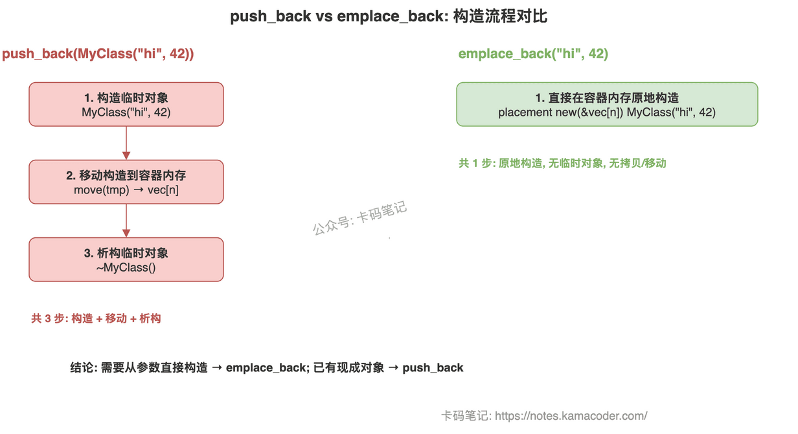

# push_back 与 emplace_back 的区别

> 来源: https://notes.kamacoder.com/cpp/pushback-vs-emplaceback.html

# `# push_back 与 emplace_back 的区别 

面试官问"push_back 和 emplace_back 有什么区别"，大多数人能答出"emplace_back 更高效"，但追问"高效在哪""什么时候 push_back 反而更好""扩容时 emplace_back 还能省拷贝吗"，就开始含糊了。 

这道题考的是你对 STL 容器内存模型和 C++11 完美转发机制的理解。把"在哪构造"和"怎么传参"讲清楚，面试官就不会继续追了。 

## `# 简要回答 

`push_back` 接受一个**已经构造好的对象**（左值或右值），通过拷贝或移动把它放进容器。`emplace_back` 接受的是**构造函数的参数**，通过完美转发直接在容器尾部的内存上原地构造对象，省掉了临时对象和一次拷贝/移动。 

一句话区分：**push_back 是"做好了搬进去"，emplace_back 是"直接在里面做"。** 

## `# 详细回答 

**底层机制的核心差异** 

`push_back(const T& val)` 和 `push_back(T&& val)` 接受的是一个完整的对象。调用时要么传一个左值（触发拷贝构造），要么传一个右值/临时对象（触发移动构造）。不管哪种，容器外面先有一个对象，然后"搬"进容器内存。 

`emplace_back(Args&&... args)` 是个变参模板，接受任意数量的参数，通过 `std::forward` 完美转发给元素类型的构造函数，直接在容器已分配的内存上 placement new 构造对象。整个过程只有一次构造，没有临时对象，没有拷贝/移动。 

**性能差异体现在哪** 

对于 `vec.push_back(MyClass("hello", 42))`，实际发生了：1）构造临时对象 2）移动构造到容器内存 3）析构临时对象。而 `vec.emplace_back("hello", 42)` 只发生一次构造。当构造函数开销大（比如涉及内存分配、IO 操作）时，省掉一次构造 + 一次析构的差距很明显。 

但如果你已经有一个现成的对象 `obj`，`push_back(obj)` 和 `emplace_back(obj)` 效果完全一样——都是拷贝构造。emplace_back 的优势只在"从参数直接构造"的场景。 

**参数转发的灵活性** 

`push_back` 只能接受一个参数（就是那个对象本身）。`emplace_back` 可以接受任意多个参数，对应元素类型的任意构造函数。比如 `map.emplace(key, value)` 可以直接传 pair 的两个构造参数，不需要先构造 `std::pair`。 

 

## `# 知识拓展 

**Q：emplace_back 是否总能避免拷贝/移动？** 

不是。如果 vector 需要扩容（capacity 不够），所有已有元素都要移动到新内存，这个开销跟用 push_back 还是 emplace_back 无关。emplace_back 省的是"新元素入容器"这一步的临时对象开销，不是扩容时的搬迁开销。 

**Q：什么时候 push_back 反而更合适？** 

当你手里已经有一个构造好的对象时，`push_back(obj)` 语义更清晰。另外，emplace_back 因为接受任意参数，可能导致隐式转换不易察觉（比如 `vec.emplace_back(0)` 可能意外调用单参数构造函数），push_back 在这种场景下类型检查更严格。 

**Q：emplace_back 的异常安全性如何？** 

如果构造函数抛异常，emplace_back 保证容器状态不变（强异常安全）。但如果构造成功后扩容时移动抛异常，行为取决于元素类型是否有 noexcept 移动构造。这一点和 push_back 一样。 

**Q：实际开发中怎么选？** 

简单原则：**需要从参数直接构造 → emplace_back；已有现成对象 → push_back**。性能关键路径上优先 emplace_back；普通代码优先可读性，两者皆可。
