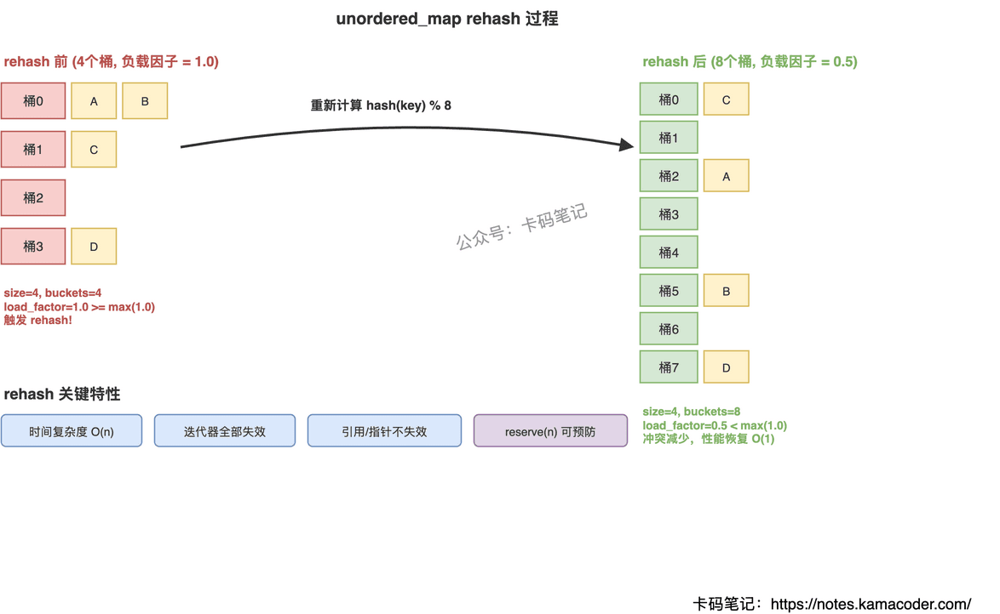

# unordered_map 的 rehash 机制

> 来源: https://notes.kamacoder.com/cpp/unordered-map-rehash.html

# `# unordered_map 的 rehash 机制 

面试官问"unordered_map 什么时候会 rehash"，很多人只答"元素多了就会扩容"。但追问"负载因子怎么算""rehash 的复杂度是多少""迭代器会不会失效""reserve 和 rehash 有什么区别"就答不上来了。 

## `# 简要回答 

unordered_map 底层是哈希表（桶数组 + 链表/红黑树）。负载因子 = `size() / bucket_count()`，衡量桶的拥挤程度。当插入元素导致负载因子超过 `max_load_factor()`（默认 1.0）时，自动触发 rehash：分配更大的桶数组，对所有元素重新计算哈希并分配到新桶，时间复杂度 O(n)。rehash 后所有迭代器失效，但元素的引用和指针不失效（节点式容器，节点本身不搬移）。可以用 `reserve(n)` 提前预分配足够的桶，避免插入过程中多次 rehash 导致性能抖动。 

## `# 详细回答 

**负载因子——rehash 的触发条件** 

负载因子 = 当前元素数 / 桶数量。负载因子越高，每个桶里的链表越长，查找从 O(1) 退化为 O(n)。所以 unordered_map 设了一个上限 `max_load_factor()`，默认 1.0。每次插入后，如果 `load_factor() > max_load_factor()`，就自动 rehash。 

**rehash 的过程** 
  - 分配一个新的、更大的桶数组（通常是原来的 2 倍左右，取下一个素数）   - 遍历旧桶数组中所有节点   - 对每个节点的 key 重新计算 `hash(key) % new_bucket_count`，挂到新桶上   - 释放旧桶数组 

整个过程是 O(n)，n 是元素数量。这就是为什么 unordered_map 的插入是"均摊 O(1)"而不是"严格 O(1)"——大部分插入是 O(1)，但偶尔一次插入会触发 O(n) 的 rehash。 

**迭代器失效规则** 

rehash 后所有迭代器失效。但元素的引用和指针不失效——因为 unordered_map 是节点式容器，rehash 只是把节点从旧桶摘下来挂到新桶，节点本身的内存地址不变。这和 vector 扩容不同（vector 扩容后引用也失效）。 

**reserve 和 rehash 的区别** 

`rehash(n)` 是直接设置桶数量至少为 n。`reserve(n)` 是从元素数量角度出发，保证插入 n 个元素之前不会触发 rehash，内部调用 `rehash(ceil(n / max_load_factor()))`。实际使用中，如果你知道要插入多少元素，用 `reserve` 更直观。 

 

## `# 知识拓展 

**Q：为什么默认 max_load_factor 是 1.0 而不是更小？** 

这是空间和时间的权衡。负载因子越小，桶越空，查找越快，但浪费内存越多。1.0 意味着平均每个桶一个元素，是一个比较平衡的选择。Java 的 HashMap 默认是 0.75，更偏向性能。 

**Q：rehash 会改变元素的相对顺序吗？** 

会。rehash 后元素在桶中的分布完全重新计算，遍历顺序会变。这也是为什么 unordered_map 叫"无序"——不保证任何遍历顺序，甚至两次遍历之间如果发生了 rehash，顺序都可能不同。 

**Q：如何避免 rehash 带来的性能抖动？** 

如果能预估元素数量，在插入前调用 `reserve(n)`。这样一次性分配足够的桶，后续插入都不会触发 rehash。对于实时系统或延迟敏感的场景，这是必须做的优化。 

**Q：unordered_map 和 map 怎么选？** 

需要有序遍历或范围查询用 map（红黑树，O(log n)）。只需要快速查找/插入用 unordered_map（哈希表，均摊 O(1)）。数据量小时 map 可能更快（红黑树常数小），数据量大时 unordered_map 优势明显。
