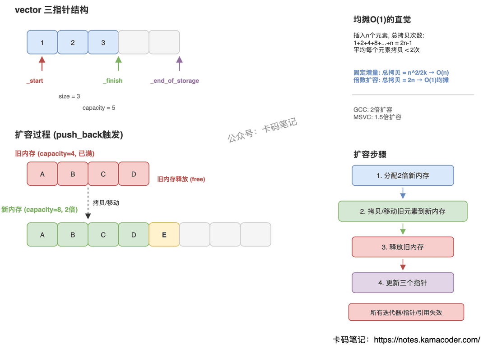

# vector底层原理和扩容过程

> 来源: https://notes.kamacoder.com/cpp/vector-internals.html

# `# vector底层原理和扩容过程 

面试官问："说一下vector的底层实现，扩容的时候发生了什么？" 

这题几乎每场C++面试都会出现。很多人能答出"动态数组、2倍扩容"，但说不清三个指针各自的含义，也讲不明白扩容时为什么所有迭代器都会失效。把底层结构和扩容流程讲清楚，这题就稳了。 

## `# 简要回答 

vector底层是一块**连续内存**，通过三个指针管理：`_start`指向首元素，`_finish`指向最后一个元素的下一位置，`_end_of_storage`指向已分配内存的末尾。当`size() == capacity()`时插入新元素触发扩容——分配一块更大的内存（通常2倍），把旧元素拷贝/移动过去，释放旧内存。 

## `# 详细回答 

**三个指针的含义** 

vector内部维护三个指针，所有操作都围绕它们展开： 
  - `_start`：指向数组首元素，`begin()`返回的就是它   - `_finish`：指向最后一个有效元素的下一个位置，`end()`返回它，`size() = _finish - _start`   - `_end_of_storage`：指向已分配内存块的末尾，`capacity() = _end_of_storage - _start` 

当`_finish == _end_of_storage`时，说明已有空间用完了，下一次`push_back`就会触发扩容。 

**扩容的完整流程** 
  - 分配一块新内存，大小通常是原来的**2倍**（GCC的libstdc++），MSVC用的是**1.5倍**   - 将旧内存中的元素**逐个拷贝或移动**到新内存（如果元素有noexcept移动构造，优先移动）   - **释放旧内存**   - 更新三个指针指向新内存 

整个过程中，旧内存地址失效，所以**所有指向旧元素的迭代器、指针、引用全部失效**。 

**时间复杂度** 
  - 随机访问：O(1)，因为连续内存可以直接算偏移   - 尾部插入：**均摊O(1)**，虽然单次扩容是O(n)，但扩容频率随容量指数增长而降低   - 中间插入/删除：O(n)，需要移动后续所有元素 

 

## `# 知识拓展 

面试官可能追问： 

**Q1: 为什么选2倍扩容而不是每次加固定大小？** 

固定增量（比如每次+100）的分摊复杂度是O(n)，因为总拷贝次数和元素数量成正比。倍数扩容的分摊复杂度是O(1)，每个元素平均只被拷贝常数次。 

**Q2: reserve和resize有什么区别？** 

`reserve(n)`只分配内存不创建元素，改变capacity不改变size；`resize(n)`会实际创建或销毁元素，size和capacity都可能变。预知元素数量时用`reserve`避免多次扩容。 

**Q3: 扩容后能不能把多余的内存还回去？** 

C++11提供了`shrink_to_fit()`，请求把capacity缩到和size一样大。注意它是非绑定请求，实现可以忽略。另一个经典做法是`vector<int>(v).swap(v)`。 

**Q4: vector和deque扩容策略有什么不同？** 

deque不做整体搬迁，它用分段连续内存（多个固定大小的buffer），扩容时只需要加一个新buffer，不用拷贝已有元素，所以deque头尾插入都不会让已有元素的引用失效。
