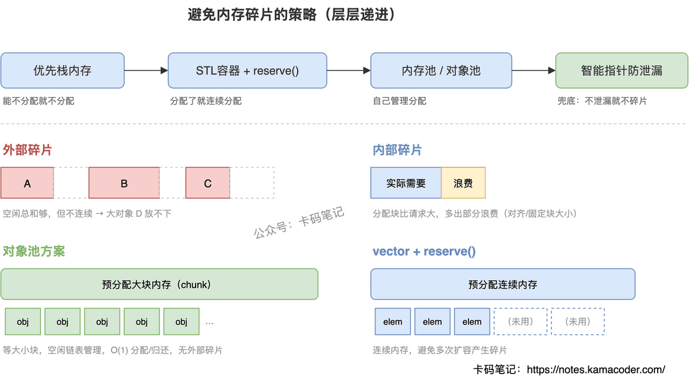

# C++如何避免内存碎片

> 来源: https://notes.kamacoder.com/cpp/avoid-memory-fragmentation.html

# `# C++如何避免内存碎片 

面试官问：”你们项目里怎么处理内存碎片问题的？有哪些手段可以避免？” 

这题考的不是背概念，而是你对内存管理有没有实战理解。很多人只能答出”用内存池”就卡住了，说不清楚从哪些层面系统性地解决碎片问题。 

## `# 简要回答 

避免内存碎片的核心策略是**减少不同生命周期、不同大小内存块的交替申请与释放**。 

主要手段包括：**内存池**处理小对象高频分配；STL容器（如 `vector`）**预分配连续内存**；**智能指针**防止泄漏导致的不可回收碎片。 

## `# 详细回答 

内存碎片分两种： 
  - **外部碎片**：空闲内存总和够用，但分散在不连续的小块中，无法满足大分配请求   - **内部碎片**：分配的内存块比实际请求大，多出来的部分浪费了 

避免策略需要从多个层面系统考虑： 

**1. 减少动态内存分配** 

最好的避免就是不做。优先用栈内存、静态存储期对象或成员变量，栈分配速度快且无碎片。 

**2. 使用STL容器管理连续内存** 

`std::vector`、`std::string`、`std::array` 在内部管理一块连续的动态增长内存，保证元素内存连续，极大减少外部碎片。如果提前知道大致大小，用 `reserve()` 预分配容量，避免多次扩容带来的碎片。 

**3. 智能指针防止泄漏** 

`std::unique_ptr`、`std::shared_ptr` 通过 RAII 自动管理生命周期，防止忘记释放导致的”永久碎片”。对碎片的作用是间接的，但很关键。 

**4. 对象池（Object Pool）** 

对于频繁申请释放的固定大小小对象（链表节点、网络数据包等），对象池是终极方案：一次性分配一大块内存，内部维护空闲链表，分配和归还都是 O(1) 操作，完全避免外部碎片。 

**5. 自定义分配器（Custom Allocator）** 

STL容器支持自定义分配器，可以实现基于内存池的分配器替换默认 `new/delete`，为特定类型对象提供无碎片的分配策略。 

总结一下：**从”能不分配就不分配”到”分配了就连续分配”再到”自己管理分配”，层层递进。** 

 

## `# 知识拓展 

面试官可能追问： 

**Q1: 外部碎片和内部碎片能举例说明吗？** 

外部碎片：堆上零散分布着 A、B、C 三个对象，中间有空隙，总空闲够分配 D，但没有一块连续空间放得下。内部碎片：malloc 为了内存对齐多给了几个字节，或者对象池块大小固定但你申请的对象比块小。 

**Q2: std::list 和 std::vector 在碎片上有什么不同？** 

vector 是单块连续内存，无外部碎片，扩容时可能产生暂时碎片。list 每个节点独立分配，频繁插入删除会产生大量外部碎片，高频场景应避免用 list。 

**Q3: 智能指针怎么帮助减少碎片？** 

主要贡献是防泄漏。泄漏的内存对系统来说就是永远无法使用的碎片，智能指针确保内存能被正确释放，间接对抗了泄漏引起的碎片。 

**Q4: 线程安全的对象池怎么设计？** 

最简单的方式是 mutex 保护 freeList。高性能场景用线程本地存储（TLS），每个线程有自己的空闲列表，避免锁竞争。本线程池耗尽时再去访问全局加锁的池子。
