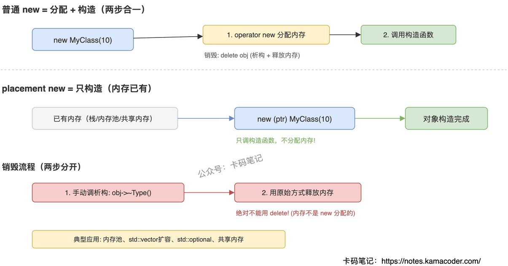

# Placement new 的作用

> 来源: https://notes.kamacoder.com/cpp/placement-new.html

# `# Placement new 的作用 

面试官问"placement new 是什么，有什么用"，很多人能说出"在指定地址上构造对象"，但追问"为什么不能用 delete 释放""内存对齐怎么保证""标准库哪些组件用了 placement new"就答不上来了。这道题的核心是理解：placement new 把"内存分配"和"对象构造"这两步拆开了，让你可以分别控制。 

## `# 简要回答 

普通 `new` 做两件事：分配内存 + 调构造函数。Placement new 只做第二件事——在你给定的内存地址上调用构造函数，不分配任何内存。语法是 `new (ptr) Type(args)`，其中 `ptr` 是一块已经分配好的内存。对应地，销毁时不能用 `delete`（它会试图释放这块内存，但这块内存不是 `new` 分配的），必须手动调析构函数 `obj->~Type()`，然后用原始方式释放内存。 

## `# 详细回答 

**和普通 new 的关系** 

普通 `new MyClass(10)` 编译器拆成两步：先调 `operator new(sizeof(MyClass))` 分配内存，再在这块内存上调构造函数。Placement new 跳过第一步，直接在你提供的地址上调构造函数。底层实现很简单——标准库有一个特殊的 `operator new` 重载：`void* operator new(size_t, void* ptr) noexcept { return ptr; }`，它什么都不做，直接返回你传入的指针。 

**为什么不能用 delete 释放** 

`delete obj` 做两件事：调析构函数 + 调 `operator delete` 释放内存。但 placement new 构造的对象，其内存可能来自栈上的 `char` 数组、内存池、共享内存段——这些都不是堆分配器管理的。如果对这种内存调 `operator delete`，行为是未定义的（通常直接崩溃）。正确做法：先手动调析构 `obj->~MyClass()`，再用原始方式释放内存（栈上的自动回收，内存池的还给池，`new char[]` 分配的用 `delete[]` 释放）。 

**内存对齐要求** 

placement new 要求你提供的内存地址满足目标类型的对齐要求（`alignof(Type)`）。如果用 `char` 数组做缓冲区，必须加 `alignas(Type)` 保证对齐，否则在某些架构上会触发硬件异常或性能严重下降。C++17 的 `std::aligned_storage` 或直接用 `alignas` 都能解决。 

**标准库哪些地方用了 placement new** 

`std::vector` 扩容时：分配新的更大内存块，然后用 placement new 在新内存上移动构造旧元素。`std::optional`：内部有一块 `aligned_storage`，有值时用 placement new 构造，无值时调析构销毁。`std::variant`：在同一块内存上构造不同类型的对象。所有内存池/对象池的实现都依赖 placement new。 

 

## `# 知识拓展 

**Q：为什么不能用 memcpy 代替 placement new？** 

`memcpy` 只是逐字节拷贝，不调用构造函数。对于有虚函数的类，虚函数表指针不会被正确设置；对于持有资源的类（`string`、`vector` 成员），内部指针会指向错误的地址。只有 POD 类型（没有构造函数、没有虚函数）才能用 memcpy，其他类型必须用 placement new。 

**Q：placement new 会失败吗？** 

不会。标准的 placement `operator new` 标记了 `noexcept`，它只是返回你传入的指针，不做任何可能失败的操作。但构造函数本身可能抛异常——如果构造函数抛了，对象没有被成功构造，你不需要调析构函数，但内存仍然需要按原始方式释放。 

**Q：能在同一块内存上反复构造不同对象吗？** 

能，这正是 placement new 的典型用法。先调析构销毁旧对象，再用 placement new 构造新对象。`std::variant` 切换类型时就是这么做的。但要注意：新对象的大小和对齐要求不能超过这块内存的容量。 

**Q：placement new 和内存池是什么关系？** 

内存池的核心思想是"预分配一大块内存，按需切割使用"。切割出来的小块内存上构造对象就靠 placement new，销毁对象就靠手动调析构。这样避免了频繁调 malloc/free 的开销和内存碎片问题。游戏引擎、数据库、高频交易系统都大量使用这种模式。
