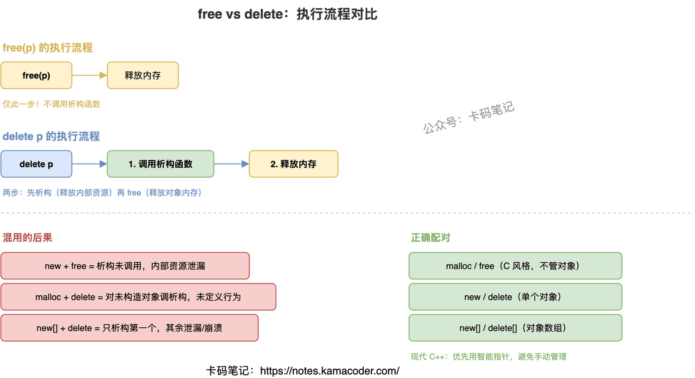

# free 与 delete 的区别

> 来源: https://notes.kamacoder.com/cpp/free-vs-delete.html

# `# free 与 delete 的区别 

面试官问："free 和 delete 有什么区别？能混着用吗？" 

这题考的是你对 C++ 对象生命周期和内存管理的理解。很多人能说出"delete 会调用析构函数"，但问到底层 delete 到底做了什么、为什么混用是未定义行为、delete[] 和 delete 为什么不能互换，就说不清楚了。 

## `# 简要回答 
  - `free`：C 语言函数，配合 `malloc` 使用。只做一件事——把内存还给系统。不关心内存里存的是什么，不调用任何析构函数。   - `delete`：C++ 运算符，配合 `new` 使用。做两件事——先调用对象的析构函数（释放对象内部管理的资源），再释放对象本身占用的内存。 

一句话总结：`free` 只管内存，`delete` 管对象（析构 + 内存）。 

## `# 详细回答 

**delete 的底层实现** 

`delete p` 本质上做了两步：第一步调用 `p->~T()`（析构函数），第二步调用 `operator delete(p)`（释放内存）。`operator delete` 的默认实现就是调用 `free`。所以 delete = 析构 + free。 

`new p` 也是两步：第一步调用 `operator new(sizeof(T))`（分配内存，默认实现就是 `malloc`），第二步在这块内存上调用构造函数。所以 new = malloc + 构造。 

**为什么不能混用** 

如果用 `new` 创建对象但用 `free` 释放，析构函数不会被调用。如果对象内部管理了资源（比如 `new` 了其他内存、打开了文件、持有锁），这些资源就泄漏了。 

反过来，用 `malloc` 分配内存但用 `delete` 释放，`delete` 会试图调用析构函数——但这块内存上根本没有正确构造的对象，调用析构函数就是未定义行为。 

**delete 和 delete[] 的区别** 

`new T[n]` 分配数组时，会在内存块前面偷偷记录元素个数。`delete[]` 读取这个数字，逐个调用每个元素的析构函数，然后释放整块内存。如果用 `delete` 释放数组，它只会析构第一个元素，剩下的全部泄漏——而且因为内存布局不匹配，可能直接崩溃。 

**free 的底层实现** 

`free(p)` 会找到 `p` 前面的 metadata（malloc 分配时偷偷加的头部，记录了这块内存的大小），标记为已释放，然后尝试和相邻空闲块合并（减少碎片）。如果这块内存很大（通常 > 128KB），直接 `munmap` 还给内核；否则放入空闲链表，等下次 `malloc` 复用。 

 

## `# 知识拓展 

面试官可能追问： 

**Q1: delete nullptr 会怎样？** 

完全安全，C++ 标准明确规定对 nullptr 调用 delete 是合法的空操作（no-op）。所以释放前不需要判空。但 `free(NULL)` 同样是安全的——C 标准也规定了这一点。 

**Q2: 为什么要区分 delete 和 delete[]？** 

因为数组和单个对象的内存布局不同。`new T[n]` 会在内存块头部额外存储元素个数（通常 4 或 8 字节），`delete[]` 需要读取这个数字来知道要析构多少个对象。如果用 `delete` 释放数组，它不知道有多少个元素，只析构第一个，而且释放的起始地址可能不对（因为头部偏移），导致堆损坏。 

**Q3: 现代 C++ 还需要手动 new/delete 吗？** 

尽量不要。现代 C++ 推荐用智能指针（`unique_ptr`、`shared_ptr`）管理堆内存，用容器（`vector`、`string`）管理动态数组。手动 new/delete 容易忘记释放（泄漏）或重复释放（崩溃），智能指针通过 RAII 自动管理生命周期，从根本上避免这些问题。 

**Q4: operator new 和 operator delete 能重载吗？** 

能。可以全局重载，也可以类内重载。常见用途：自定义内存池（减少 malloc 开销）、内存泄漏检测（记录每次分配）、对齐分配（满足 SIMD 要求）。重载 `operator new` 只负责分配内存，构造函数由编译器自动调用；重载 `operator delete` 只负责释放内存，析构函数也是编译器自动调用。
