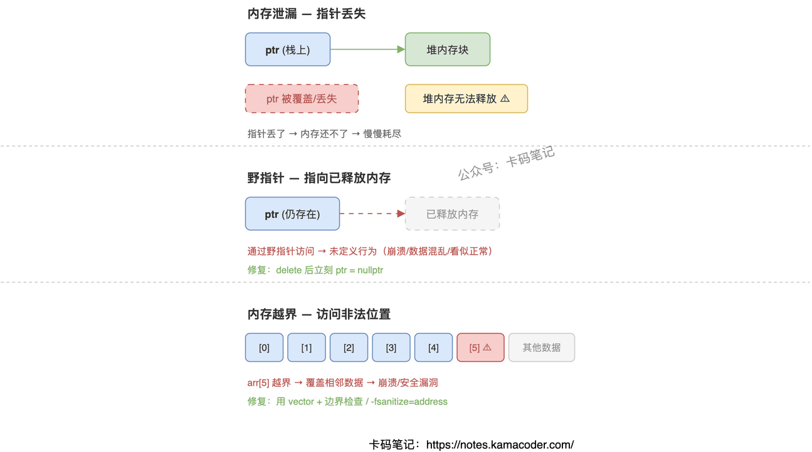

# 内存泄漏、野指针和内存越界

> 来源: https://notes.kamacoder.com/cpp/memory-issues.html

# `# 内存泄漏、野指针和内存越界 

面试官问"什么是内存泄漏、野指针、内存越界"，大部分人能说出定义，但追问"泄漏为什么不会立刻崩""野指针为什么有时候不报错""越界和堆溢出什么关系"就开始含糊了。这三个问题的核心区别在于：泄漏是"忘了还"，野指针是"用了废的"，越界是"写出界了"。 

## `# 简要回答 

**内存泄漏**是程序在堆上申请了内存，但丢失了指针地址导致无法释放，内存被白白占着。**野指针**是指针还在，但它指向的内存已经被释放或失效了，再次访问就是非法操作。**内存越界**是访问了数组或动态内存的合法范围之外的位置，可能覆盖其他数据。三者的共同点是都可能导致程序崩溃或安全漏洞，区别在于发生机制和表现形式不同。 

## `# 详细回答 

**内存泄漏** 

程序通过 `new`/`malloc` 在堆上申请了内存，但后来指针被覆盖、函数返回、或者异常跳出，导致这块内存的地址丢了，再也没法释放。短期看程序不会崩，但长期运行（服务器、嵌入式设备）内存会被慢慢吃光，最终分配失败或系统 OOM 杀进程。 

避免方法：C++ 里最有效的手段是 RAII——用智能指针（`unique_ptr`/`shared_ptr`）管理堆内存，离开作用域自动释放。手动管理时确保每条路径（包括异常路径）都有对应的 `delete`/`free`。 

**野指针** 

指针本身还存在，但它指向的内存已经被 `delete`/`free` 了。这时候通过这个指针读写，行为是未定义的——可能读到旧数据（看起来"正常"），可能读到垃圾值，也可能直接 SIGSEGV 崩溃。最危险的是"看起来正常"的情况，bug 潜伏很久才爆发。 

避免方法：`delete` 后立刻把指针置为 `nullptr`；不要返回局部变量的地址；用智能指针代替裸指针，析构后自动失效。 

**内存越界** 

访问数组时下标超出 `[0, size-1]` 的范围，或者往 `malloc(10)` 分配的 10 字节之外写数据。越界写入可能覆盖相邻变量、堆管理元数据、甚至函数返回地址，是缓冲区溢出攻击的根源。 

避免方法：用 `std::vector` 等容器代替裸数组（debug 模式下有边界检查）；编译时开 `-fsanitize=address` 检测越界；循环中严格检查下标范围。 

 

## `# 知识拓展 

**Q：智能指针能完全防止内存泄漏吗？** 

大多数情况能，但 `shared_ptr` 循环引用会导致引用计数永远不归零，内存永远不释放。解决办法是用 `weak_ptr` 打断引用环。另外智能指针管不了非内存资源（文件句柄、socket），那些需要自定义 deleter 或者用 RAII 封装类。 

**Q：free/delete 后为什么野指针有时候"能用"？** 

`free`/`delete` 只是告诉分配器这块内存可以回收，并不会立刻清零或归还操作系统。短期内数据还在原地，所以野指针读到的可能是旧值——这恰恰是最危险的，因为 bug 不会立刻暴露，等内存被重新分配给别人才会出问题。 

**Q：内存越界和堆溢出是什么关系？** 

堆溢出是内存越界的一种特殊情况——往堆上分配的缓冲区之外写数据。栈上数组越界叫栈缓冲区溢出。两者都是越界写入，但攻击面不同：栈溢出可以覆盖返回地址劫持控制流，堆溢出可以覆盖堆元数据或相邻对象的 vtable。 

**Q：泄漏为什么不会立刻崩溃？** 

因为泄漏只是内存没释放，程序本身的逻辑没有错误。操作系统的虚拟内存机制让进程可以持续申请，直到地址空间或物理内存耗尽。长期运行的服务（如 Web 服务器）对泄漏特别敏感，可能跑几天才 OOM。
