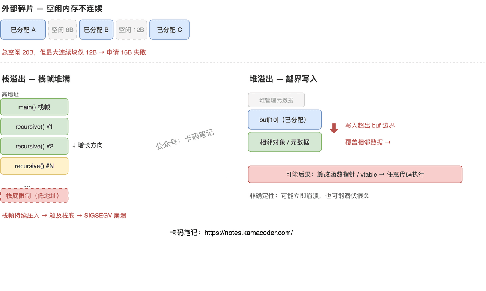

# 内存碎片的概念及栈溢出与堆溢出的区别

> 来源: https://notes.kamacoder.com/cpp/memory-fragmentation-overflow.html

# `# 内存碎片的概念及栈溢出与堆溢出的区别 

面试官问"什么是内存碎片""栈溢出和堆溢出有什么区别"，很多人能说出"碎片就是内存不连续""栈溢出是递归太深"，但追问"外部碎片为什么比内部碎片难解决""堆溢出为什么是安全问题"就答不上来了。这道题考的是你对内存布局和分配机制的理解深度。 

## `# 简要回答 

内存碎片是系统中空闲内存总量够用，但因为不连续（外部碎片）或分配粒度浪费（内部碎片）而无法满足分配请求的现象。栈溢出是栈空间被耗尽的错误，比如无限递归把栈帧堆满了；堆溢出是往动态分配的内存块之外写数据的错误，本质是越界访问，常被利用来做攻击。两者一个是"装不下了"，一个是"写出界了"。 

## `# 详细回答 

**内存碎片** 

外部碎片：频繁分配释放不同大小的内存块后，空闲内存被切成很多不连续的小块。单个小块都不够大，但加起来总量足够——这就是"有钱但花不出去"。C/C++ 中特别严重，因为指针直接指向内存地址，没法像 Java 那样做内存压缩（移动对象需要更新所有指针）。 

内部碎片：分配器按固定粒度分配（比如 8 字节对齐），你要 5 字节它给你 8 字节，多出来的 3 字节就浪费了。内存池也有这个问题——池里的块大小固定，小请求浪费空间。 

**栈溢出 vs 堆溢出** 

| 维度  栈溢出 (Stack Overflow)  堆溢出 (Heap Overflow) 
| 发生区域  栈内存（向低地址增长）  堆内存（动态分配区） 
| 根本原因  空间耗尽：递归过深或局部变量过大，超出栈容量  越界写入：往 `malloc`/`new` 分配的块之外写数据 
| 触发方式  通常是编程错误（无限递归、栈上大数组）  可以是无意错误，也常是恶意攻击手段 
| 后果  程序立即崩溃（SIGSEGV），确定性行为  可能立即崩溃，也可能潜伏——覆盖了什么决定后果 
| 安全影响  影响可用性（程序挂了）  影响安全性（可能被利用执行任意代码） 

 

## `# 知识拓展 

**Q：外部碎片为什么比内部碎片难解决？** 

内部碎片是"已知的浪费"，上限可控——选合适的分配粒度或内存池块大小就行。外部碎片是"全局的混乱"，取决于分配释放的随机序列，没法预测。解决它要做内存压缩（移动已分配块来合并空闲块），但 C/C++ 里指针是裸地址，移动了对象就得更新所有指向它的指针，几乎不可能。所以只能靠好的分配策略（best-fit、buddy system）来缓解。 

**Q：堆溢出为什么是严重的安全问题？** 

堆溢出让攻击者能覆盖堆里相邻的数据。精心构造溢出内容可以：覆盖函数指针让它指向恶意代码、覆盖对象的 vtable 控制执行流、修改相邻数据改变程序逻辑。配合 ROP 链，即使开了 DEP/NX 保护也能执行任意代码。 

**Q：如何避免栈溢出？** 

把递归改迭代；不在栈上放大数组（改用堆分配）；给递归设深度上限；编译时开 `-fstack-protector` 检测。 

**Q：所有递归都会栈溢出吗？** 

不会。只要深度在栈容量内就没事。遍历深度 1000 的二叉树没问题（栈深度≈树高），但用递归遍历百万节点链表就会溢出（栈深度≈节点数）。尾递归可以被编译器优化成循环，不增长栈空间。
