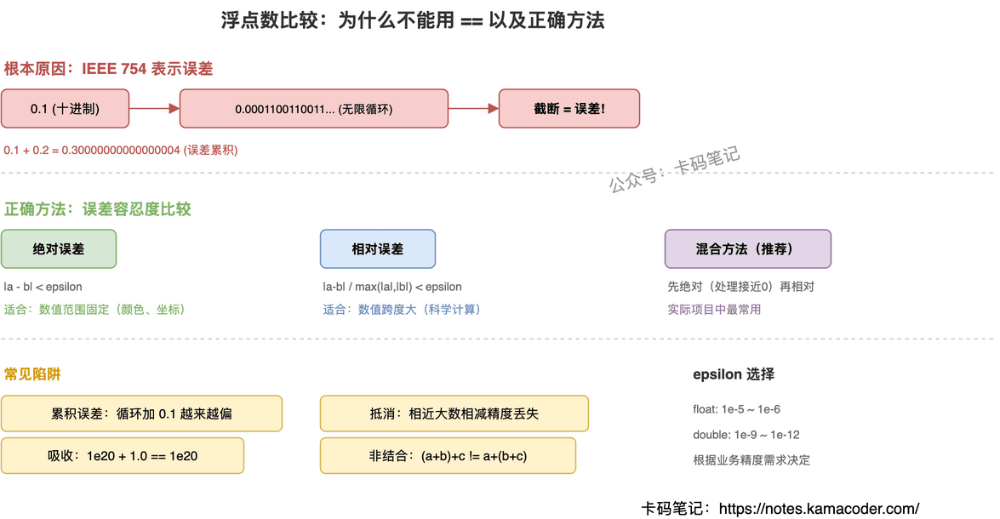

# C++ 浮点数比较

> 来源: https://notes.kamacoder.com/cpp/float-comparison.html

# `# C++ 浮点数比较 

面试官问："为什么浮点数不能直接用 == 比较？正确的比较方法是什么？" 

这题看似简单，但很多人只能说出"因为有精度问题"，问到具体原因（为什么 0.1 在二进制里是无限循环）、epsilon 该取多大、绝对误差和相对误差怎么选，就答不上来了。关键是从 IEEE 754 的**表示原理**出发理解问题的根源。 

## `# 简要回答 

浮点数不能直接用 `==` 比较，因为 IEEE 754 标准下，二进制浮点数无法精确表示所有十进制小数。比如 `0.1` 在二进制中是无限循环小数，存储时必须截断，产生表示误差。运算过程中误差会累积，导致 `0.1 + 0.2` 的结果不是精确的 `0.3`。 

正确做法是用误差容忍度（epsilon）比较：判断两个浮点数的差的绝对值是否小于某个阈值，而不是判断是否严格相等。 

## `# 详细回答 

**根本原因：二进制无法精确表示所有十进制小数** 

IEEE 754 单精度浮点数用 32 位存储：1 位符号、8 位指数、23 位尾数。尾数只有 23 位有效数字（约 7 位十进制精度），任何超出这个精度的信息都会被截断。 

`0.1` 转成二进制是 `0.0001100110011...`（0011 无限循环），存储时必须在 23 位处截断。这个截断就是误差的来源——不是运算出了错，而是数字本身就没法精确表示。 

**三种比较方法** 

绝对误差比较：`|a - b| < epsilon`。简单直接，但 epsilon 是固定值，对大数不够精确（1000000.0 和 1000000.1 的差可能超过 epsilon），对极小数又太宽松。适合数值范围已知且固定的场景（比如颜色值 0~1、像素坐标）。 

相对误差比较：`|a - b| / max(|a|, |b|) < epsilon`。按比例衡量误差，对大数和小数都公平。但当 a 和 b 接近 0 时会出问题（除以接近 0 的数导致结果爆炸）。适合数值跨度大的科学计算。 

混合方法：先用绝对误差处理接近 0 的情况，再用相对误差处理一般情况。实际项目中最常用。 

**常见浮点数陷阱** 
  - 累积误差：循环中反复加 0.1，误差会越来越大   - 吸收现象：`1e20 + 1.0 == 1e20`，小数被大数"吸收"   - 抵消现象：两个相近的大数相减，有效数字急剧减少   - 非结合性：`(a + b) + c` 不一定等于 `a + (b + c)` 

 

## `# 知识拓展 

面试官可能追问： 

**Q1: 为什么 0.1 + 0.2 不等于 0.3？** 

因为 0.1 和 0.2 在二进制中都是无限循环小数，存储时各自被截断，各自带了一点误差。两个带误差的数相加，误差累积，结果是 0.30000000000000004 而不是精确的 0.3。这不是 C++ 的 bug，任何用 IEEE 754 的语言（Java、Python、JavaScript）都有这个问题。 

**Q2: epsilon 该取多大？** 

没有万能答案，取决于场景。对于 float（约 7 位有效数字），绝对误差通常取 1e-5 到 1e-6；对于 double（约 15 位有效数字），取 1e-9 到 1e-12。如果用相对误差，通常取 `std::numeric_limits<float>::epsilon()`（约 1.19e-7）的几倍。关键是要根据业务精度需求来定，而不是随便取一个"看起来很小"的数。 

**Q3: 什么时候可以直接用 == 比较浮点数？** 

极少数情况：比较的是整数值的浮点表示（如 `3.0 == 3.0`）、检查是否为字面量赋值的特定值（如判断是否为 0.0）、或者比较的两个值来自同一个赋值而没有经过任何运算。只要经过了运算（加减乘除），就不能用 `==`。 

**Q4: NaN 有什么特殊行为？** 

NaN（Not a Number）是 IEEE 754 定义的特殊值，表示无效运算的结果（如 0.0/0.0、sqrt(-1)）。它的特殊之处在于：NaN 和任何值比较（包括自己）都返回 false。所以 `x != x` 是判断 NaN 的一种方式，但更推荐用 `std::isnan(x)`。
