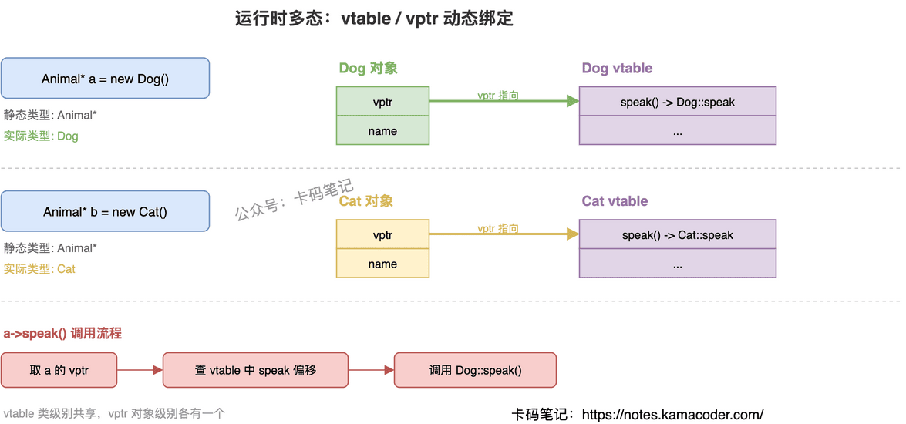

# C++三大特性：封装、继承、多态

> 来源: https://notes.kamacoder.com/cpp/cpp-three-features.html

# `# C++三大特性：封装、继承、多态 

面试官问："介绍一下 C++ 的三大特性。" 

这题几乎每场 C++ 面试都会问，但答"封装继承多态"六个字肯定不够。面试官想听的是：每个特性解决什么问题、多态的底层怎么实现的、vtable 和 vptr 怎么配合工作。 

## `# 简要回答 

**封装**：把数据和操作打包在类里，通过 `public`/`private`/`protected` 控制访问权限，外部只能通过接口操作，不能直接改内部数据。 

**继承**：子类复用父类的属性和方法，在原有功能基础上扩展，避免重复代码。 

**多态**：同一个接口，不同对象调用表现不同。分编译时多态（函数重载、模板）和运行时多态（虚函数 + 继承）。 

## `# 详细回答 

**封装** 

核心思想是"隐藏实现细节，暴露接口"。`private` 成员外部不可访问，`protected` 成员子类可访问，`public` 成员所有人可访问。好处是提高安全性，修改内部实现不影响外部调用者。 

**继承** 

子类自动拥有父类的非私有成员，可以重写（override）父类方法来改变行为。比如定义 `Animal` 基类，派生出 `Dog`、`Cat`，共享 `name` 属性但各自实现不同的 `speak()` 方法。 

继承有三种方式：`public`（最常用，保持父类接口）、`protected`、`private`，区别在于父类成员在子类中的访问级别变化。 

**多态** 

多态是三大特性中面试问得最深的。 
  - **编译时多态（静态绑定）**：函数重载、运算符重载、模板。编译阶段就确定调用哪个函数。   - **运行时多态（动态绑定）**：通过虚函数实现。基类指针/引用指向派生类对象时，调用的是派生类的重写版本，而不是基类版本。 

运行时多态的底层机制： 
  - 每个含虚函数的类，编译器生成一张 **vtable**（虚函数表），存放该类所有虚函数的地址   - 每个对象内部有一个隐藏的 **vptr**（虚指针），指向所属类的 vtable   - 通过基类指针调用虚函数时，程序顺着 vptr 找到 vtable，再从表里取出实际函数地址调用 

vtable 是类级别的（同类所有对象共享一张表），vptr 是对象级别的（每个对象各有一个）。 

 

## `# 知识拓展 

面试官可能追问： 

**Q1: 编译时多态能替代运行时多态吗？** 

不完全能。编译时多态要求类型在编译期就确定，适合"类型已知但行为不同"的场景（比如模板）。运行时多态适合"类型运行时才确定"的场景（比如工厂模式返回基类指针）。如果类型编译期能确定又想避免虚函数开销，可以用 CRTP（奇异递归模板模式）模拟。 

**Q2: vtable 和 vptr 具体怎么工作的？** 

`Animal* a = new Dog()` 时，Dog 对象的 vptr 指向 Dog 的 vtable。调用 `a->speak()` 时，编译器生成的代码是：取 a 的 vptr → 在 vtable 中找 speak 的偏移 → 调用那个地址。所以即使 a 的静态类型是 Animal*，实际调用的是 Dog::speak()。 

**Q3: 不用虚函数能实现运行时多态吗？** 

能，但比较 hack。可以用函数指针成员、`std::function` + 策略模式、或者类型擦除（type erasure）。标准库的 `std::function` 就是用类型擦除实现的"无虚函数多态"。
