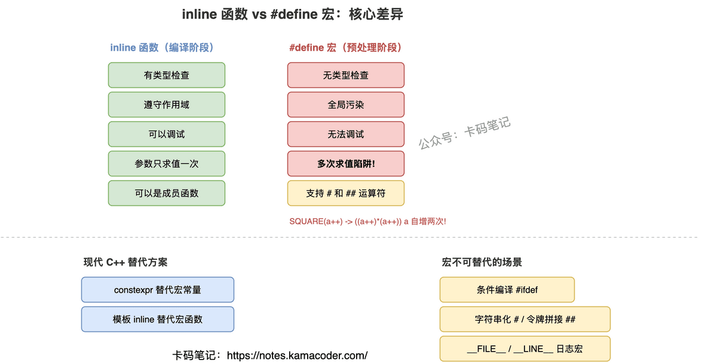

# inline 函数与 #define 宏的区别

> 来源: https://notes.kamacoder.com/cpp/inline-vs-macro.html

# `# inline 函数与 #define 宏的区别 

面试官问："inline 函数和宏有什么区别？为什么现代 C++ 推荐用 inline？" 

这题考的是你对 C++ 编译流程的理解。很多人能说出"宏是文本替换，inline 是函数"，但问到宏的多次求值问题具体怎么发生、inline 一定会内联吗、宏有什么是 inline 做不到的，就答不清楚了。 

## `# 简要回答 

两者的本质区别在于**处理阶段**不同： 
  - `#define` 宏：预处理阶段处理，纯文本替换。没有类型检查，不遵守作用域，无法调试，可能产生多次求值 bug。   - `inline` 函数：编译阶段处理，是真正的函数。有类型检查，遵守作用域，可以调试，参数只求值一次。 

一句话：宏是"傻替换"，inline 是"聪明的函数"。 

## `# 详细回答 

**宏的致命问题：多次求值** 

`#define SQUARE(x) ((x) * (x))` 看起来没问题，但如果调用 `SQUARE(a++)`，展开后变成 `((a++) * (a++))`——a 被自增了两次！这是纯文本替换的必然后果。inline 函数不会有这个问题，因为参数在传入时只求值一次。 

**处理阶段的差异** 

宏在预处理阶段展开（编译器还没介入），所以它不知道类型、不知道作用域、不知道命名空间。宏定义是全局的，一旦 `#define` 了就到处生效，容易和其他代码冲突。 

inline 函数在编译阶段处理，编译器会做类型检查、重载决议、模板实例化等所有正常的语义分析。它遵守命名空间和类的作用域，不会污染全局。 

**调试的差异** 

宏展开后，调试器看到的是替换后的代码，你无法在宏"内部"设断点。inline 函数即使被内联了，调试器通常也能正确映射到源码行（现代编译器的调试信息支持这一点）。 

**宏不可替代的场景** 

条件编译（`#ifdef`）、字符串化（运算符把参数变成字符串）、令牌拼接（`##` 运算符拼接标识符）——这三个功能是 inline 函数做不到的，只有预处理器能做。 

 

## `# 知识拓展 

面试官可能追问： 

**Q1: inline 函数一定会被内联展开吗？** 

不一定。`inline` 只是给编译器的建议，不是命令。编译器会根据函数体大小、是否有循环/递归、优化级别等因素自行决定。函数体太大的 inline 函数不会被内联（反而会增大代码体积）。反过来，没标 inline 的小函数在 `-O2` 下也可能被自动内联。现代 C++ 中 inline 的主要作用其实是允许在头文件中定义函数（避免多重定义链接错误），而不是"强制内联"。 

**Q2: 宏的 # 和 ## 运算符有什么用？** 

把宏参数转成字符串字面量：`#define STR(x) #x`，调用 `STR(hello)` 得到 `"hello"`。`##` 把两个令牌拼接成一个：`#define CONCAT(a,b) a##b`，调用 `CONCAT(var, 1)` 得到 `var1`。这两个功能在日志宏、断言宏、代码生成中很常用，是 inline 函数无法替代的。 

**Q3: 现代 C++ 用什么替代宏？** 

编译期常量用 `constexpr` 替代 `#define` 常量；类型安全的"宏函数"用 inline 函数或模板替代；泛型操作用模板替代。但条件编译（`#ifdef`）、平台适配、日志宏（需要 `__FILE__`、`__LINE__`）这些场景，宏仍然不可替代。 

**Q4: 类内定义的成员函数默认是 inline 的吗？** 

是的。在类定义体内直接写实现的成员函数，编译器默认当作 inline 处理。这是 C++ 的语言规则，不需要显式写 `inline` 关键字。但同样，是否真正内联展开还是由编译器决定。
