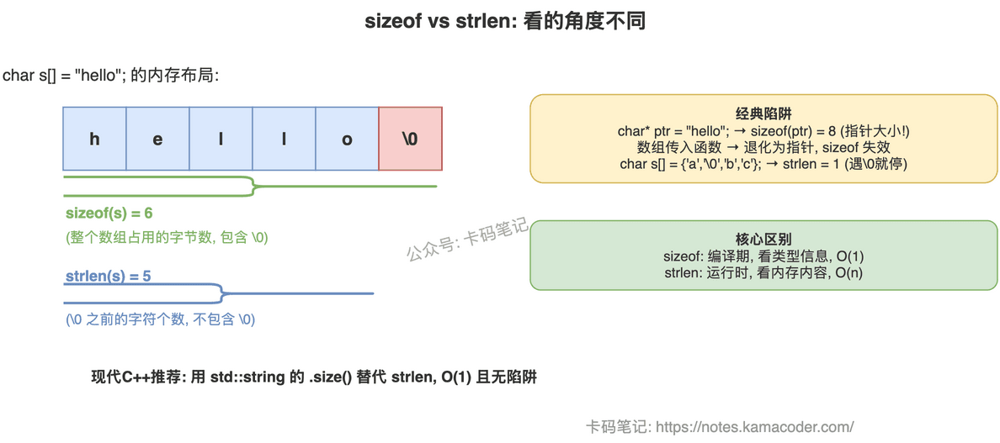

# sizeof 与 strlen 的区别

> 来源: https://notes.kamacoder.com/cpp/sizeof-vs-strlen.html

# `# sizeof 与 strlen 的区别 

面试官问"sizeof 和 strlen 有什么区别"，大多数人能答出"一个算内存大小一个算字符串长度"，但追问"对指针和数组结果一样吗""数组传进函数里 sizeof 还对吗""strlen 复杂度是多少"，就开始含糊了。 

这道题考的是你对 C/C++ 内存模型和类型系统的理解。把"编译期 vs 运行时"和"类型信息 vs 内容遍历"讲清楚，面试官就不会继续追了。 

## `# 简要回答 

`sizeof` 是**编译期运算符**，看的是类型信息，返回类型/变量占用的字节数（包含 `'\0'`）；`strlen` 是**运行时函数**，看的是内存内容，从头遍历到第一个 `'\0'` 停止，返回字符个数（不包含 `'\0'`）。两者对同一个字符数组 `char s[] = "hello"` 的结果分别是 6 和 5。 

## `# 详细回答 

| 对比维度  sizeof  strlen 
| 本质  运算符（operator）  标准库函数（`<cstring>`） 
| 执行时机  编译期  运行时 
| 计算内容  类型/变量占用的字节数  `'\0'` 前的字符个数 
| 包含 `'\0'`  包含  不包含 
| 适用类型  任意类型  仅限 `char*` / `char[]` 
| 时间复杂度  O(1)（编译期确定）  O(n)（运行时遍历） 

**经典陷阱一：指针 vs 数组** 

`char arr[] = "hello"` 的 `sizeof` 是 6（数组类型 `char[6]`），`char* ptr = "hello"` 的 `sizeof` 是 8（64位系统指针大小）。因为 `sizeof` 看的是类型——`arr` 的类型是 `char[6]`，`ptr` 的类型是 `char*`。而 `strlen` 对两者都返回 5，因为它不看类型，只看内容。 

**经典陷阱二：数组退化** 

数组作为函数参数传递时，退化为指针。函数内 `sizeof(arr)` 得到的是指针大小（8），不是数组大小。如果需要在函数内知道数组长度，必须额外传参数或用模板推导。 

**经典陷阱三：中间 `'\0'`** 

`char s[] = {'a', '\0', 'b', 'c'}` 的 `sizeof` 是 4（数组真实大小），`strlen` 是 1（碰到第一个 `'\0'` 就停了）。这说明 `strlen` 完全不关心数组有多大，只关心第一个 `'\0'` 在哪。 

 

## `# 知识拓展 

**Q：strlen 的时间复杂度是 O(n)，有什么实际影响？** 

如果在循环条件里写 `i < strlen(s)`，每次循环都会重新遍历整个字符串——O(n) 的循环变成了 O(n²)。正确做法是提前缓存：`size_t len = strlen(s); for (int i = 0; i < len; i++) { ... }`。 

**Q：sizeof 的结果一定是编译期常量吗？** 

在标准 C++ 中，是的。C99 引入了变长数组（VLA），此时 `sizeof` 会退化为运行时计算。但 C++ 标准不支持 VLA，所以 C++ 中 `sizeof` 始终是编译期常量，可以用在模板参数、数组声明等需要常量表达式的地方。 

**Q：现代 C++ 中还需要用 strlen 吗？** 

如果用 `std::string`，直接调 `.size()` 或 `.length()`，O(1) 复杂度（string 内部维护了长度）。只有处理 C 风格字符串（`char*`）时才需要 `strlen`。现代 C++ 推荐尽量用 `std::string` 避免这类问题。
