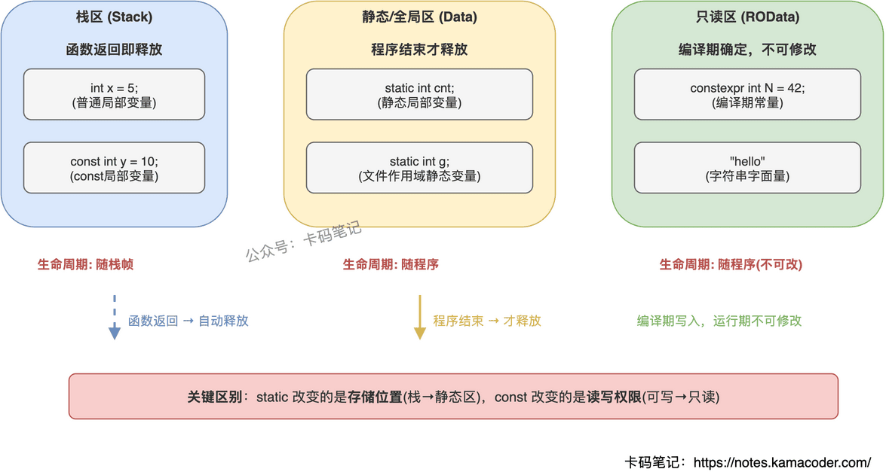

# static 与 const 关键字的区别

> 来源: https://notes.kamacoder.com/cpp/static-vs-const.html

# `# static 与 const 关键字的区别 

面试官问"static 和 const 分别有什么作用"，很多人能各列几条，但追问"它们修饰同一个东西时语义有什么不同"就答不清楚了。这道题的关键是把两者的核心语义——生命周期/可见性 vs 只读性——分层讲清楚。 

## `# 简要回答 

**static 控制的是"在哪活多久"**：让局部变量在函数调用之间持久存在，让全局符号限制在当前文件可见，让类成员被所有对象共享。 

**const 控制的是"能不能改"**：把变量标记为只读，把指针/引用标记为不可通过它修改所指对象，把成员函数标记为不会修改对象状态。 

两者完全正交，可以同时使用：`static const int X = 42;` 既是共享的、又是只读的。 

## `# 详细回答 

**static 的四种用法** 
  - 

**局部静态变量**：生命周期延长到程序结束，但作用域仍在函数内。只初始化一次，后续调用保留上次的值。   - 

**文件作用域的 static**：限制符号为内部链接，其他 `.cpp` 文件无法通过 `extern` 访问——实现"文件级私有"。   - 

**类的静态成员变量**：属于类本身而非某个对象，所有对象共享同一份，必须在类外定义（C++17 起可用 `inline static` 类内定义）。   - 

**类的静态成员函数**：没有 `this` 指针，不能访问非静态成员，可通过 `类名::函数名()` 直接调用。 

**const 的四种用法** 
  - 

**修饰普通变量**：标记为只读，赋值会编译报错。   - 

**修饰指针**：`const` 在 `*` 左边修饰值（底层 const，指向的内容不可改），在 `*` 右边修饰指针本身（顶层 const，指针不可改指向别处）。`const int* const p` 则两者都不可改。   - 

**修饰引用**：`const int& ref = x` 表示不能通过 ref 修改 x，常用于函数参数——避免拷贝又保证不修改。   - 

**修饰成员函数**：承诺不修改对象的任何非 `mutable` 成员，const 对象只能调用 const 成员函数。 

**核心差异** 

| 维度  static  const 
| 核心语义  控制生命周期和可见性  控制可修改性（只读） 
| 修饰局部变量  延长生命周期至程序结束  值不可更改 
| 修饰全局变量  限制为文件内部链接  默认内部链接 + 只读 
| 修饰类成员变量  所有对象共享一份  必须在初始化列表中初始化 
| 修饰成员函数  无 this，可用类名调用  不修改成员，const 对象可调用 

 

## `# 知识拓展 

**Q：const 和 constexpr 有什么区别？** 

const 是"运行时只读"，初始值可以运行时才确定。constexpr 更强，是"编译期常量"，值必须编译时就能算出来，可以用于数组大小、模板参数。简单说：constexpr 一定是 const，但 const 不一定是 constexpr。 

**Q：static 局部变量的初始化是线程安全的吗？** 

C++11 保证是的（magic statics），编译器底层会加锁确保只有一个线程执行初始化。但初始化之后的读写不是线程安全的，仍需加锁。这也是 Meyer's Singleton 的理论基础——用函数内 `static` 局部变量实现单例。 

**Q：mutable 是干什么的？** 

允许一个成员变量在 const 成员函数中被修改。典型场景：缓存、访问计数器、互斥锁（`mutable std::mutex mtx_`）。它不破坏逻辑上的 const 语义——对象的可观察状态没变，只是内部实现细节变了。 

**Q：const_cast 能去掉 const 吗？有什么风险？** 

能，但如果原始对象本身就是 const 的，去掉后修改是未定义行为。只有对象本身不是 const、只是通过 const 引用传进来的情况下才合法。实际开发中尽量不用。 

**Q：不同编译单元的 static 变量初始化顺序有什么坑？** 

不同 `.cpp` 文件中的全局/静态变量，初始化顺序是未定义的（Static Initialization Order Fiasco）。如果 A 文件的静态变量依赖 B 文件的静态变量，可能在 B 还没初始化时就被使用。解决办法：用函数内局部 static 变量替代（Construct On First Use），保证首次访问时才初始化。 

**Q：C 的 const 和 C++ 的 const 有什么不同？** 

C 中 const 变量默认外部链接，不能用于数组大小，本质是"只读变量"。C++ 中 const 默认内部链接，编译器会尝试当编译期常量处理，可以用于数组大小。所以 C++ 的 const 更接近真正的"常量"语义。
