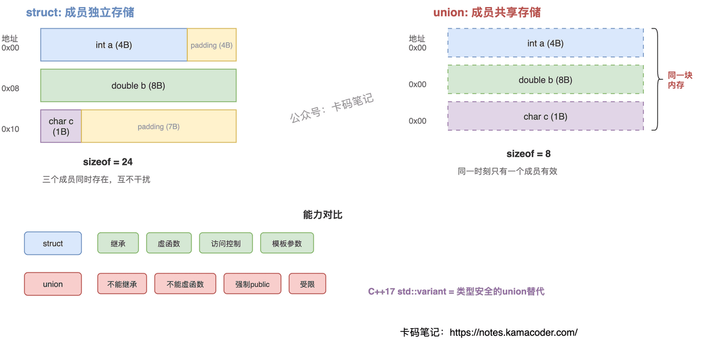

# struct 与 union 的区别

> 来源: https://notes.kamacoder.com/cpp/struct-vs-union.html

# `# struct 与 union 的区别 

面试官问"struct 和 union 有什么区别"，很多人只答"struct 成员各占各的内存，union 共享内存"就停了。但追问"union 的 sizeof 怎么算""union 里能放 string 吗""现代 C++ 还需要 union 吗"就答不上来了。 

## `# 简要回答 

struct 的所有成员各自占用独立内存，sizeof 是所有成员大小之和（加对齐填充）。union 的所有成员共享同一块内存，sizeof 等于最大成员的大小，同一时刻只有一个成员有效。 

struct 支持继承、虚函数、完整的面向对象能力。union 不能继承、不能有虚函数、不能有引用成员，成员永远是 public。C++11 后 union 可以放非 POD 类型（如 `std::string`），但必须手动用 placement new 构造、手动调析构。C++17 的 `std::variant` 是 union 的类型安全替代。 

## `# 详细回答 

**内存布局——核心差异** 

struct 的成员按声明顺序依次排列在内存中，每个成员有自己的地址。一个 `struct { int a; double b; char c; }` 占 24 字节（含对齐填充），三个成员同时存在、互不干扰。 

union 的所有成员从同一个起始地址开始，共享同一块内存。一个 `union { int a; double b; char c; }` 只占 8 字节（最大成员 double 的大小）。写入一个成员会覆盖其他成员的值，同一时刻只有一个成员"活跃"。 

**能力差异** 

struct 本质上就是 class（只是默认 public），拥有完整的面向对象能力：继承、虚函数、模板参数、访问控制。 

union 受限很多：不能继承也不能被继承，不能有虚函数，不能有引用成员，所有成员强制 public。但 union 可以有构造函数、析构函数和普通成员函数。 

**C++11 后的 union** 

C++11 之前 union 只能放 POD 类型。C++11 放开了这个限制，允许放 `std::string` 这样的非 POD 类型，但编译器不会自动调用构造/析构——因为 union 不知道当前哪个成员活跃。开发者必须自己用 placement new 构造、手动调析构函数，否则就是未定义行为。 

**现代替代：`std::variant`（C++17）** 

`std::variant` 是类型安全的 union 替代品。它内部跟踪当前活跃类型，自动管理构造/析构，访问错误类型时抛异常而不是未定义行为。除非有极致的内存/性能需求，现代 C++ 应该优先用 `std::variant`。 

 

## `# 知识拓展 

**Q：union 的 sizeof 怎么算？** 

等于最大成员的大小，再按最大对齐要求向上取整。比如 `union { char c; double d; }` 是 8 字节，不是 1+8。 

**Q：union 有什么实际用途？** 

两个经典场景：一是二进制协议解析，把一块 buffer 按不同字段解释（网络包头、硬件寄存器）；二是节省内存，当多个字段不会同时使用时共享空间（嵌入式、高性能场景）。但现代 C++ 中这两个场景都有更安全的替代（`std::bit_cast`、`std::variant`）。 

**Q：为什么 union 里放 string 需要手动管理？** 

因为 union 不知道当前哪个成员活跃，无法在析构时决定调谁的析构函数。如果你写入了 string 但没手动调 `s.~string()`，就会内存泄漏；如果当前活跃的不是 string 却去调它的析构，就是未定义行为。这就是为什么 `std::variant` 更好——它用内部 tag 跟踪活跃类型，自动处理生命周期。 

**Q：union 和 struct 的默认访问权限有什么不同？** 

struct 默认 public 但可以改成 private/protected。union 的成员永远是 public，不能加访问控制修饰符。这是语法强制的，不是惯例。
