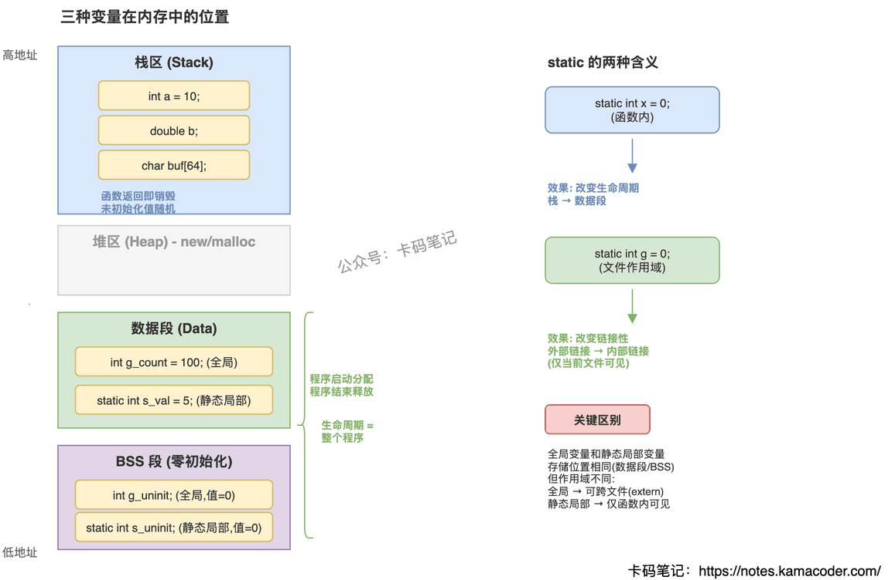

# 局部变量、全局变量、静态局部变量的区别

> 来源: https://notes.kamacoder.com/cpp/variable-scopes.html

# `# 局部变量、全局变量、静态局部变量的区别 

面试官问"局部变量、全局变量、静态局部变量有什么区别"，大多数人能答出"作用域不同"。但追问"它们分别存在内存的哪里""未初始化时值是什么""static 修饰全局变量有什么效果""静态局部变量什么时候初始化"就容易卡住了。关键是从三个维度理解：作用域、生命周期、存储位置。 

## `# 简要回答 

**局部变量**：定义在函数/代码块内，作用域限于该块，生命周期随栈帧创建和销毁，存储在栈区，未初始化时值不确定（随机值）。 

**全局变量**：定义在所有函数外，作用域为整个翻译单元（加 extern 可跨文件），生命周期贯穿整个程序，存储在数据段（已初始化）或 BSS 段（未初始化/零初始化），默认零初始化。 

**静态局部变量**：定义在函数内用 `static` 修饰，作用域限于该函数（外部不可访问），但生命周期贯穿整个程序，存储在数据段/BSS 段，只在第一次执行到定义语句时初始化一次，之后保持上次的值。 

## `# 详细回答 

**存储位置——最本质的区别** 

局部变量在栈上分配，函数调用时压栈、返回时弹栈，速度快但生命周期短。全局变量和静态局部变量都在静态存储区（数据段或 BSS 段），程序启动时分配、结束时释放，生命周期贯穿整个程序。 

**初始化规则** 

局部变量如果不显式初始化，值是不确定的（栈上的残留数据），这是常见 bug 来源。全局变量和静态局部变量如果不显式初始化，编译器保证零初始化（整型为 0，指针为 nullptr，浮点为 0.0）。静态局部变量的初始化只在第一次执行到该语句时发生，之后跳过——这是实现单例模式的经典手法（C++11 保证线程安全）。 

**static 修饰全局变量的效果** 

不加 static 的全局变量具有外部链接性，其他翻译单元可以用 `extern` 声明后访问。加了 static 的全局变量变成内部链接，只在当前文件可见，避免跨文件命名冲突。这和 static 修饰局部变量的效果完全不同——前者改变链接性，后者改变生命周期。 

**同名遮蔽** 

如果局部变量和全局变量同名，在函数内部局部变量会遮蔽全局变量。C++ 中可以用 `::globalVar` 显式访问被遮蔽的全局变量，但最好的做法是避免同名。 

 

## `# 知识拓展 

**Q：静态局部变量的初始化是线程安全的吗？** 

C++11 标准保证静态局部变量的初始化是线程安全的。如果多个线程同时第一次进入函数，只有一个线程会执行初始化，其他线程会等待。这就是为什么 Meyers 单例（函数内 `static Singleton& instance`）在 C++11 后是线程安全的。 

**Q：全局变量的初始化顺序有什么问题？** 

同一个翻译单元内，全局变量按定义顺序初始化。但不同翻译单元之间的全局变量初始化顺序是未定义的（Static Initialization Order Fiasco）。如果全局变量 A 的初始化依赖全局变量 B，而 B 在另一个文件中，可能 A 初始化时 B 还没初始化。解决方案是用函数内静态局部变量替代全局变量（Construct On First Use 惯用法）。 

**Q：为什么说"能用局部变量就不要用全局变量"？** 

全局变量的问题：1）任何地方都能修改，难以追踪状态变化；2）跨文件依赖导致耦合；3）多线程下需要额外同步；4）初始化顺序不确定。局部变量作用域最小、生命周期最短，最容易推理和维护。 

**Q：静态局部变量和全局变量都在数据段，有什么区别？** 

存储位置相同，但作用域不同。静态局部变量只能在定义它的函数内访问，编译器会阻止外部访问。全局变量（不加 static）可以被其他文件通过 extern 访问。从封装角度看，静态局部变量更安全——它把"持久状态"限制在了函数内部。
