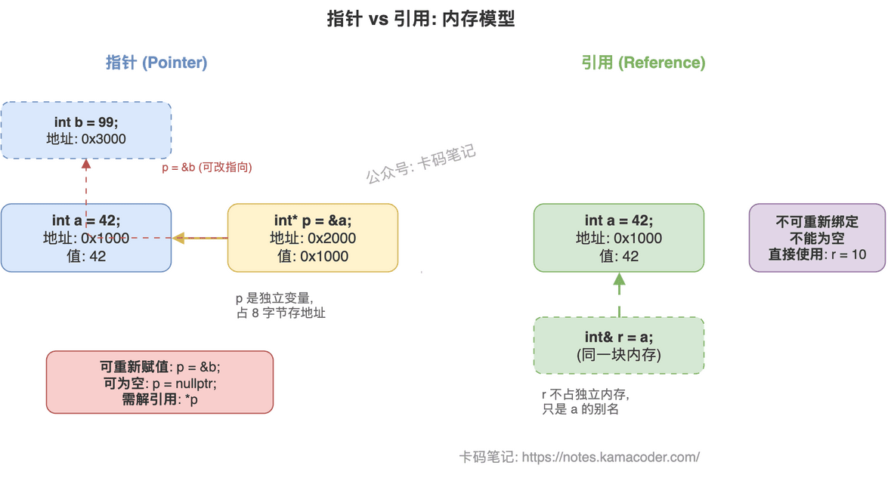

# 指针与引用的区别

> 来源: https://notes.kamacoder.com/cpp/pointer-vs-reference.html

# `# 指针与引用的区别 

面试官问"指针和引用有什么区别"，大多数人能答出"指针可以为空，引用不行"，但接着追问"底层实现有什么不同""const 怎么修饰""什么场景该用哪个"，就开始含糊了。 

这道题考的不是背定义，而是你对 C++ 内存模型的理解深度。把几个核心维度讲清楚，面试官就不会继续追了。 

## `# 简要回答 

指针是**存储地址的独立变量**，可重新赋值、可为空、支持算术运算，但需要手动管理内存。引用是**变量的别名**，必须初始化、不能为空、绑定后不可更改，编译器不为其分配独立存储空间。 

一句话区分：**指针是"我知道他住哪"，引用是"我就是他的另一个名字"。** 

## `# 详细回答 

| 维度  指针  引用 
| 本质  存储地址的变量  变量的别名 
| 内存占用  独立占 4/8 字节  无独立存储（编译器内部可能用指针实现，但语义上不占空间） 
| 初始化  可延迟初始化  **必须在声明时初始化** 
| 空值  可为 `nullptr`  **不能为空** 
| 重新绑定  `p = &b` 随时改指向  绑定后终身不变 
| 多级间接  支持 `int**` 指针的指针  不存在"引用的引用" 
| 算术运算  支持 `p++`、`p+n`  不支持 
| 访问目标  需解引用 `*p`  直接使用，语法透明 
| sizeof  返回指针本身大小（4/8）  返回绑定对象的大小 
| const 修饰  `const int*`（指向const）、`int* const`（指针本身const）、`const int* const`（双const）  没有"const引用"的说法，`const int&` 是"绑定到const对象的引用" 

**关于 const 修饰指针**，记住一个口诀：**const 在 `*` 左边修饰指向的值，在 `*` 右边修饰指针本身**。`const int* p` 不能改值但能改指向，`int* const p` 能改值但不能改指向。 

引用本身没有 const 的概念——因为引用绑定后本来就不能改，天然就是"const"的。`const int& r` 的 const 修饰的是被引用的对象，不是引用本身。 

 

## `# 知识拓展 

**Q：底层实现上，引用真的不占内存吗？** 

语义上不占，但编译器实现时通常用指针来存引用的地址。区别在于编译器保证引用不会为空、不会重新绑定，这些约束在编译期就检查了，运行时引用和指针的机器码可能一样。 

**Q：什么时候用指针，什么时候用引用？** 

需要表达"可能没有"（可选参数、可能为空）→ 用指针。需要改变指向（遍历链表、动态分配）→ 用指针。其他情况一律优先用引用，语法干净、不用判空、不会野指针。现代 C++ 里，裸指针越来越少，能用引用就用引用，需要所有权语义就用智能指针。 

**Q：函数参数传递时，指针和引用有性能差异吗？** 

没有。编译器生成的代码几乎一样，都是传地址。选择依据是语义而非性能：参数一定存在用引用，参数可能为空用指针。 

**Q：引用能绑定到临时对象吗？** 

普通左值引用不行，但 `const int&` 可以绑定临时对象并延长其生命周期。C++11 的右值引用 `int&&` 专门用来绑定临时对象，这是移动语义的基础。
