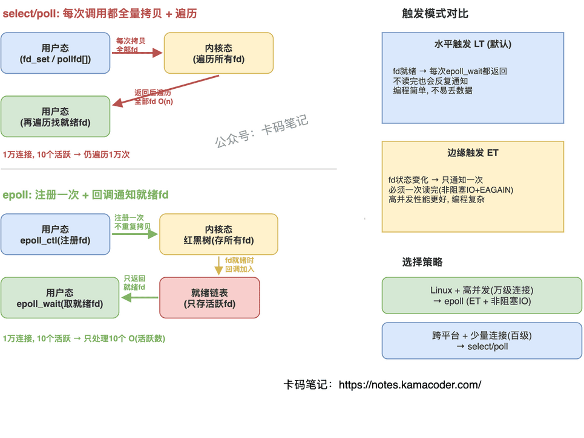

# select、poll、epoll 的区别

> 来源: https://notes.kamacoder.com/cpp/select-poll-epoll.html

# `# select、poll、epoll 的区别 

面试官问"说一下 select、poll、epoll 的区别"，大多数人能答出"epoll 性能最好"，但追问"为什么好""好在哪""什么场景下 select 反而更合适"，就开始含糊了。 

这道题考的是你对内核 IO 多路复用实现机制的理解深度。把"数据结构""通知方式""内核态到用户态的数据拷贝"三个维度讲清楚，面试官就不会继续追了。 

## `# 简要回答 

三者都是让**单线程同时监视多个 fd 就绪状态**的机制。核心区别在于：select 用位图、有 1024 限制、每次轮询 O(n)；poll 用数组、去掉数量限制、但仍 O(n) 遍历；epoll 用红黑树 + 就绪链表 + 事件回调，只返回活跃 fd，大量连接时性能碾压前两者。 

## `# 详细回答 

| 维度  select  poll  epoll 
| 数据结构  位图 `fd_set`  `pollfd` 结构体数组  红黑树 + 就绪链表 
| fd 数量限制  默认 1024（`FD_SETSIZE`）  无硬性限制（受系统 `ulimit` 约束）  无硬性限制 
| 每次调用开销  重设 fd_set + 拷贝到内核 + 遍历所有 fd  拷贝整个数组到内核 + 遍历所有 fd  只取就绪链表，无需遍历 
| 就绪通知方式  返回后需遍历所有 fd 找就绪的  返回后需遍历所有 fd 找就绪的  `epoll_wait` 直接返回就绪 fd 列表 
| 时间复杂度  O(n)  O(n)  O(活跃连接数) 
| 触发模式  仅水平触发（LT）  仅水平触发（LT）  支持 LT 和边缘触发（ET） 
| 跨平台  是（POSIX）  是（POSIX）  否（Linux 特有） 

**为什么 epoll 在大量连接时碾压 select/poll** 

select/poll 每次调用都要把所有监控的 fd 从用户态拷贝到内核态，内核遍历所有 fd 检查就绪状态，返回后用户态再遍历一遍找到就绪的。连接数 1 万时，即使只有 10 个活跃，也要遍历 1 万次——这就是 O(n) 的代价。 

epoll 的设计完全不同：`epoll_ctl` 注册 fd 时就把它挂到内核的红黑树上，之后不需要重复拷贝。当 fd 就绪时，内核通过回调把它加入就绪链表。`epoll_wait` 只需要检查就绪链表是否为空，非空就直接返回里面的 fd——不管总共监控了多少连接，开销只和活跃连接数成正比。 

**LT 和 ET 的区别** 

水平触发（LT，默认）：只要 fd 处于就绪状态，`epoll_wait` 每次都会返回它。编程简单，但如果不及时处理会反复通知。边缘触发（ET）：只在 fd 状态变化时通知一次，之后不再通知。必须一次性读完所有数据（用非阻塞 IO + 循环读到 `EAGAIN`），否则数据会丢。ET 减少了 `epoll_wait` 的返回次数，高并发场景性能更好，但编程复杂度更高。 

 

## `# 知识拓展 

**Q：连接数少的时候用哪个？** 

连接数在几十到几百时，三者性能差异不大。如果需要跨平台（macOS/Windows），只能用 select/poll（epoll 是 Linux 特有的，macOS 用 kqueue，Windows 用 IOCP）。连接数少 + 跨平台需求 → select/poll；Linux + 高并发 → epoll。 

**Q：epoll 的 mmap 是怎么回事？** 

早期说法是 epoll 用 mmap 让内核和用户态共享内存来避免拷贝。实际上现代 Linux 内核实现中，`epoll_wait` 返回就绪事件时仍然有一次从内核到用户态的拷贝（`copy_to_user`），但因为只拷贝就绪的 fd（而非全部），数据量很小，开销可以忽略。真正省的是"注册时一次性拷贝 vs 每次调用都拷贝"。 

**Q：select 的 1024 限制能改吗？** 

可以修改 `FD_SETSIZE` 宏重新编译，但不推荐。因为 `fd_set` 是固定大小的位图，改大了栈空间开销也大。需要大量 fd 时直接用 poll 或 epoll。 

**Q：ET 模式下为什么必须用非阻塞 IO？** 

因为 ET 只通知一次，你必须循环读到 `EAGAIN` 才能确保数据读完。如果 fd 是阻塞的，最后一次 `read` 会卡住（没数据了但还在等），整个事件循环就死了。所以 ET + 非阻塞 IO 是固定搭配。
