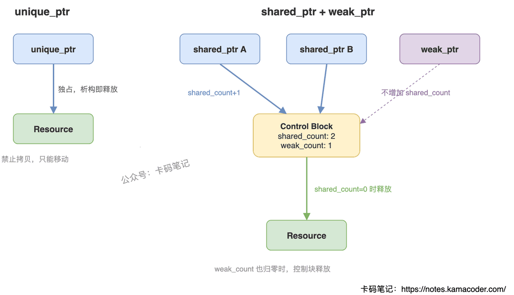

# 智能指针的实现原理

> 来源: https://notes.kamacoder.com/cpp/smart-pointer-implementation.html

# `# 智能指针的实现原理 

面试官问"智能指针的实现原理"，很多人能说出 RAII 和引用计数，但再往下追问——控制块里存了什么？weak_ptr 怎么知道对象已经死了？make_shared 为什么比 new 快？——就答不上来了。 

这道题考的不是"会不会用"，而是你对底层机制理解到什么程度。 

## `# 简要回答 

智能指针本质是一个**类模板**，封装原始指针并重载 `*` 和 `->` 操作符，利用 **RAII 机制**在对象析构时自动释放资源。三种智能指针分别通过独占所有权、引用计数、弱引用来管理不同的生命周期场景。 

## `# 详细回答 

智能指针的核心思路：把裸指针包进一个栈上对象里，利用析构函数自动释放堆内存，彻底避免手动 delete 遗漏的问题。 

**unique_ptr — 独占所有权** 

实现上很简单：删除拷贝构造和拷贝赋值，只保留移动语义。同一时刻只有一个 unique_ptr 拥有资源，析构时直接 delete。零开销，性能和裸指针一样。 

**shared_ptr — 共享所有权** 

核心是一个**控制块（Control Block）**，里面存两个原子计数器：`shared_count`（强引用数）和 `weak_count`（弱引用数）。每次拷贝 shared_ptr，shared_count 原子加 1；析构时原子减 1；减到 0 时释放资源对象。控制块本身要等 shared_count 和 weak_count 都为 0 才释放。 

**weak_ptr — 弱引用** 

和 shared_ptr 共享同一个控制块，但不增加 shared_count。通过 `lock()` 尝试提升为 shared_ptr——如果 shared_count 已经为 0，lock() 返回空，说明对象已销毁。这就是它能解决循环引用的原因：两个对象互相持有 weak_ptr 不会阻止对方析构。 

 

## `# 知识拓展 

**Q：make_shared 比 new + shared_ptr 好在哪？** 

`make_shared<T>(args)` 一次分配就搞定对象和控制块（放在同一块内存里），而 `new T` + `shared_ptr` 构造需要两次分配。少一次 malloc，对缓存也更友好。 

**Q：控制块什么时候释放？** 

资源对象在 shared_count 归零时释放，但控制块要等 weak_count 也归零才释放。所以如果有 weak_ptr 还活着，控制块这块内存会一直留着——这也是 make_shared 的一个小代价：对象内存和控制块绑在一起，weak_ptr 不死，对象那块内存也回收不了。 

**Q：unique_ptr 能转成 shared_ptr 吗？** 

可以，`shared_ptr<T> sp = std::move(up)` 就行，反过来不行。这是单向的所有权放大。 

**Q：多线程下 shared_ptr 安全吗？** 

引用计数的加减是原子操作，线程安全。但 shared_ptr 对象本身（指针值的读写）不是线程安全的——多个线程同时读写同一个 shared_ptr 变量需要加锁。
