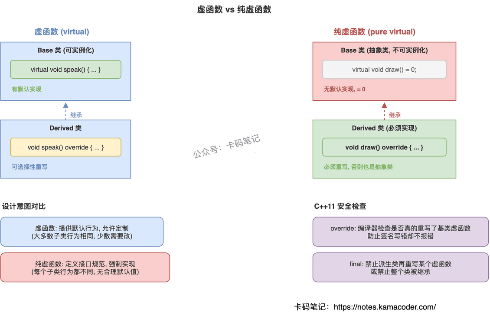

# 虚函数和纯虚函数有什么区别

> 来源: https://notes.kamacoder.com/cpp/virtual-vs-pure-virtual.html

# `# 虚函数和纯虚函数有什么区别 

面试官问："虚函数和纯虚函数有什么区别？什么时候用虚函数，什么时候用纯虚函数？" 

这题看着简单，但很多人只能答出"纯虚函数后面加=0"就卡住了，说不清两者在设计意图上的本质差异，也答不上纯虚函数能不能有实现体这种追问。 

## `# 简要回答 

虚函数用`virtual`声明，**有默认实现**，派生类**可以选择性重写**，类**可以实例化**。纯虚函数在声明后加`= 0`，**没有默认实现**，派生类**必须重写**，类**不能实例化**（成为抽象类）。 

一句话：虚函数是"我有默认行为，你可以改"；纯虚函数是"我只定规范，你必须自己实现"。 

## `# 详细回答 

**虚函数：提供默认行为，允许覆盖** 

用`virtual`声明后，通过基类指针/引用调用时走动态绑定，运行时根据对象实际类型决定调哪个版本。派生类可以override也可以不override，不override就用基类的默认实现。类本身可以正常实例化。 

**纯虚函数：定义接口，强制实现** 

声明时加`= 0`，告诉编译器"这个函数没有默认实现，派生类必须自己写"。包含纯虚函数的类自动变成抽象类，不能直接`new`出来。设计意图是定义接口规范——基类只规定"要做什么"，具体"怎么做"由派生类决定。 

**核心区别** 

| 维度  虚函数  纯虚函数 
| 声明  `virtual void f() {}`  `virtual void f() = 0;` 
| 默认实现  有，派生类可不重写  无，派生类必须重写 
| 类能否实例化  能  不能（抽象类） 
| 设计意图  提供默认行为，允许定制  定义接口规范，强制实现 
| 典型场景  大多数派生类行为相同，少数需要定制  每个派生类行为都不同 

 

## `# 知识拓展 

面试官可能追问： 

**Q1: 构造函数能不能是虚函数？** 

不能。虚函数调用依赖vptr，而vptr是在构造函数里才被设置的。构造函数的工作是"把对象建出来"，虚函数机制需要"对象已经存在"，顺序矛盾。 

**Q2: 纯虚函数能不能有实现体？** 

能。语法上`= 0`只是说"派生类必须重写"，不是说"基类不能提供实现"。基类可以在类外给纯虚函数写实现体，派生类通过`Base::f()`显式调用。典型用途是提供一个"默认实现"让派生类选择性复用。 

**Q3: override和final分别解决什么问题？** 

`override`让编译器检查你是不是真的重写了基类虚函数，防止函数签名写错了却不报错。`final`禁止派生类再重写某个虚函数，或者禁止整个类被继承。两个都是C++11加的，属于编译期安全检查。 

**Q4: 什么时候该用纯虚函数？** 

当基类只规定"要做什么"但不知道"怎么做"时。比如定义一个`Shape`基类，`draw()`每个形状画法都不同，没有合理的默认实现，就该用纯虚函数。如果大多数派生类行为相同只有少数需要定制，用普通虚函数给个默认实现更合适。
