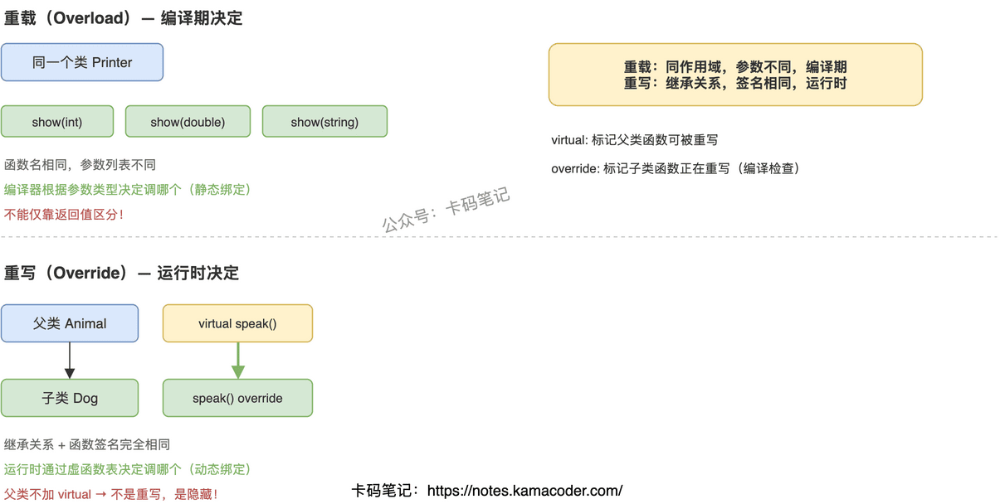

# 重载和重写的区别

> 来源: https://notes.kamacoder.com/cpp/overload-vs-override.html

# `# 重载和重写的区别 

面试官问"重载和重写有什么区别"，大部分人能说出"重载参数不同，重写是子类覆盖父类"，但追问"重载能不能靠返回值区分""不加 virtual 会怎样""override 关键字到底有什么用"就开始含糊了。这道题的核心是理解：重载是编译期决定调哪个（静态绑定），重写是运行时决定调哪个（动态绑定）。 

## `# 简要回答 

重载（Overload）是在同一个作用域里，多个函数名字相同但参数列表不同（类型不同、个数不同、顺序不同），编译器在编译时根据你传的参数类型决定调用哪个版本。重写（Override）是子类对父类虚函数的重新实现，函数名、参数、返回值完全一样，运行时通过虚函数表决定调用父类版本还是子类版本。一个是编译期多态，一个是运行时多态。 

## `# 详细回答 

**重载发生在什么条件下** 

重载发生在同一个作用域内（同一个类里，或者同一个命名空间里）。条件是函数名相同，但参数列表必须不同——可以是参数类型不同、参数个数不同、或者参数顺序不同。编译器通过参数列表来区分调用哪个函数，这个过程在编译期就确定了，叫静态绑定。注意：**不能仅靠返回值类型来区分重载**，因为调用时编译器看不到你要用返回值做什么，无法判断该调哪个。 

**重写发生在什么条件下** 

重写必须满足三个前提：有继承关系、父类函数标了 `virtual`、子类函数签名和父类完全一致（函数名、参数列表、const 修饰都一样）。满足这三个条件后，通过父类指针/引用调用该函数时，运行时会根据对象的实际类型（通过虚函数表查找）决定调用父类版本还是子类版本，这就是动态绑定。 

**virtual 和 override 各自的作用** 

`virtual` 写在父类函数声明前面，告诉编译器"这个函数可能被子类重写，请走虚函数表机制"。如果父类不加 `virtual`，子类写了同名同参的函数不叫重写，叫"隐藏"（hiding）——通过父类指针调用时永远调父类版本，多态失效。 

`override` 写在子类函数声明后面（C++11 引入），告诉编译器"我打算重写父类的虚函数，请帮我检查签名是否匹配"。如果你不小心写错了参数类型或者拼错了函数名，编译器会直接报错。不加 `override` 也能重写成功，但加了更安全，属于防御性编程。 

**不加 virtual 会怎样** 

如果父类函数没有 `virtual`，子类定义了同名同参的函数，这不是重写而是隐藏。通过父类指针调用时，永远调父类版本；只有通过子类指针/对象直接调用时才会调子类版本。这是面试中最常见的坑——很多人以为只要子类写了同名函数就是重写，实际上没有 `virtual` 就没有多态。 

 

## `# 知识拓展 

**Q：重载能不能靠返回值来区分？** 

不能。C++ 标准规定重载只看参数列表，不看返回值。原因很简单：调用 `func(1)` 时，编译器能看到参数是 `int`，但看不到你要把返回值赋给什么类型的变量（甚至可能不用返回值），所以无法靠返回值区分。 

**Q：重写的返回值必须完全一样吗？** 

有一个例外叫"协变返回类型"（covariant return type）：如果父类虚函数返回 `Base*`，子类重写时可以返回 `Derived*`（Derived 是 Base 的子类）。除此之外返回值必须完全一致。 

**Q：重载和重写能同时存在吗？** 

能。一个类里可以有多个同名函数（重载），其中某个版本是从父类继承来的虚函数被重写了。重载和重写是两个维度的概念，不冲突。 

**Q：还有个"隐藏"（hiding）是什么？** 

子类定义了和父类同名的函数（不管参数是否相同），如果父类函数不是虚函数，或者参数列表不同，就会把父类的同名函数"隐藏"掉。通过子类对象调用时只能看到子类版本，父类版本被遮蔽了。这和重写不同——重写是多态机制，隐藏不是。
