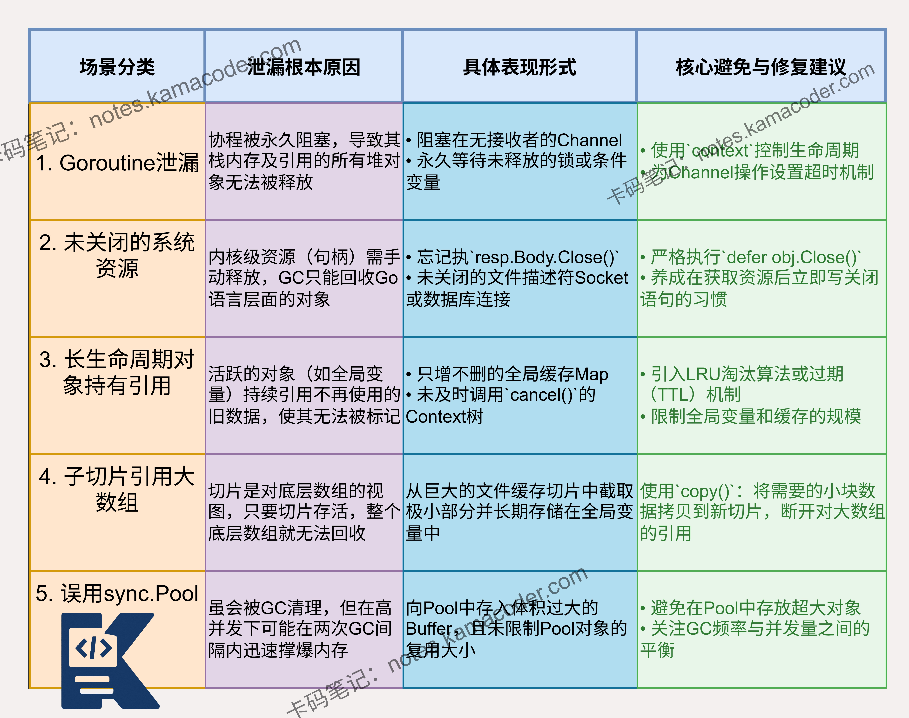

# Go语言中什么情况下会导致内存泄漏？

> 来源: https://notes.kamacoder.com/go/go_memory_leak.html

# `# Go语言中什么情况下会导致内存泄漏？ 

在Go中，什么情况下可能会导致内存泄漏（即使有GC）？请举例说明。 

## `# 简要回答 

Go 的 GC 并不能解决所有内存泄漏问题。主要原因有：**goroutine 泄漏**（goroutine 永久阻塞在 Channel 或锁上）、**未正确关闭的系统资源**（如文件句柄、Socket）、**全局变量或长生命周期对象（如缓存）**持续增长且未设置淘汰策略。这些情况都会导致内存无法被 GC 回收。 

## `# 详细回答 

Go 内存泄漏主要有以下几种情况： 
  - **goroutine 泄漏**：当 goroutine 被阻塞在 channel 操作、互斥锁或条件变量上，且没有机制唤醒它们时，该 goroutine 及其栈内存、引用的堆对象均无法被回收。   - **未释放的系统资源**：文件描述符、网络连接、数据库连接等属于操作系统资源。虽然包装它们的 Go 对象最终会被 GC，但如果不手动调用 `Close()`，底层的资源句柄会耗尽，导致程序崩溃。   - **长生命周期对象持有短生命周期对象**：如缓存未设置过期策略，导致旧数据一直被保留。或者使用 context 时未正确取消，导致相关资源无法释放。   - **子切片引用大数组**：如果从一个巨大的数组中切出一小块并长期保存，底层的庞大数组将无法被 GC 回收。   - **不当使用 sync.Pool**：`sync.Pool` 虽会被 GC 清理，但如果往 Pool 里放了占用巨大内存的对象且不限制大小，在 GC 发生前的并发高峰期可能会撑爆内存。 

## `# 知识图解 

 

## `# 知识扩展 

Go 的 GC 采用**标记清除算法**，能够自动回收不再被引用的内存。 

但 GC 只能回收那些没有任何引用的对象。当对象仍然被某个活跃的 goroutine 或全局变量引用时，即使这些对象不再被使用，GC 也无法回收它们。 

goroutine 泄漏是 Go 中最常见的内存泄漏形式。每个 goroutine 会占用一定的内存，如果泄漏大量 goroutine，会导致内存持续增长。 

goroutine 泄漏通常发生在：等待永远不会到来的 channel 数据、等待未被释放的互斥锁、或者 goroutine 进入无限循环。 

检测内存泄漏的常用工具包括：pprof（Go 自带的性能分析工具）、go tool trace（跟踪 goroutine 和内存分配）、以及第三方工具如 go-leak 等。 

### `# 面试官可能会追问 

Q1：如何避免 goroutine 泄漏？ 

A1：避免 goroutine 泄漏的方法包括： 
  - 使用 context 控制 goroutine 的生命周期；   - 为 channel 操作设置超时或使用带缓冲的 channel；   - 使用 sync.WaitGroup 等待 goroutine 完成；   - 避免在 goroutine 中进行可能永远阻塞的操作；   - 在 goroutine 中处理 panic，确保 goroutine 能够正常退出；   - 定期检查 goroutine 的数量，确保没有异常增长。 

Q2：Go 的 GC 是如何工作的？ 

A2：Go 的 GC 采用**三色标记法和写屏障技术**。 

它的工作过程分为几个阶段：首先是标记准备阶段，短暂停止所有 goroutine，初始化标记状态。 

然后进入并发标记阶段，GC 与 goroutine 同时运行，标记所有可达对象。在这个阶段，写屏障会记录对象引用的变化。 

标记完成后，进入标记终止阶段，再次短暂停止所有 goroutine，完成标记工作。 

最后是并发清除阶段，清除未被标记的对象。 

Q3：Go 中的 context 包有什么作用？如何正确使用 context 来避免内存泄漏？ 

A3：context 包主要用于在 goroutine 之间传递取消信号和请求范围的值。 

正确使用 context 可以有效避免内存泄漏： 
  - 在函数间传递 context，而不是存储在结构体中；   - 使用 context.WithCancel () 创建可取消的 context；   - 在 goroutine 中监听 context 的 Done () channel，当收到取消信号时，及时清理资源并退出；   - 避免在 context 中存储大量数据；   - 在不需要 context 时及时调用 CancelFunc。
