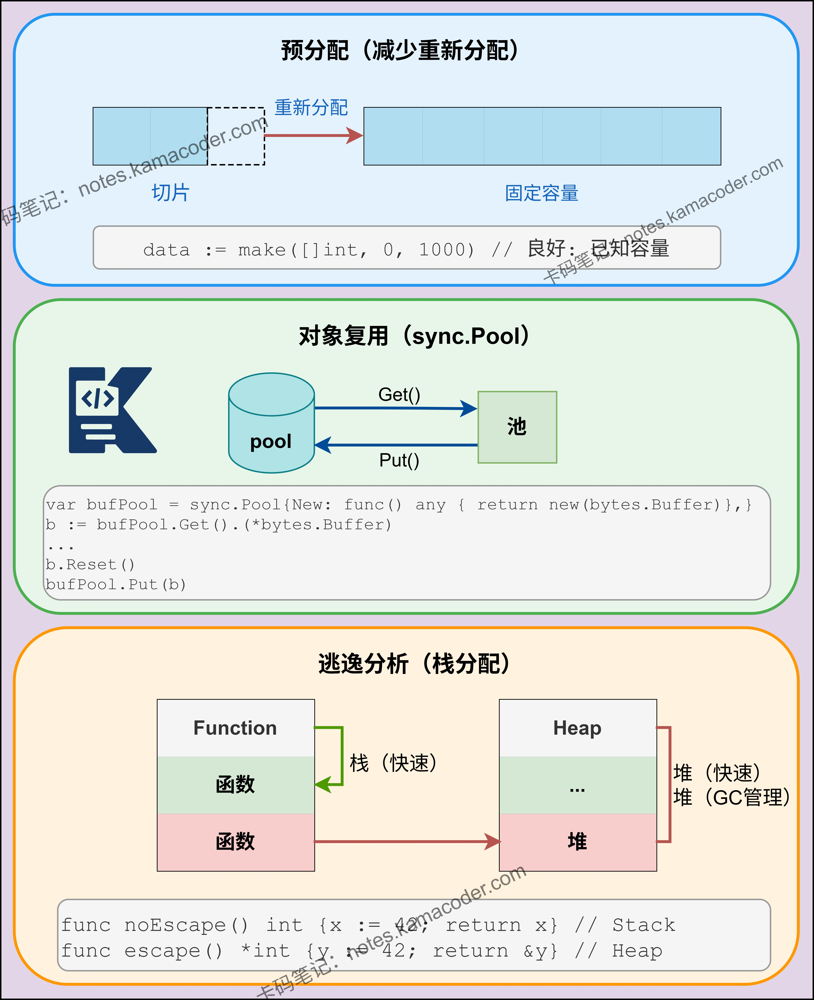

# Go语言中如何进行内存分配优化？

> 来源: https://notes.kamacoder.com/go/go_memory_all_opt.html

# `# Go语言中如何进行内存分配优化？ 

Go语言中如何进行内存分配优化？ 

## `# 简要回答 

Go 内存分配优化的核心是减少内存分配次数和大小。 

可以通过预分配切片容量、使用对象池复用对象、避免不必要的内存拷贝等方式实现。 

但同时要注意避免内存泄漏，如 goroutine 泄漏、未关闭的 channel 等。 

还要关注内存对齐，合理组织结构体字段顺序，减少内存碎片。 

## `# 详细回答 
  - 

Go 的内存分配器的工作原理是将内存分为不同大小的 span，以减少内存碎片。 

在代码层面，预分配容器容量是最直接的优化手段，如 `make([]int, 0, 100)` 可避免多次扩容。   - 

使用 `sync.Pool` 复用对象，特别是频繁创建的临时对象，如处理 HTTP 请求时的缓冲区。 

避免不必要的指针使用，**因为包含指针的结构体会增加 GC 扫描的压力，且指针更容易导致对象逃逸到堆上**。 

合理使用值类型，如在函数参数传递时，对于小结构体使用值传递而非指针传递。   - 

优化结构体字段顺序，按照内存对齐原则排列，减少内存浪费。 

例如，将相同类型的字段放在一起，将占用空间大的字段放在前面。 

在字符串处理方面，使用 `strings.Builder` 代替 `+` 操作符，以减少临时字符串创建。   - 

最后，通过 pprof 工具分析内存使用情况，定位内存泄漏和热点，进行针对性优化。 

## `# 知识图解 

内存分配机制： 

 

内存分配优化： 

 

## `# 知识扩展 

Go 的内存分配器**基于 tcmalloc 的思想实现**，采用三级缓存结构：线程缓存（mcache）、中心缓存（mcentral）和页堆（mheap）。线程缓存是每个 P（Processor）私有的，用于快速分配小对象，避免锁竞争。中心缓存是全局的，用于管理不同大小的 span。页堆管理大内存分配。 

内存分配优化需要理解这个机制，例如小对象分配会优先从线程缓存获取，大对象直接从页堆分配。因此，优化策略需要考虑对象大小，对于小对象通过对象池复用，对于大对象则要避免频繁分配。同时，要注意内存对齐，**Go 的分配器会根据预设的 size class 规格（如 8B, 16B, 32B 等）来分配内存块，而结构体内部的内存对齐是由 Go 编译器在编译期自动处理的**，合理组织结构体字段可以减少结构体本身的内存浪费。 

### `# 面试官可能会追问 

Q1：sync.Pool 的工作原理是什么？它适用于哪些场景？ 

A1：sync.Pool 的核心是减少内存分配压力和垃圾回收开销。 

它的工作原理基于两级缓存结构：每个处理器（P）维护一个本地对象缓存，包含一个私有对象和共享对象链表；当本地缓存无可用对象时，会尝试从其他处理器的共享缓存中“窃取”对象，若仍未获取到则调用用户定义的 New 函数创建新对象。 

它适用于临时对象的复用，如处理请求时的临时缓冲区、解析数据时的临时对象等。 

但不适用于需要持久化管理状态或包含长连接的对象（如数据库连接池），因为 Pool 中的对象随时可能在下一次 GC 时被无通知地回收。 

Q2：如何避免 Go 中的内存泄漏？ 

A2：Go 内存泄漏的主要原因是**资源未正确释放或生命周期被意外延长**。 

避免方法包括： 
  - 使用 `context` 管理 goroutine 生命周期，确保 goroutine 能正常退出；   - 及时关闭 channel，或确保 channel 读写端不会永久阻塞；   - 使用 `defer` 语句释放外部资源（如文件句柄、网络连接）；   - 避免不必要的全局变量，或者全局 map 无限制地增长；   - 定期使用 pprof 工具的 heap profile 检测内存泄漏。 

Q3：什么是内存对齐？如何优化结构体的内存对齐？ 

A3：内存对齐是指数据在内存中的起始地址必须是其大小（或特定对齐系数）的整数倍，以提高 CPU 访问内存的效率。 

**Go 的编译器**会自动进行内存对齐，如果字段排列不合理，编译器会插入空白字节来填补。 

优化结构体内存对齐的方法是将字段按照大小排序，**通常将占用空间大的字段放在前面**，相同类型的字段放在一起，从而使编译器生成的空白字节最少，减小结构体的总大小。
