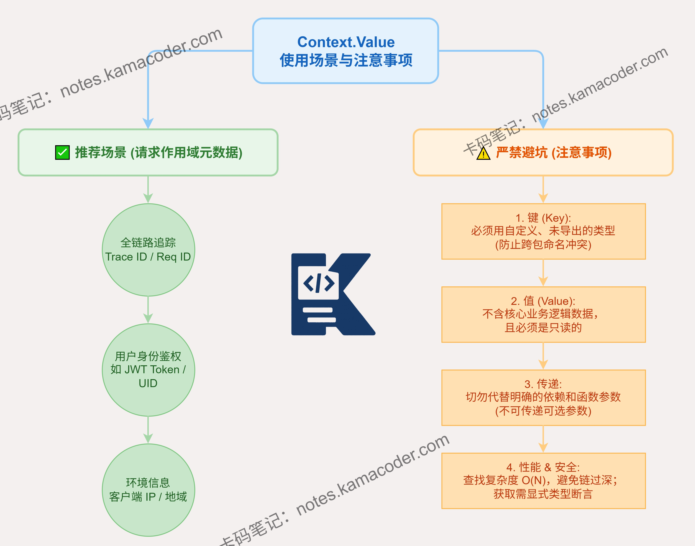

# Context.Value的使用场景和注意事项是什么？

> 来源: https://notes.kamacoder.com/go/go_ContextValue.html

# `# Context.Value的使用场景和注意事项是什么？ 

Context.Value的使用场景和注意事项有哪些？ 

## `# 简要回答 

Context.Value 主要用于在请求的生命周期内，跨越 API 边界传递请求级别的数据，如全链路的 TraceID、用户鉴权 Token 或客户端 IP。 

使用时需注意几点核心事项： 
  - 绝对不能将它作为传递业务必选参数的工具；   - 为了避免跨包的键冲突，Key 必须使用未导出的自定义类型；   - Context 是并发安全的，存储的 Value 也应当是只读的；   - 由于其底层是链表结构，查找耗时是 O(N)，切忌存储过多数据。 

## `# 详细回答 

Context.Value 是 Go 语言中专用于在跨 API 和进程间传递请求作用域数据的机制。 它的核心使用场景集中在基础架构层面。最常见的是链路追踪，例如将 Zipkin 或 Jaeger 的 TraceID 注入 Context，使得整个请求经过的所有函数和下游 RPC 调用都能串联在同一个追踪树上。此外，它也常用于安全认证以及统一日志打印。 

在使用时，必须严格遵守以下注意事项： 

第一，**键的唯一性防范**。Go 官方文档明确指出，Key 绝不能使用内置的 `string` 或 `int` 类型。必须定义未导出的自定义类型，以防止不同包之间意外覆盖彼此的数据。 

第二，**切勿传递业务必选参数**。如果一个函数需要数据库连接或订单 ID 才能运行，这些参数必须写在函数签名里。将它们藏在 Context 中会严重破坏代码的可读性和编译期的类型安全。 

第三，**并发安全性**。Context 通常会被多个下游 goroutine 共享。传入的 Value 必须是线程安全的，最好是不可变的，否则极易引发数据竞争。 

第四，**关注性能损耗**。它底层的查找机制是沿着节点向上遍历，时间复杂度为 O(N)。过度嵌套会导致查找极慢。 

## `# 知识图解 

 

## `# 知识扩展 

深刻理解 Context.Value，不可不知其底层的 `valueCtx` 源码结构。很多初学者误以为它是把数据存在一个并发安全的 `map` 里，其实不然。每次调用 `context.WithValue(parent, key, val)`，都会返回一个全新的 `valueCtx` 结构体。这个结构体内部只包含三个字段：**指向父 Context 的引用、当前的 key、当前的 val**。 

这就形成了一个倒置的树状或链表结构。当你执行 `ctx.Value(key)` 时，它会先对比当前节点的 key，如果不匹配，就会沿着父引用一层一层向上回溯，直到找到对应的 key 或者遇到顶层的 `Background()` 返回 nil。 

这种设计保证了 Context 的不可变性，使得多个 goroutine 可以无锁地安全共享同一条上下文链路。但也正是因为这种设计，其查找效率是线性的 O(N)，所以官方才三令五申：千万不要用它来存储大量的键值对。 

### `# 面试官可能会追问 

Q1： **为什么官方强烈建议Context的Key必须是自定义类型而不是普通的string？** 

A1： 因为底层 `valueCtx` 存储 Key 的类型是 `interface{}`。 

在 Go 中，两个 `interface{}` 相等的条件是类型和值都必须相等。 

如果用普通 string，类型都是 string，只要字符串内容一样就会冲突。 

而定义为包私有的自定义类型后，其类型签名在全项目全局唯一，这就形成了一种天然的命名空间隔离，提升了大型项目协作的安全性。 

Q2： **如果在goroutine中修改Context.Value里存储的数据，会有什么问题？** 

A2： 这违背了 Context 的不可变设计原则。 

Context 每次 `WithValue` 衍生都是创建新节点，本身不提供修改旧节点的方法，其意图就是保证上下文的纯净和只读传递。 

如果在某一个子 goroutine 里偷偷修改了传入的共享对象，会产生不可预期的副作用，悄无声息地污染其他平行 goroutine 读到的数据，这种 Bug 极难排查。 

Q5： **在微服务链路追踪中，Context.Value是如何发挥作用的？** 

A5： 在微服务中，一个请求往往要经过网关、A 服务、B 服务甚至数据库。我们会在入口处生成一个全局唯一的 TraceID，通过 `context.WithValue` 放入 Context 中。 

由于 Go 的标准库和几乎所有第三方网络框架（如 gRPC、HTTP 等）都支持将 Context 作为首个参数传递，这个 TraceID 就能像接力棒一样跨越函数边界。 

在打印日志或发起下游 RPC 时，统一从 Context 中取出这个 ID 注入进去，从而将零散的日志串联成完整的链路。
