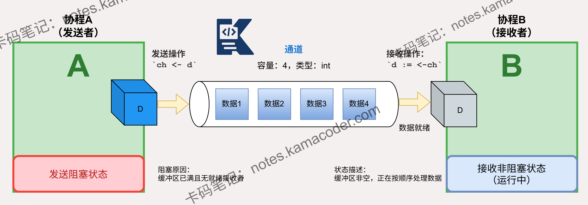

# Go语言中协程是如何进行通信的？

> 来源: https://notes.kamacoder.com/go/go_goroutine_communicate.html

# `# Go语言中协程是如何进行通信的？ 

协程是如何进行通信的？ 

## `# 简要回答 

协程（Goroutine）通信的核心机制是 **channel**。 

它是 Go 语言内置的类型，遵循“不要通过共享内存来通信，而要通过通信来共享内存”的设计哲学。 

发送者通过 `ch <- data` 将数据发送到 channel，接收者通过 `data := <-ch` 接收数据。这种机制通过**阻塞特性**实现了协程间的自然同步。 

## `# 详细回答 

协程通信的核心机制是 channel。channel 是 Go 语言提供的一种类型安全且并发安全的管道，用于在不同 goroutine 之间传递数据。 
  - **阻塞与同步**：当发送和接收操作不匹配时，goroutine 会进入阻塞状态。例如，在无缓冲 channel 中，发送方会阻塞直到接收方就绪，反之亦然。这种特性使得开发者无需显式使用锁（Mutex）就能实现数据同步。   - **关闭机制**：使用 `close(ch)` 可以关闭 channel。关闭后，**无法再发送数据**，但**可以继续接收**已存在于 channel 中的数据。当数据取完后，接收操作会立即返回该类型的零值和 false 标志。   - **缓冲类型**：

    - **无缓冲 channel**：发送与接收必须同步发生，保证了强一致性的同步。     - **有缓冲 channel**：允许在缓冲区未满时发送数据，在缓冲区非空时接收数据。它在解耦生产者和消费者、应对瞬时流量峰值方面非常有效。 

## `# 知识图解 

 

## `# 知识扩展 
  - 

**同步原语**：无缓冲 channel 常被用作“信号量”。例如，一个 goroutine 完成任务后向 channel 发送信号，主协程通过接收该信号来确保任务已结束。   - 

**单向 Channel**：Go 支持将 channel 声明为**只发送** `chan<- T` 或**只接收** `<-chan T`。这通常用于函数参数中，通过编译期的类型检查来增强代码的健壮性和意图清晰度。   - 

**Select 多路复用**：`select` 语句允许一个 goroutine 同时等待多个 channel 操作。它是处理并发逻辑（如超时控制、多任务分发）的核心工具。 

### `# 面试官可能会追问 

Q1：channel 的无缓冲和有缓冲有什么区别？ 

A1：无缓冲 channel 是**同步**的，要求发送者和接收者必须同时“握手”成功才能传递数据，缓冲区大小为 0。 

有缓冲 channel 是**异步**的（在容量范围内），它允许发送者在没有接收者的情况下先将数据存入队列，只有当缓冲区满时才会阻塞发送者。 

Q2：如何关闭 channel？关闭 channel 后还能发送或接收数据吗？ 

A2：关闭 channel 的正确方式是由发送者调用`close`函数。 

关闭后，接收操作可以继续进行，直到 channel 中的所有数据都被接收完毕。发送操作会导致 panic。 

因此，在关闭 channel 之前，应该确保没有 goroutine 会继续向 channel 发送数据。 

Q3：select 语句的作用是什么？它如何处理多个 channel 操作？ 

A3：`select` 用于监听多个 channel 的 IO 操作。如果所有 case 都阻塞： 
  - 如果有 `default` 分支，则立即执行 `default`（实现**非阻塞通信**）。   - 如果没有 `default` 分支，该 goroutine 将进入阻塞状态，直到其中一个 case 变为可通信。如果所有协程都处于阻塞状态，Go 运行时会检测到死锁并报错。
