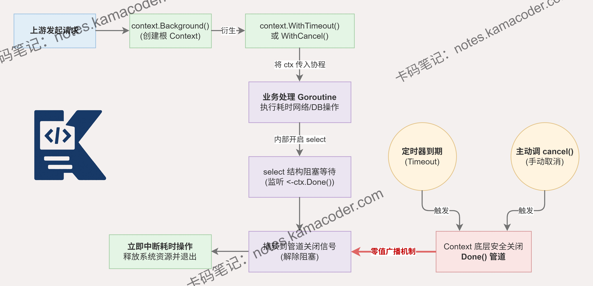

# Go语言中如何用context实现请求的超时或取消控制？

> 来源: https://notes.kamacoder.com/go/go_context.html

# `# Go语言中如何用context实现请求的超时或取消控制？ 

如何用context实现请求的超时或取消控制？ 

## `# 简要回答 

在Go语言中，实现超时或取消的核心是结合 `context` 与 `select` 机制。 

通过 `context.WithTimeout` 或 `context.WithCancel` 创建派生上下文，并在执行任务的 goroutine 中使用 `select` 监听 `ctx.Done()` 管道和业务处理管道。 

一旦触发超时或主动调用 `cancel()` 函数，`ctx.Done()` 会立马接收到关闭信号，此时直接中断后续逻辑并返回即可。 

最后，在函数退出前通过 `defer cancel()` 释放关联资源，防止 goroutine 泄漏。 

## `# 详细回答 

在 Go 语言中，`context` 标准库用来处理并发超时和取消控制。 

具体实现可分为三步： 

首先，根据场景选择 API，若是手动取消则用 `context.WithCancel(ctx)`，若是超时控制则用 `context.WithTimeout(ctx, duration)` 或 `context.WithDeadline`。 

其次，在执行业务逻辑的 goroutine 内，必须配合 `select` 原语使用。我们将耗时操作放在一个单独的 goroutine 中并将其结果通过 channel 传递，同时在主控流程里 `select` 监听业务 channel 和 `ctx.Done()`。如果 `ctx.Done()` 先收到信号（即管道被关闭），说明发生了超时或上游主动取消，此时应立即终止后续逻辑并返回错误（如通过 `ctx.Err()` 明确是 Canceled 还是 DeadlineExceeded）。 

最后，无论业务是否正常完成，都必须主动调用衍生 context 时返回的 `cancel()` 函数，通常通过 `defer cancel()` 实现。这能确保底层挂载的定时器和维护的层级关系被及时销毁，避免产生隐蔽的 goroutine 泄漏和内存 OOM 风险。 

## `# 知识图解 

 

## `# 知识扩展 

面试官在问完超时控制后，常常会顺势考察 `context.WithValue` 的使用场景及避坑指南。 

`context` 除了控制 goroutine 生命周期，还承担着在整条请求链路中安全传递“请求范围”数据的重任，例如 traceID、用户鉴权 Token、请求地域信息等。 

需要注意的是，`context.WithValue` 会在内部创建一条单向的链表结构。每次存入新值，都会嵌套生成一个新的 context 节点，查找时则自底向上线性遍历。因此，千万不要将它当作全局变量或函数传参的垃圾桶，频繁存取会导致严重的性能开销。此外，为了避免不同包之间出现数据 Key 冲突，建议使用自定义且不可导出的类型（如 `type key struct{}`）作为 Context 的键，从而保障并发安全与数据隔离。 

### `# 面试官可能会追问 

Q1： 如果忘记调用 context 的 cancel 函数，会导致什么后果？ 

A1：会导致严重的内存和 goroutine 泄漏。 

当我们通过 `WithTimeout` 或 `WithCancel` 创建子 Context 时，父 Context 会在内部维护一个子节点的关联关系。 

如果不调用 `cancel()` 且父 Context 一直存活，子 Context 就会一直挂在父节点上无法被垃圾回收。 

同时，该 goroutine 内部相关的定时器也不会被释放，长此以往会导致服务 OOM 崩溃。 

Q2： context 内部是如何实现级联取消（向子节点传播）的？ 

A2： Context 内部是通过树形结构组织起来的。 

当一个 Context 被取消时，它内部的方法会首先关闭自己的 `done` channel。 

接着，它会遍历内部维护的一个存放所有可取消子 Context 的集合（children 字典），并递归地调用所有子 Context 的取消逻辑。 

这样，取消信号就从父节点一层层向下传递，确保下游 goroutine 都能收到信号。
