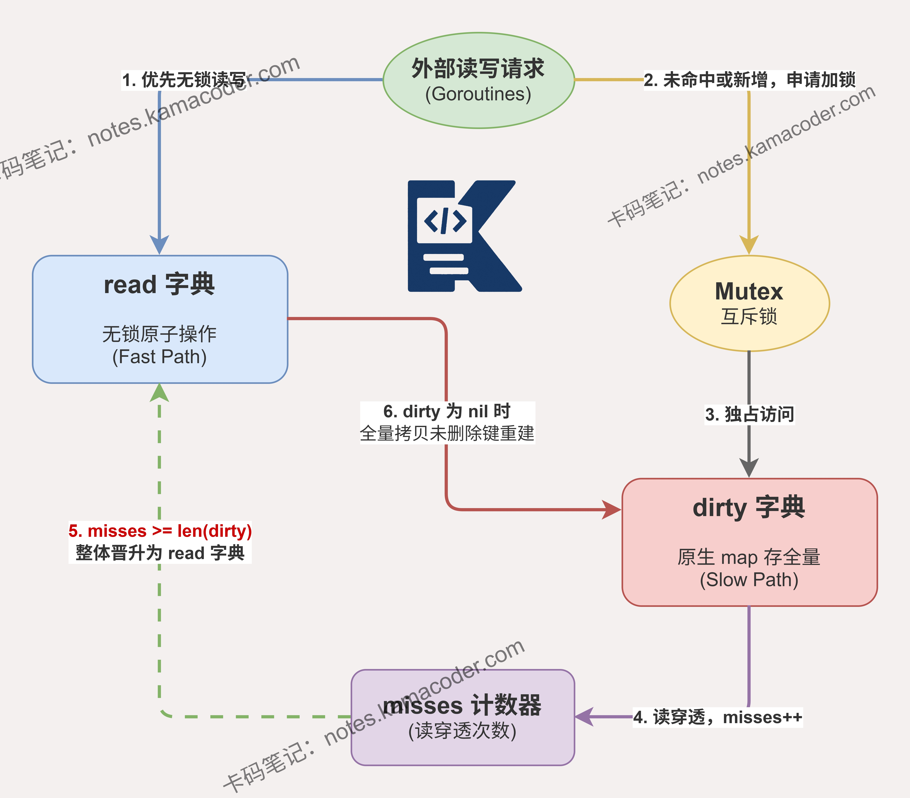

# sync.Map如何实现并发安全？与map加锁相比有什么优缺点？

> 来源: https://notes.kamacoder.com/go/go_sync.Map.html

# `# sync.Map如何实现并发安全？与map加锁相比有什么优缺点？ 

简述sync.Map的底层实现思路。 

## `# 简要回答 

`sync.Map` 通过设计 `read` 和 `dirty` 两个字典实现并发安全。 

它的核心机制包含**读写分离**、**原子操作**与**延迟删除**。 

读数据时无锁读取只读字典 `read`，若未命中且数据被修改，再加锁查 `dirty` 并增加 `misses` 计数；当穿透次数达到 `dirty` 长度时触发状态机晋升，`dirty` 覆盖 `read`。 

写数据时，若 key 存在于 `read` 则用 CAS 无锁更新；若为新增，则加锁写入 `dirty`。删除采用逻辑软删除。 

整体上用双 buffer 的思想极大降低了锁粒度。 

## `# 详细回答 

`sync.Map` 底层通过 `read` 和 `dirty` 两个内嵌字典实现并发安全。 

结构上，它包含一个互斥锁 `Mutex` 用于保护 `dirty`，`read`（原子类型）用于无锁读取，`dirty` 包含所有数据（含新插入），以及一个 `misses` 计数器。 

**核心流程如下**： 
  - 查询时，优先走无锁 Fast Path，在 `read` 中原子读取；若未命中且 `amended` 标志为 true，则加锁进入 Slow Path 查询 `dirty`，同时 `misses` 加一。当 `misses` 等于 `dirty` 长度时，`dirty` 整体提升为 `read`，清空 `dirty`。   - 更新/插入时，若 key 已在 `read` 且未被彻底删除，直接通过 CAS 更新其指针；如果是新 key，则加锁写入 `dirty`。   - 删除也是软删除，先在 `read` 中 CAS 标记为 `nil`，后续在重建 `dirty` 时转为 `expunged`（彻底删除）。 

这种**读写分离**极大提升了读多写少场景的性能。 

## `# 知识图解 

 

## `# 知识扩展 

官方明确指出 `sync.Map` 仅适用于两种场景：一是**读多写少**的场景（如本地配置缓存），因为读操作基本都在无锁的 `read` 字典中完成，性能极高；二是**多 goroutine 并发读写互不相交的 key** 的场景，这也能避免锁竞争。 

但在**写多读少**或者**频繁插入新 key** 的场景下，`sync.Map` 的性能甚至不如原生的 `map + sync.RWMutex`。原因是新插入的 key 会落入 `dirty` 字典，当 `dirty` 提升为 `read` 后，下一次插入新 key 会触发将 `read` 字典中未删除的数据全量遍历拷贝到新的 `dirty` 字典中。 

这个 O(N) 的全量拷贝过程在数据量大时极其耗时，会导致严重的性能抖动。因此，在技术选型时切忌盲目滥用 `sync.Map`。 

### `# 面试官可能会追问 

Q1： **为什么 sync.Map 中的 entry 会有 nil 和 expunged 两种删除状态？** 

A1：区分 `nil` 和 `expunged` 是为了优化 `dirty` 字典的初始化。 

`nil` 表示键在 `read` 中被逻辑删除，但 `dirty` 中可能还存在； 

`expunged` 则表示键被彻底删除，且当前的 `dirty` 字典中绝对没有这个键。 

当需要新建 `dirty` 时，系统只会把 `read` 中未被删除的键拷贝过去，并将 `nil` 状态转为 `expunged`，避免将已删除的键无意义地复制到新 `dirty` 中，节省了内存和拷贝时间。 

Q2： **sync.Map 里的 misses 计数器具体是怎么工作的？什么时候触发提拔？** 

A2：`misses` 用于记录从 `read` 字典中未命中，从而不得不穿透到加锁的 `dirty` 字典中查找的次数。 

每次在 `read` 中没找到，并且 `amended`（表明 dirty 有新数据）为 true 时，去 `dirty` 查完后 `misses` 就会加 1。 

当 `misses` 的值等于 `dirty` 字典的长度（即 `len(dirty)`）时，就会触发提拔机制，直接将 `dirty` 整体赋给 `read`，然后 `dirty` 置空，`misses` 清零。 

Q3： **如果有大量写操作，sync.Map 会有什么性能问题？为什么？** 

A3： 面对写多读少的场景，它有两个致命伤。 

第一是每次新增 key 都要获取互斥锁，锁竞争严重； 

第二是 `dirty` 字典的重建机制。当新键不断插入，会频繁触发 `dirty` 提升为 `read`。一旦 `dirty` 空了，下一次再插入新键时，系统必须遍历整个 `read` 将有效数据复制到新 `dirty` 中。 

这种 O(N) 复杂度的拷贝不仅拖慢速度，还会制造大量短生命周期对象，增加 GC 压力。
