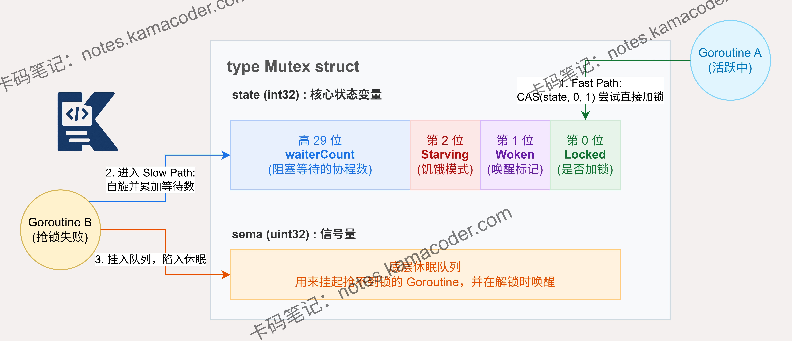

# sync.Mutex是如何在底层实现锁状态的？

> 来源: https://notes.kamacoder.com/go/go_syncMutex_bit_implementation.html

# `# sync.Mutex是如何在底层实现锁状态的？ 

sync.Mutex 是如何在底层实现锁状态的？ 

## `# 简要回答 

`sync.Mutex` 的锁状态浓缩在一个 32 位的 `state` 字段中。 

Go 利用位运算，将第 0 位设为 Locked（加锁状态），第 1 位设为 Woken（唤醒状态），第 2 位设为 Starving（饥饿模式），高 29 位设为 WaiterCount（等待者数量）。 

这种将多个状态压缩在一个变量中的设计，使得一次 CAS 原子指令就能同时完成状态检查和修改，避免了多字段带来的数据不一致问题，极大地提升了基础组件的性能。 

## `# 详细回答 

在底层数据结构上，`sync.Mutex` 只有两个字段：`state int32` 和 `sema uint32`。核心的锁状态全部记录在 `state` 这个 32 位整数中。具体来说： 
  - **第 0 位 (mutexLocked)**：值为 1 表示锁已经被某个 Goroutine 占用。   - **第 1 位 (mutexWoken)**：值为 1 表示有 Goroutine 已经被唤醒，主要是为了通知解锁的 Goroutine 不要再去唤醒其他等待者。   - **第 2 位 (mutexStarving)**：值为 1 表示锁进入了饥饿模式，这意味着锁的获取策略从竞争变为了严格排队，防止老的 Goroutine 饿死。   - **高 29 位 (waitersCount)**：记录当前阻塞等待该锁的 Goroutine 数量。 

加锁时，如果 `state` 为 0，Goroutine 会直接通过原子操作 CAS 将第 0 位置为 1。如果已被占用，Goroutine 会进入 Slow path，可能进行自旋，或者调用底层的信号量机制将自己挂起。解锁时，同样通过 CAS 操作修改状态，并通过信号量唤醒等待队列中的 Goroutine。 

## `# 知识图解 

 

## `# 知识扩展 

**正常模式与饥饿模式的动态切换机制** 

Go 1.9 版本在 `sync.Mutex` 中引入了饥饿模式，以解决尾部延迟问题。 

在正常模式下，等待者被唤醒后需要与新到达的 Goroutine 竞争，由于新来的 Goroutine 在 CPU 上运行且数量可能很多，唤醒的等待者往往会失败。 如果一个 Goroutine 等待时间超过 1 毫秒，它就会把 Mutex 的状态修改为饥饿模式。 

在饥饿模式下，锁严格按照 FIFO（先进先出）排队，新来的 Goroutine 直接去排队。 

当满足以下两个条件之一时，锁会恢复为正常模式：1. 当前获得锁的 Goroutine 等待时间小于 1 毫秒；2. 它是等待队列里的最后一个 Goroutine。这种设计兼顾了正常情况下的极高吞吐量与极端情况下的绝对公平。 

### `# 面试官可能会追问 

Q1： **为什么 sync.Mutex 不支持可重入？** 

A1：Go 官方明确反对在 Mutex 中加入重入机制。 

如果 Mutex 是可重入的，某个 Goroutine 在持有锁期间调用了其他复杂函数，就很难追踪锁的释放时机，导致 Bug 难以排查。 

遇到需要重入的场景，Go 推荐将需要保护的核心逻辑抽离成独立的无锁内部函数，由外部暴露的接口统一加锁调用。 

Q2： **Mutex 加锁过程中的自旋需要满足哪些条件？** 

A2： 自旋的核心逻辑是“盲等”，期望持有锁的 Goroutine 马上释放。 

触发条件是：1. 锁处于正常模式（非饥饿）；2. 运行在多核 CPU 且 `GOMAXPROCS` > 1；3. 至少有另一个 P 在工作；4. 自旋不超过 4 次。底层其实是调用了汇编级别的 `procyield` 指令，执行数十次空操作。 

Q3： **如果一个 Goroutine 在持有锁的时候发生了 panic，会发生什么？** 

A3：如果发生 panic 时没有被 `recover` 捕获，整个程序会崩溃退出。 

如果被捕获了，但没有在 `defer` 中释放锁，那么这把锁将永远处于 Locked 状态。 

此时，所有正在等待这把锁的 Goroutine 都会永久阻塞，导致严重的 Goroutine 泄漏甚至死锁。
