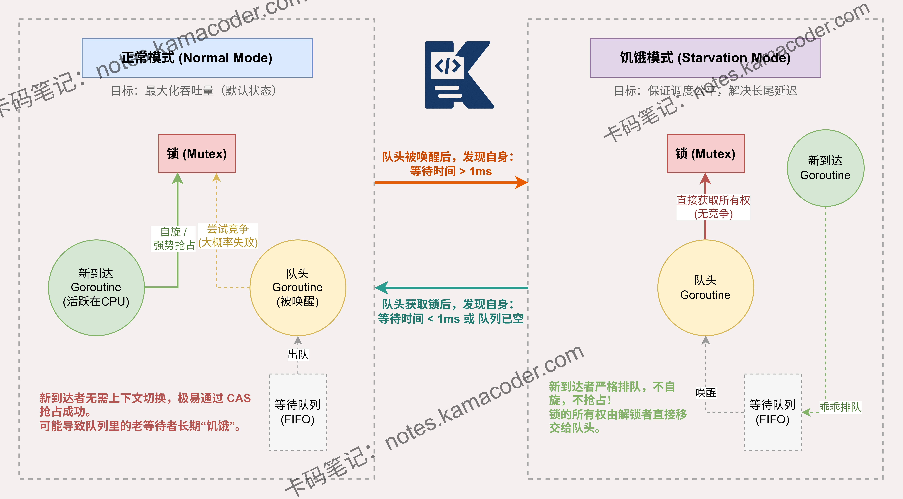

# sync.Mutex的两种模式是什么？正常模式和饥饿模式有什么区别？

> 来源: https://notes.kamacoder.com/go/go_syncMutex_normal_starvation.html

# `# sync.Mutex的两种模式是什么？正常模式和饥饿模式有什么区别？ 

简述 sync.Mutex 的两种模式（正常模式和饥饿模式）及其作用。 

## `# 简要回答 

`sync.Mutex` 默认为**正常模式**，该模式下新请求锁的 goroutine 会与队列中的协程共同竞争，利用自旋机制减少上下文切换开销，提升整体吞吐。 

若队列中的协程超过 1ms 未能获取锁，则触发**饥饿模式**。此模式下，锁的拥有权会从释放锁的协程直接移交给队列首部，禁止新协程抢占。 

通过这种双模式切换，Go 解决了原生自旋锁可能带来的长尾延迟问题，实现了性能优先下的“保底公平”。 

## `# 详细回答 

`sync.Mutex` 的**正常模式**是其默认状态。在此模式下，等待者按 FIFO 顺序排队，但被唤醒的等待者并不直接持有锁，而是需要与新到达的 goroutine（正占用 CPU 运行）共同竞争。新来的协程往往具有优势，因为它们已在 CPU 上运行，无需经过复杂的上下文切换。这种策略极大提升了系统的整体吞吐量。 

然而，这可能导致队列尾部的协程始终获取不到锁，产生“饥饿”现象。 为了解决此问题，当一个等待者获取锁的耗时超过 1ms，Mutex 会切换到**饥饿模式**。在该模式下，释放锁的协程会将锁的控制权直接移交给队头等待者。新来的 goroutine 不会尝试自旋或抢占，而是直接进入队尾排队。当队头等待者是最后一个，或者其等待时间小于 1ms 时，锁会切回正常模式。 

这种机制在保证高性能的同时，利用饥饿模式作为兜底，防止了极端情况下的长尾延迟。 

## `# 知识图解 

 

## `# 知识扩展 

**自旋（Spinning）机制与 Mutex 的关系** 

在 `sync.Mutex` 进入饥饿模式之前，正常模式下的高性能很大程度上依赖于**自旋**。 

当一个 goroutine 尝试获取已被占用的锁时，如果它发现锁持有者正在 CPU 上运行，且当前机器是多核的，它不会立即进入睡眠排队，而是执行一段忙等待（Loop），尝试通过消耗少量 CPU 周转来等待锁释放。 

这样做的好处是避免了将 goroutine 挂起再唤醒的两次上下文切换开销。但自旋是有限度的：如果尝试了几次仍未获取锁，或者 CPU 核心数不足，协程最终还是会进入阻塞状态。饥饿模式的存在，正是为了防止过度的自旋或竞争导致某些协程永远无法从阻塞中恢复。 

### `# 面试官可能会追问 

Q1：Mutex 切换到饥饿模式的具体触发条件是什么？ 

A1： 当一个处于等待队列中的 goroutine 被唤醒后，如果它发现从进入队列到当前被唤醒的时间超过了 1ms，它就会通过原子操作将 Mutex 的状态设置为饥饿模式。 

这是一种基于时间的启发式保护机制。 

Q2：在饥饿模式下，新来的 goroutine 会发生什么？ 

A2： 在饥饿模式下，新到达的 goroutine 完全失去了竞争资格。 

它们不会尝试去获取锁，也不会进行自旋，而是直接被调用 `runtime_SemacquireMutex` 放入等待队列的尾部，严格遵守先来后到的准则。 

Q3：Mutex 什么时候会从饥饿模式切换回正常模式？ 

A3： 切换回正常模式有两种情况： 

一是当前获取锁的协程是等待队列中的最后一个，说明已经没有更多积压的请求了； 

二是该协程虽然拿到了锁，但发现自己的等待时间其实小于 1ms。满足任一条件，Mutex 就会切回正常模式。
