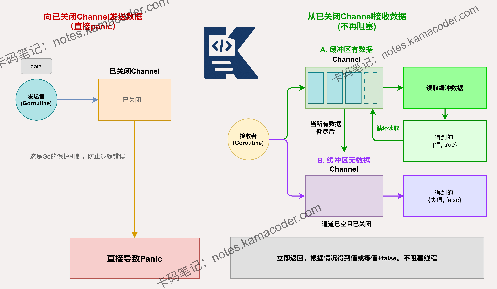

# 向已关闭的channel发送数据会怎样？如何安全关闭channel？

> 来源: https://notes.kamacoder.com/go/go_channel_close.html

# `# 向已关闭的channel发送数据会怎样？如何安全关闭channel？ 

向一个已关闭的channel发送数据，或从一个已关闭的channel接收数据，会发生什么？如何安全地关闭channel？ 

## `# 简要回答 

向已关闭的 channel 发送数据会触发 **panic**。 

从已关闭的 channel 接收数据时：若缓冲区仍有数据，则正常接收；若缓冲区已空，则立即返回**零值**和 **false**。 

安全关闭 channel 的原则是：**不在接收端关闭 channel，也不在有多个并发发送者时关闭 channel**。通常由唯一的发送者负责关闭，或使用 `sync.Once` 确保仅关闭一次。 

## `# 详细回答 

向已关闭的 channel 发送数据会导致panic，这是为了强制开发者保证程序的逻辑一致性。 

从已关闭的 channel 接收数据时，Go 会先清空缓冲区中的存量数据，数据取完后，后续的接收操作将不再阻塞，而是直接返回该类型的零值和布尔标志 `false`。 

安全关闭 channel 的常用方案： 
  - **单一发送者模式**：由该发送者在发送完毕后直接调用 `close`。   - **多发送者模式**：引入一个中间层（如额外的 `stopCh` 或 `sync.WaitGroup`），或者使用 **`sync.Once`** 确保关闭动作只被执行一次，防止重复关闭。   - **Context 控制**：利用 `context.Context` 通知所有 goroutine 停止工作并退出，从而间接管理 channel 的生命周期。 

## `# 知识图解 

 

## `# 知识扩展 

在 Go 语言中，channel 的关闭是一个不可逆的操作，一旦关闭就无法重新打开。关闭 channel 的主要目的是通知接收方没有更多数据会被发送。当 channel 被关闭后，接收方仍然可以继续接收数据，直到所有已发送的数据都被接收完毕，之后再接收就会返回零值和 false。 

在实际应用中，通常会使用 "生产者 - 消费者" 模式来管理 channel 的生命周期。生产者负责发送数据并在完成后关闭 channel，消费者负责接收数据并处理。这种模式可以确保 channel 的安全关闭，避免向已关闭的 channel 发送数据导致 panic。 

### `# 面试官可能会追问 

Q1：**如何判断一个 channel 是否已经关闭？** 

A1：在 Go 语言中，无法直接判断一个 channel 是否已经关闭。 

通常的做法是使用 `v, ok := <-ch`。如果 `ok` 为 `false`，则确定已关闭。如果必须在发送端知道是否关闭，通常需要配合额外的信号通道或 `context`。 

Q2：**如果多个发送者同时向同一个 channel 发送数据，如何确保安全关闭？** 

A2：绝对不能由任何一个发送者直接关闭，单纯使用 `sync.Once` 执行关闭也是**不安全**的。 

标准做法是增加一个“控制通道”（如 `stopCh`）。接收者或协调者通过关闭 `stopCh` 来广播通知所有发送者停止发送。当所有发送者通过 `sync.WaitGroup` 确认完全退出后，再安全地关闭数据 channel。 

Q3：**在 select 语句中，如果有一个 case 是从已关闭的 channel 接收数据，会发生什么？** 

A3：在 select 语句中，如果有一个 case 是从已关闭的 channel 接收数据，这个 case 会被立即选中，接收操作会返回零值和 false，不会阻塞。 

在检测到 `ok == false` 时，必须立即将该 channel 设置为 `nil`，或者直接使用 `break` 退出整个循环，这样才能真正实现优雅退出。
