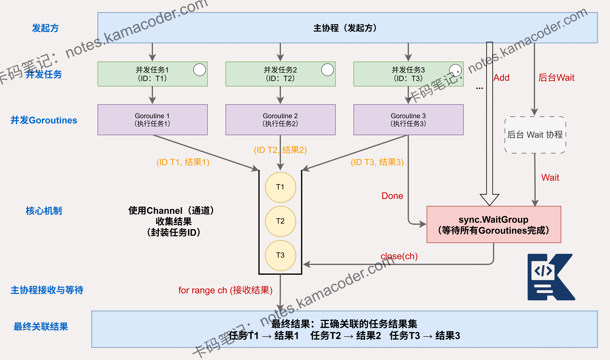

# 如何等待并收集多个并发goroutine的执行结果？

> 来源: https://notes.kamacoder.com/go/go_multiple_goroutines.html

# `# 如何等待并收集多个并发goroutine的执行结果？ 

如何等待并收集多个并发 goroutine 的执行结果，并确保能正确地将结果与其对应的发起方或任务关联起来？ 

## `# 简要回答 

在 Go 中，可以通过以下几种主要方式等待并收集多个 goroutine 的执行结果： 
  - 使用 **channel** 传递结果，将结果与任务标识（如 ID）封装在结构体中发送，主 goroutine 接收并关联；   - 使用 **sync.WaitGroup** 等待所有 goroutine 完成，同时使用**预分配大小的切片（Slice）**通过索引直接无锁写入结果，或使用共享数据结构（如 map，需加互斥锁）存储；   - 使用官方扩展包 **golang.org/x/sync/errgroup**，它原生封装了 WaitGroup、错误处理和 Context 的生命周期管理，是处理此类场景的最佳实践。 

## `# 详细回答 

在 Go 中，等待并收集多个 goroutine 结果的常用且安全的方法有以下几种： 
  - **使用 channel 传递结果**：每个 goroutine 将结果（通常封装成包含任务 ID 的结构体以确保关联）发送到 channel 中，主 goroutine 接收结果。可以使用带缓冲的 channel 以防 goroutine 阻塞。需要注意 channel 的关闭时机，通常配合 WaitGroup 在所有任务结束后关闭。   - **使用 sync.WaitGroup 结合 Slice/Map**：主 goroutine 使用 WaitGroup 等待所有任务完成。**推荐做法**是预先分配一个与任务数相同大小的 Slice，将任务索引（index）传给 goroutine，在 goroutine 中直接按索引写入结果（如 `results[i] = res`），这种方式并发安全且无需加锁。如果必须使用 map，则因为 map 非并发安全，必须配合互斥锁（`sync.Mutex`）或使用 `sync.Map`。   - **使用 errgroup 和 context.Context**：结合 `golang.org/x/sync/errgroup` 可以极其优雅地管理并发任务。它不仅能控制 goroutine 的生命周期（某个任务失败时自动取消其他任务的 context），还能直接收集第一个发生的错误，有效避免资源浪费。 

无论使用哪种方式，确保结果与发起方关联的核心在于：**在结果数据中携带任务标识（如传入的任务 ID、索引或请求参数）**，或者**严格按照固定的内存位置（如 Slice 索引）进行写入**。 

## `# 知识图解 

 

## `# 知识扩展 

在 Go 中，等待并收集多个 goroutine 结果时，需要注意以下几点： 
  - **并发安全**：使用共享数据结构（如 map）存储结果时，需要使用互斥锁（sync.Mutex）或原子操作保护，避免数据竞争。   - **channel 的关闭**：使用 channel 传递结果时，需要注意 channel 的关闭时机，避免主 goroutine 一直阻塞。可以使用 sync.WaitGroup 等待所有 goroutine 完成后再关闭 channel。   - **context 的使用**：结合 context 可以控制 goroutine 的生命周期，当需要取消 goroutine 的执行时，可以使用 context 的 CancelFunc。   - **错误处理**：需要考虑 goroutine 执行过程中可能出现的错误，将错误信息与结果一起传递，确保主 goroutine 能够正确处理错误。 

### `# 面试官可能会追问 

Q1：如何处理 goroutine 执行过程中的错误？ 

A1：可以将结果和错误一起封装到一个结构体中，通过 channel 传递。例如：`type Result struct { TaskID int; Value interface{}; Err error }`。主程序接收 Result 后，检查 Err 字段。另外，如果只关心是否全部成功，可以直接使用 `errgroup.Group`，它会自动捕获并返回第一个返回的 error。 

Q2：如何限制并发 goroutine 的数量？ 

A2：可以使用带缓冲的 channel 作为并发控制的信号量（Semaphore）。例如：`sem := make(chan struct{}, 5)`，每个 goroutine 在执行实际逻辑前先向 sem 写入数据（`sem <- struct{}{}`），执行完成后读取数据释放槽位（`<-sem`）。这种方式可以严格控制同时活跃的 goroutine 数量，防止资源耗尽。 

Q3：如何保证处理或输出 goroutine 结果的顺序与输入顺序一致？ 

A3：可以**使用预分配的切片（Slice）**。在启动 goroutine 前，创建一个长度与任务数量相等的切片 `results := make([]Result, len(tasks))`。将任务的索引 `i` 传给 goroutine，在计算完成后直接赋值 `results[i] = res`。主程序等待所有任务完成（WaitGroup）后，直接按顺序遍历该切片即可。如果使用 channel 乱序收集，则必须在收集完毕后根据任务 ID 在主协程中重新排序。
