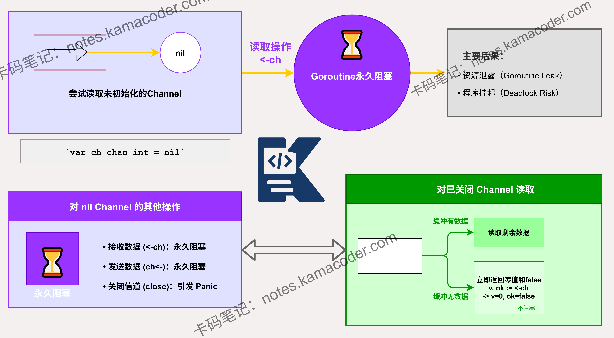

# 对值为nil的channel读取会发生什么？

> 来源: https://notes.kamacoder.com/go/go_channel_nil.html

# `# 对值为nil的channel读取会发生什么？ 

对值为nil的channel读取会发生什么？ 

## `# 简要回答 

从 `nil channel` 读取会导致 goroutine 永久阻塞。 

`nil channel` 是未初始化的 channel，既没有缓冲区也没有关联的 goroutine。 

当尝试从 `nil channel` 读取时，goroutine 会进入等待状态，且无法被唤醒 

这与关闭的 channel 不同，关闭的 channel 读取会立即返回零值和 `false`（或缓冲的剩余数据）。 

在 Go 语言中，`nil channel` 常用于 `select` 语句中**动态禁用某个 case 分支**。 

## `# 详细回答 

从 `nil channel` 读取会导致 goroutine 永久阻塞。这是 Go 语言的设计决策，`nil channel` 既不能发送也不能接收数据。当 goroutine 尝试从 `nil channel` 读取时，它会进入等待状态，且无法被唤醒。 

`nil channel` 的这种特性在某些场景下是有用的。例如，在 `select` 语句中，可以通过将 channel 赋值为 `nil` 来**动态地禁用该分支**，让 goroutine 只等待其他 case 条件满足： 

```
// 假设 ch1 在某个条件下被赋值为 nil (例如已经读取完毕)
select {
case data, ok := <-ch1:
    // 如果 ch1 为 nil，此分支会永久阻塞，相当于被 select 忽略
    if !ok {
        ch1 = nil // 读取结束后将 channel 置为 nil，禁用此分支
    } else {
        // 处理 ch1 的数据
    }
case <-ch2:
    // 处理 ch2
}

```

 

但在普通的读取操作中，必须确保 channel 已经初始化。如果 channel 可能为 nil，应该先进行检查： 

```
if ch != nil {
    <-ch
}

```

 

否则，会导致 goroutine 永久阻塞，造成资源泄露。 

在 Go 语言中，`nil channel` 与已关闭的 channel 有本质区别，已关闭的 channel 可以非阻塞地读取到零值和 `false`，而 `nil channel` 会让 goroutine 永久阻塞。 

## `# 知识图解 


 

## `# 知识扩展 

在 Go 语言中，channel 的状态有三种：nil、已初始化但未关闭、已关闭。这三种状态的行为各不相同： 
  - **nil channel**：发送和接收操作都会阻塞，且无法被唤醒。   - **已初始化但未关闭的 channel**：根据 channel 类型（无缓冲或有缓冲）决定发送和接收的行为。   - **已关闭的 channel**：发送操作会 panic，接收操作会读取完缓冲区剩余数据后，返回零值和 `false`。 

理解这三种状态的区别对于编写正确的并发程序至关重要。特别是在处理 goroutine 间通信时，必须清楚 channel 的当前状态，避免意外的阻塞或 panic。 

### `# 面试官可能会追问 

Q1：**如何避免对 nil channel 进行操作？** 

A1：避免对 `nil channel` 进行操作的核心方法是**确保 channel 在使用前已经被正确初始化**。 

在 Go 语言中，应该使用内置的 `make` 函数来显式初始化 channel（例如 `ch := make(chan int)`）。 

同时，在不确定 channel 状态的复杂逻辑中，可以在使用前检查它是否为 `nil`（即 `if ch != nil`），以避免因为误操作导致 goroutine 永久阻塞。 

Q2：**如何安全地处理可能为 nil 的 channel？** 

A2：处理可能为 `nil` 的 channel 时，有两种主要方法： 
  - **显式检查 nil**：在使用 channel 前，先检查是否为 `nil`。   - **使用 select 的 default 分支**：通过 `select` 实现非阻塞读取。需要注意的是，如果 channel 为 `nil`，或者 channel 非 `nil` 但暂时没有数据，都会走到 `default` 分支。 

例如： 

```
// 方法一：显式检查
if ch != nil {
    data, ok := <-ch
    if ok {
        // 处理数据
    }
}

// 方法二：使用 select 进行非阻塞读取
select {
case data, ok := <-ch:
    if ok {
        // 处理数据
    }
default:
    // channel 为 nil，或 channel 中暂时没有数据时，走此分支避免阻塞
}

```

 

Q3：**nil channel 和已关闭的 channel 有什么区别？** 

A3：`nil channel` 和已关闭的 channel 的主要区别在于： 
  - **nil channel**：是未初始化的 channel，既没有缓冲区也没有关联的 goroutine。   - **已关闭的 channel**：是已初始化但已关闭的 channel，仍然存在缓冲区（如果是有缓冲 channel）。 

它们的行为差异： 
  - **从 nil channel 读取**：永久阻塞。   - **从已关闭的 channel 读取**：不阻塞。如果缓冲区有未读数据，会正常读出；如果缓冲区为空，返回零值和 `false`。   - **向 nil channel 发送**：永久阻塞。   - **向已关闭的 channel 发送**：panic。
