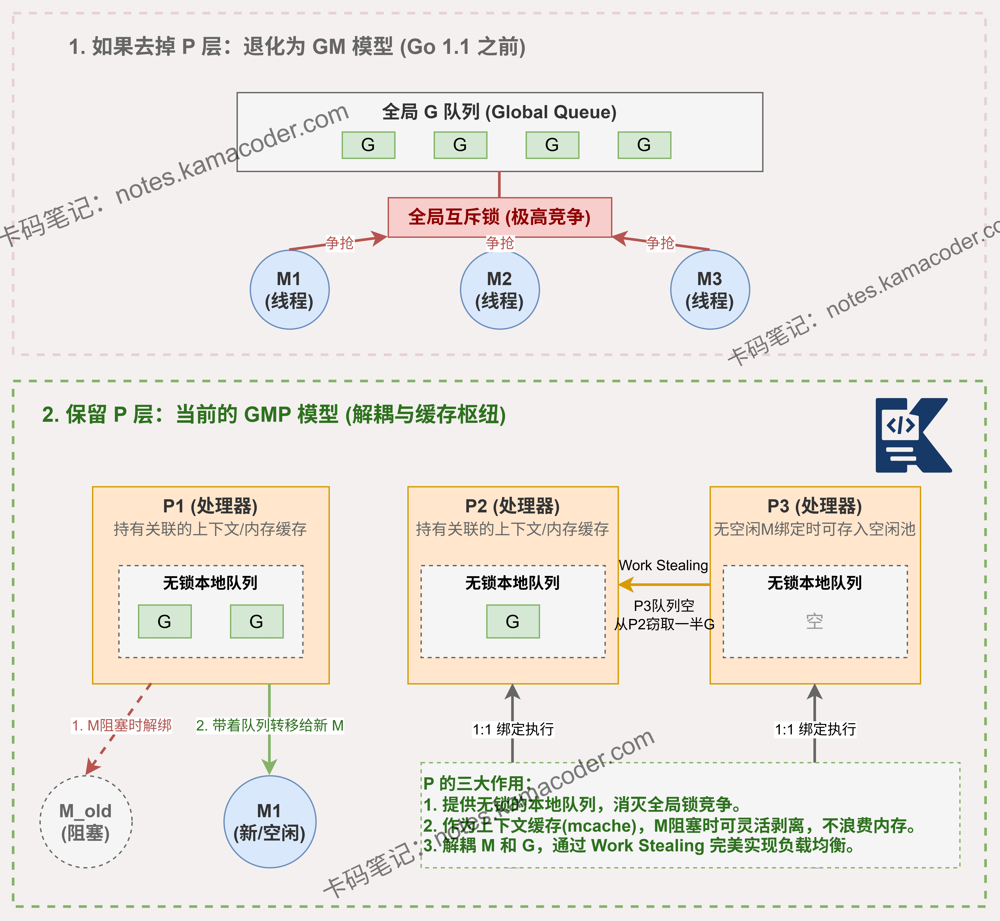

# GMP模型中P这一层能否去掉？去掉会带来什么问题？

> 来源: https://notes.kamacoder.com/go/go_gmp_p.html

# `# GMP模型中P这一层能否去掉？去掉会带来什么问题？ 

GMP模型中，P这一层能否去掉？如果去掉会带来什么问题？ 

## `# 简要回答 

理论上P层可以去掉，退化成GM模型（早期Go 1.0版本就是这样），但会带来严重性能问题。 

去掉P后，所有goroutine只能放在全局队列中，所有M都需要竞争全局锁来获取G，导致锁竞争激烈。 

同时会失去本地缓存、work stealing机制、以及GOMAXPROCS对并行度的精确控制，最终造成调度效率大幅下降，多核CPU利用率低下。 

## `# 详细回答 

P层不能去掉，它是Go调度器性能的关键。 

如果退化成GM模型，会产生四大问题： 

第一，全局队列锁竞争。所有M都要抢全局锁获取G，高并发下锁成为瓶颈，调度延迟暴增。 

第二，失去本地缓存。P持有mcache用于小对象内存分配，去掉P后每次分配都要加锁访问mcentral，内存分配效率骤降。 

第三，无法work stealing。P的本地队列支持无锁操作和任务窃取，去掉后无法实现负载均衡，部分M空转而其他M过载。 

第四，失去并行度控制。GOMAXPROCS通过限制P数量精确控制并行线程数，去掉P后无法有效管理系统资源。 

P层的设计本质是**用空间换时间**，通过增加一层逻辑处理器，实现了高效的两级调度和本地化优化。 

## `# 知识图解 

 

## `# 知识扩展 

P的设计体现了经典的分治思想。每个P维护256容量的本地队列（环形数组实现），新建的G优先放入当前P的本地队列，只有队列满时才放入全局队列。M执行时优先从绑定的P本地队列获取G（无锁操作），本地队列空时才尝试从全局队列获取（需要加锁），或者从其他P偷取一半任务（work stealing）。这种设计使得大部分调度操作都是无锁的，只有少数情况才需要全局同步。此外，P还承载了GC相关的写屏障缓冲区、defer池、timer堆等关键数据结构，是Go运行时的核心组件。 

### `# 面试官可能会追问 

**Q1：P的数量是如何确定的？可以动态调整吗？** 

A1：P的数量由GOMAXPROCS决定，默认等于CPU核心数。 

可以通过runtime.GOMAXPROCS()动态调整，但不建议频繁修改。 

调整时会触发STW，重新分配P并迁移G。 

增加P数量可以提高并行度，但过多会增加调度开销和内存占用（每个P约2KB）。 

减少P会降低并行度但节省资源。 

生产环境通常保持默认值，除非有特殊需求如容器限额场景需要手动设置。 

**Q2：P的本地队列满了之后，新的goroutine会怎么处理？** 

A2：当P的本地队列满（256个G）时，会触发"队列溢出"处理： 

将本地队列的前一半（128个G）和新创建的G一起打包，通过加全局锁的方式批量放入全局队列。 

这种批量转移策略减少了锁操作频率，是一种性能优化。 

其他空闲的P或M会定期检查全局队列，通过work stealing机制获取这些G。 

**Q3：work stealing机制具体是如何工作的？** 

A3：当M执行完当前P的本地队列所有G后，会按以下顺序寻找新任务： 

首先检查全局队列（加锁获取），如果全局队列为空，则随机选择其他P进行任务窃取。 

窃取时会从目标P的本地队列尾部偷取一半任务（runqsteal函数），采用无锁CAS操作提高效率。 

如果多次窃取失败，M会进入自旋状态短暂等待，最终仍无任务则进入睡眠。
