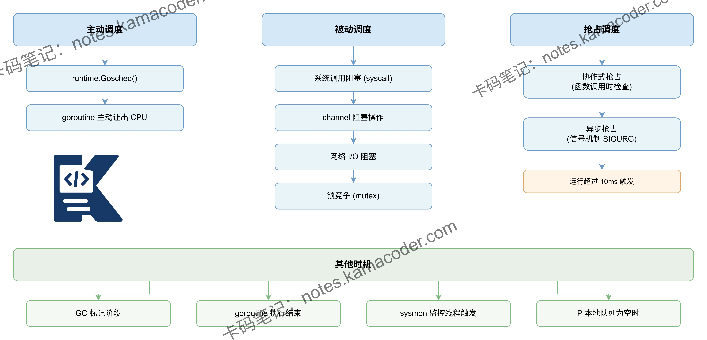

# GMP调度模型发生调度的时机有哪些？

> 来源: https://notes.kamacoder.com/go/go_gmp_schedule_timing.html

# `# GMP调度模型发生调度的时机有哪些？ 

GMP调度模型发生调度的时机有哪些？ 

## `# 简要回答 

Go的GMP调度模型主要在以下时机触发调度： 

1）**主动调度**：goroutine调用runtime.Gosched()主动让出CPU； 

2）**被动调度**：channel操作阻塞、网络IO阻塞、系统调用阻塞、锁等待等场景； 

3）**抢占式调度**：goroutine执行时间超过10ms会被sysmon线程标记抢占，Go 1.14后支持基于信号的异步抢占； 

4）**正常结束**：goroutine执行完毕退出时触发调度。 

## `# 详细回答 

GMP调度发生的时机可分为四大类： 

第一，**主动调度**。goroutine通过runtime.Gosched()主动让出CPU，或在函数调用时进行栈空间检查发现需要扩容时触发调度。 

第二，**被动调度**。包括channel的发送接收操作阻塞、网络IO操作阻塞、系统调用（如文件读写）阻塞、sync包的锁等待、time.Sleep休眠等场景，这些都会让当前goroutine让出M，调度其他可运行的goroutine。 

第三，**抢占式调度**。sysmon监控线程会定期检查运行超过10ms的goroutine并标记抢占标志，Go 1.14引入基于信号的异步抢占机制，可在任意执行点抢占长时间运行的goroutine，解决了协作式抢占的局限。 

第四，**正常结束**。goroutine执行完毕退出时，会触发调度选择下一个待运行的goroutine。 

这些机制共同保证了Go程序的并发性能和响应能力。 

## `# 知识图解 

 

## `# 知识扩展 

Go 1.14之前采用协作式抢占，依赖函数调用时的栈检查，存在无法抢占无函数调用的死循环问题。 

Go 1.14引入基于信号的异步抢占：sysmon发现长时间运行的goroutine后，向对应M发送SIGURG信号，M收到信号后在信号处理函数中保存当前执行状态并切换到调度器。 

这种机制解决了紧密循环、CGO调用等场景的抢占问题。 

此外，P的本地队列为无锁设计，全局队列需要加锁，调度器会优先从P本地队列获取goroutine，每61次调度会从全局队列获取一次，防止全局队列饥饿。 

### `# 面试官可能会追问 

**Q1：Go 1.14之前的协作式抢占有什么问题？异步抢占是如何实现的？** 

A1：协作式抢占依赖函数调用时的栈增长检查来插入抢占点，存在明显缺陷：无函数调用的死循环、紧密计算循环、CGO调用等场景无法被抢占，导致其他goroutine饥饿。 

Go 1.14引入基于信号的异步抢占：sysmon监控线程发现goroutine运行超过10ms后，向其所在的M发送SIGURG信号，M的信号处理函数会保存当前goroutine的执行上下文，将其状态改为可抢占，然后调用schedule()切换到其他goroutine。 

这种机制可在任意执行点实现抢占，彻底解决了协作式抢占的局限性。 

**Q2：sysmon监控线程具体做哪些工作？它是如何触发抢占的？** 

A2：sysmon是Go运行时的系统监控线程，不需要绑定P即可运行。 

它的主要工作包括：
1）检查运行超过10ms的goroutine并标记抢占标志preempt；
2）回收长时间处于系统调用的P，将其转交给其他M；
3）触发垃圾回收；
4）清理过期的timer。 

触发抢占的具体流程：sysmon每20微秒到10毫秒轮询一次，遍历所有P，检查其上运行的goroutine执行时间，若超过10ms则调用preemptone()函数，在Go 1.14后会向M发送SIGURG信号实现异步抢占，1.14前则设置抢占标志等待函数调用时的栈检查触发。 

**Q3：channel操作为什么会触发调度？具体流程是怎样的？** 

A3：channel操作触发调度是因为发送或接收可能导致阻塞。 

具体流程是当向channel发送数据时，如果channel已满或无接收者，发送goroutine会调用gopark()将自己挂起，状态变为waiting，并将自己加入channel的发送等待队列，然后调用schedule()让出M； 

当从channel接收数据时，如果channel为空，接收goroutine同样会gopark()挂起并加入接收等待队列。 

当另一个goroutine完成对应的接收或发送操作后，会调用goready()唤醒等待队列中的goroutine，将其状态改为runnable并放入运行队列。 

这种机制避免了忙等待，提高了CPU利用率。
