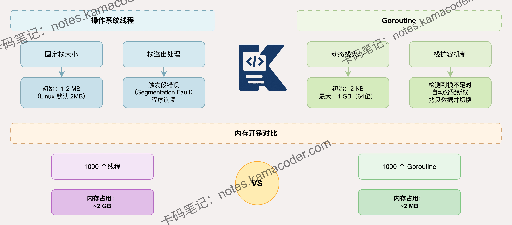

# Goroutine和线程在栈内存管理上有什么根本不同？

> 来源: https://notes.kamacoder.com/go/go_goroutine_thread_stack_memory.html

# `# Goroutine和线程在栈内存管理上有什么根本不同？ 

Goroutine和线程在栈内存管理上有什么根本不同？ 

## `# 简要回答 

Goroutine采用**动态可增长栈**，初始仅2KB，按需扩容至最大1GB； 

线程使用固定大小栈，Linux默认8MB，Windows默认1MB，创建时一次性分配。 

Goroutine通过**栈拷贝**实现扩容，运行时检测栈溢出并自动迁移； 

线程栈由操作系统管理，溢出直接崩溃。 

这使得Goroutine能以极低内存开销支持百万级并发，而线程受限于固定栈开销，通常只能创建数千个。 

## `# 详细回答 

线程栈是操作系统在创建时通过mmap等系统调用分配的连续虚拟内存区域，大小固定且包含Guard Page防止溢出，但这导致每个线程至少占用1-8MB内存。 

Goroutine栈则完全由Go运行时管理，初始分配2KB（Go 1.4后从4KB优化），存储在堆上可随时迁移。 

当函数调用深度增加导致栈空间不足时，运行时会触发栈扩容： 

分配2倍大小的新栈，将旧栈数据完整拷贝过去，并更新所有指针引用，这个过程在STW期间完成保证并发安全。 

## `# 知识图解 

 

## `# 知识扩展 

Goroutine栈扩容的触发时机是编译器在函数序言插入的栈溢出检查代码，对比SP寄存器和stackguard0判断剩余空间。 

扩容倍率采用2倍增长策略平衡内存和拷贝开销。 

栈收缩发生在GC期间，当栈使用率低于1/4且大于初始大小时触发。 

栈上数据包括局部变量、函数参数、返回地址，拷贝时需要精确识别指针类型并更新引用，这依赖编译器生成的栈映射表。 

线程栈则通过mprotect设置Guard Page为不可访问，访问时触发SIGSEGV信号终止进程，无法动态调整。 

### `# 面试官可能会追问 

**Q1：栈拷贝过程中如何保证指针的正确性？** 

A1：Go运行时依赖编译器生成的栈映射表精确识别栈上每个指针的位置和类型。 

拷贝时会遍历栈帧，根据栈映射表找到所有指针，计算它们在新栈中的偏移量并更新引用。 

对于指向旧栈的指针，会加上新旧栈的地址差值进行调整；指向堆的指针保持不变。 

整个过程在STW期间完成，避免并发修改导致的数据竞争。 

这要求编译器在生成代码时记录每个安全点的栈布局信息。 

**Q2：为什么线程不能像Goroutine一样动态扩容栈？** 

A2：线程栈由操作系统内核管理，地址空间布局在创建时固定，栈顶和栈底地址已确定且相邻区域可能被其他内存映射占用，无法原地扩展。 

若要迁移需要修改所有栈上指针和寄存器，但内核无法获取用户态的类型信息来区分指针和普通数据。 

此外线程切换由内核调度，用户态无法介入拷贝过程。 

Go运行时则完全控制Goroutine调度和内存布局，栈分配在堆上可自由迁移，且编译器提供类型信息支持精确指针识别。 

**Q3：栈拷贝的性能开销大吗？会影响程序性能吗？** 

A3：单次栈拷贝开销与栈大小成正比，2KB栈拷贝仅需微秒级，但随着栈增长到MB级别开销会显著增加。 

Go通过2倍扩容策略减少拷贝频率，栈从2KB增长到1GB理论上只需10次拷贝。 

实际应用中大部分Goroutine栈保持在几十KB，拷贝开销可忽略。 

Hot Split问题已通过连续栈解决，避免频繁扩缩容。 

相比线程固定栈浪费的内存和创建开销，动态栈的拷贝成本是值得的，这也是Go能高效支持百万级并发的关键设计。
