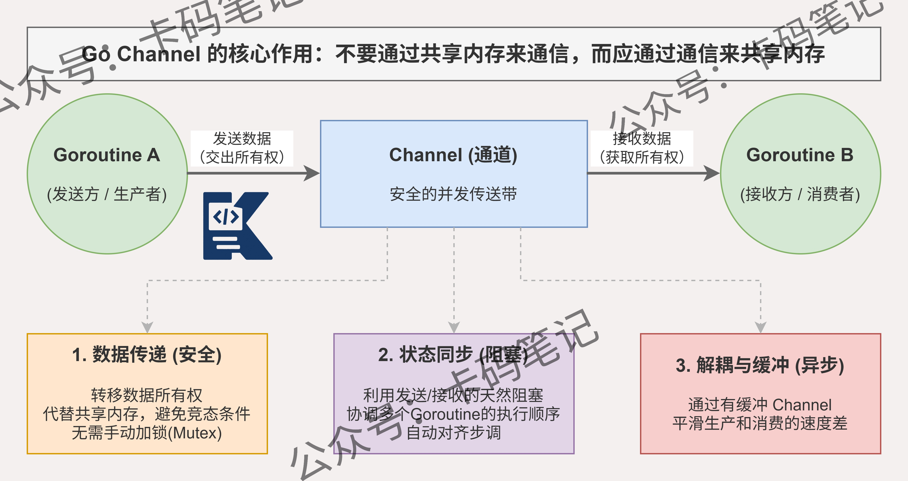

# Go语言中channel的作用是什么？

> 来源: https://notes.kamacoder.com/go/go_channel_use.html

# `# Go语言中channel的作用是什么？ 

Go语言中channel的作用是什么？ 

## `# 简要回答 

**channel** 是 Go 语言中用于 **goroutine** 之间通信和同步的核心机制。 

它遵循 Go 的设计哲学：**"不要通过共享内存来通信，而要通过通信来共享内存"**。 

**channel** 本质上是一个 **线程安全的队列**，goroutine 可以向其发送数据，也可以从中接收数据，从而实现并发协作。 

## `# 详细回答 

**channel** 在 Go 并发编程中承担着 **通信**、**同步** 和 **数据传递** 三大核心职责。 

按照是否有缓冲，channel 分为两类： 
  - **无缓冲 channel**：发送方和接收方必须同时就绪，否则阻塞，天然实现 **同步语义**   - **有缓冲 channel**：队列未满时发送不阻塞，队列为空时接收阻塞，适合 **异步解耦** 场景   - **单向 channel**：限制只读或只写，常用于函数参数中约束 **访问权限**，提升代码安全性 

**channel** 配合 **select** 语句可以同时监听多个 channel，实现超时控制、多路复用等高级并发模式。 

**关闭 channel** 后仍可读取剩余数据，读完后返回零值和 `false`，常用于广播通知多个 goroutine **退出信号**。 

向已关闭的 channel 发送数据会触发 **panic**，向 **nil channel** 发送或接收会永久阻塞，使用时需格外注意。 

## `# 知识图解 


 

## `# 知识扩展 

**channel** 底层由 `runtime.hchan` 结构体实现，包含一个 **环形队列**、发送队列、接收队列和一把 **互斥锁**。 

理解底层结构有助于写出更高效、更安全的并发代码。 

### `# 面试官可能会追问 

**Q1：channel 和 mutex 分别适合什么场景？** 

A1：**channel** 适合 goroutine 之间传递数据、传递所有权、协调执行流程等 **通信场景**。 

**mutex** 适合保护共享状态，多个 goroutine 需要读写同一块数据时使用 **互斥锁** 更直接高效。 

简单判断原则：需要 **传递数据** 用 channel，需要 **保护数据** 用 mutex。 

**Q2：如何用 channel 实现一个超时控制？** 

A2：配合 **select** 和 `time.After` 可以优雅实现超时。 

```
select {
case result := <-ch:
    fmt.Println(result)
case <-time.After(3 * time.Second):
    fmt.Println("timeout")
}

```

 

`time.After` 返回一个 **定时 channel**，超时后自动发送信号，select 选中后直接走超时分支，无需额外线程。 

**Q3：什么情况下会发生 goroutine 泄漏？** 

A3：最常见的原因是 goroutine 阻塞在 **channel 的发送或接收** 上，且没有任何其他 goroutine 来配对。 

例如只启动了发送方，接收方从未启动，发送方会永久阻塞，导致 **goroutine 泄漏**。 

排查时可使用 `runtime.NumGoroutine` 监控数量，或借助 **pprof** 的 goroutine 分析工具定位泄漏点。
