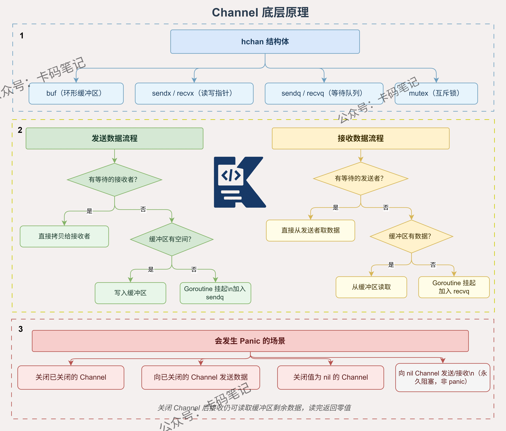

# Go语言中channel的底层原理是什么？在什么时候会发生panic？

> 来源: https://notes.kamacoder.com/go/go_channel_principle.html

# `# Go语言中channel的底层原理是什么？在什么时候会发生panic？ 

Channel的底层原理是什么？在什么时候会发生panic？ 

## `# 简要回答 

**Channel**的底层是一个名为**hchan**的结构体，包含一个**环形缓冲区**、发送和接收的索引指针，以及两个**goroutine等待队列**。 

**发送方**和**接收方**通过**互斥锁**保证并发安全，当缓冲区满或空时，goroutine会被挂起到对应的**等待队列**中。 

**Channel**在三种情况下会触发**panic**：向已关闭的Channel发送数据、重复关闭Channel、关闭值为**nil**的Channel。 

## `# 详细回答 

**hchan**结构体是Channel的核心，其中**buf**字段指向一块环形缓冲区内存，**sendx**和**recvx**分别记录发送和接收的当前索引位置。 

**qcount**记录缓冲区中当前元素数量，**dataqsiz**记录缓冲区总容量，两者配合判断缓冲区是否已满或为空。 

**sendq**和**recvq**是两个**sudog**等待队列，分别存放因缓冲区满而阻塞的发送方goroutine，以及因缓冲区空而阻塞的接收方goroutine。 

当缓冲区有空位时，**运行时**会从**recvq**唤醒一个等待的接收方，直接将数据拷贝过去，避免二次入队。 

**panic**的三种触发场景如下： 
  - **向已关闭的Channel发送数据**：运行时检测到**closed**标志位为1，立即触发panic   - **重复关闭同一个Channel**：第二次关闭时同样检测到**closed**为1，触发panic   - **关闭nil Channel**：Channel未初始化，**close**操作直接触发panic 

**无缓冲Channel**发送时若无接收方，goroutine直接挂入**sendq**并让出调度权，直到接收方到来完成数据交换。 

## `# 知识图解 

 

## `# 知识扩展 

**Channel**的设计哲学来自CSP模型，核心思想是"通过通信共享内存，而不是通过共享内存来通信"。 

**select**语句配合Channel使用时，底层会对所有涉及的Channel按地址排序后依次加锁，避免死锁。 

### `# 面试官可能会追问 

**Q1：无缓冲Channel和有缓冲Channel在调度行为上有什么区别？** 

A1：**无缓冲Channel**发送时，发送方goroutine会直接挂入**sendq**并让出CPU，等待接收方到来后由接收方完成数据拷贝并唤醒发送方。 

**有缓冲Channel**在缓冲区未满时，发送方直接将数据写入**buf**并返回，不会阻塞，只有缓冲区满时才会挂起。 

两者的本质区别在于**同步点**不同，无缓冲Channel强制要求发送和接收同时就绪，有缓冲Channel允许一定程度的**异步解耦**。 

**Q2：从已关闭的Channel接收数据会panic吗？** 

A2：不会**panic**，这是Go的设计决策之一。 

从已关闭的Channel接收数据，如果缓冲区还有数据，会正常返回剩余数据；如果缓冲区为空，会返回该类型的**零值**以及一个**false**标志位。 

因此推荐使用`v, ok := <-ch`的形式接收，通过**ok**判断Channel是否已关闭，避免误将零值当作有效数据处理。 

**Q3：Channel和Mutex分别适合什么场景？** 

A3：**Channel**适合goroutine之间传递数据和传递所有权的场景，例如任务分发、结果收集、流水线处理，符合CSP的**通信共享**思想。 

**Mutex**适合保护共享状态的场景，例如多个goroutine并发读写同一个**map**或计数器，直接加锁比通过Channel绕一圈更简洁高效。 

简单判断原则：传递数据用**Channel**，保护状态用**Mutex**。
