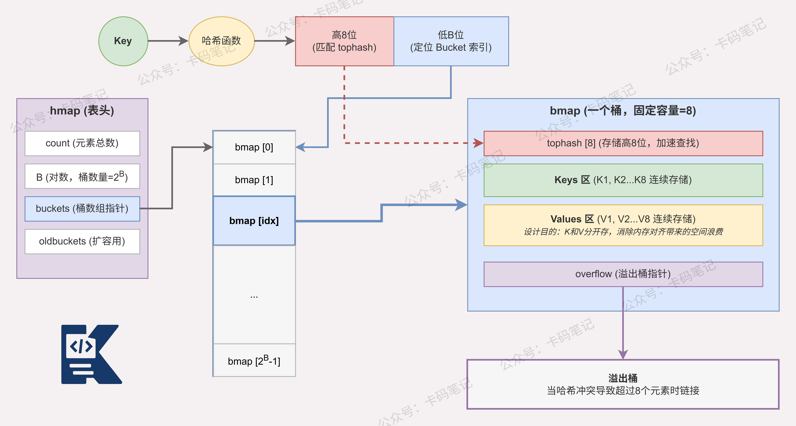

# Go语言中map底层是如何实现的？

> 来源: https://notes.kamacoder.com/go/go_map.html

# `# Go语言中map底层是如何实现的？ 

Go语言中的map底层是如何实现的？ 

## `# 简要回答 

**Go语言的map底层基于哈希表实现，核心结构是`hmap`。** 

`hmap`中维护了一个`bmap`数组，每个`bmap`称为哈希桶，每个桶最多存储8个键值对。 

当发生哈希冲突时，通过溢出桶链式连接解决。 

当负载因子超过6.5或溢出桶数量过多时，触发扩容操作，扩容采用渐进式迁移策略，避免一次性迁移造成性能抖动。 

## `# 详细回答 

**Go的map底层核心结构是`hmap`，其中关键字段包括桶数组指针`buckets`、元素数量`count`、扩容状态`oldbuckets`等。** 

每个桶对应一个`bmap`结构，包含以下核心设计： 
  - **tophash数组**：存储每个key哈希值的高8位，用于快速比对，避免无效的全量key比较   - **键数组和值数组**：以非交叉方式分开存储，即先存所有key再存所有value，减少内存对齐损耗   - **overflow指针**：指向溢出桶，当当前桶存满8个元素后，通过链表方式串联新桶 

查找时，Go先用哈希值低位确定桶编号，再用高8位与tophash比对，命中后才做完整key比较，大幅提升查询效率。 

扩容分为两种策略： 
  - **翻倍扩容**：负载因子超过6.5时触发，桶数量翻倍   - **等量扩容**：溢出桶过多但元素不多时触发，整理内存碎片 

扩容采用渐进式迁移，每次写操作时迁移少量桶，避免长时间阻塞。 

## `# 知识图解 

 

## `# 知识扩展 

Go的map在并发场景下是非线程安全的，并发读写会直接触发`fatal error: concurrent map read and map write`。 

官方提供了`sync.Map`用于并发场景，其内部通过读写分离和原子操作减少锁竞争，适合读多写少的场景。 

### `# 面试官可能会追问 

**Q1：为什么map的key必须是可比较类型？** 

A1：Go在查找key时，需要对桶内存储的key做**相等性比较**，以确认是否命中目标元素。 

如果key类型不支持`==`操作符，编译器无法完成比较逻辑，因此**slice、map、function**等不可比较类型不能作为key。 

可以使用**数组**代替slice作为key，因为数组是值类型且支持比较操作。 

**Q2：map的渐进式扩容是怎么工作的？** 

A2：扩容触发后，Go不会立刻迁移全部数据，而是保留旧桶指针`oldbuckets`，新桶和旧桶**同时存在**。 

每次对map进行**写操作或删除操作**时，触发少量旧桶数据向新桶迁移。 

迁移完成后旧桶被释放，通过这种方式将扩容开销**分摊到多次操作**中，避免单次阻塞。 

**Q3：sync.Map和加锁的map各适合什么场景？** 

A3：加锁的map适合**写操作频繁**的场景，锁粒度统一，实现简单，但高并发下锁竞争严重。 

`sync.Map`内部维护`read`和`dirty`两个map，读操作优先访问**无锁的read map**，命中则无需加锁。 

因此`sync.Map`适合**读多写少**、key相对固定的场景，写多场景反而因dirty提升频繁而性能下降。
