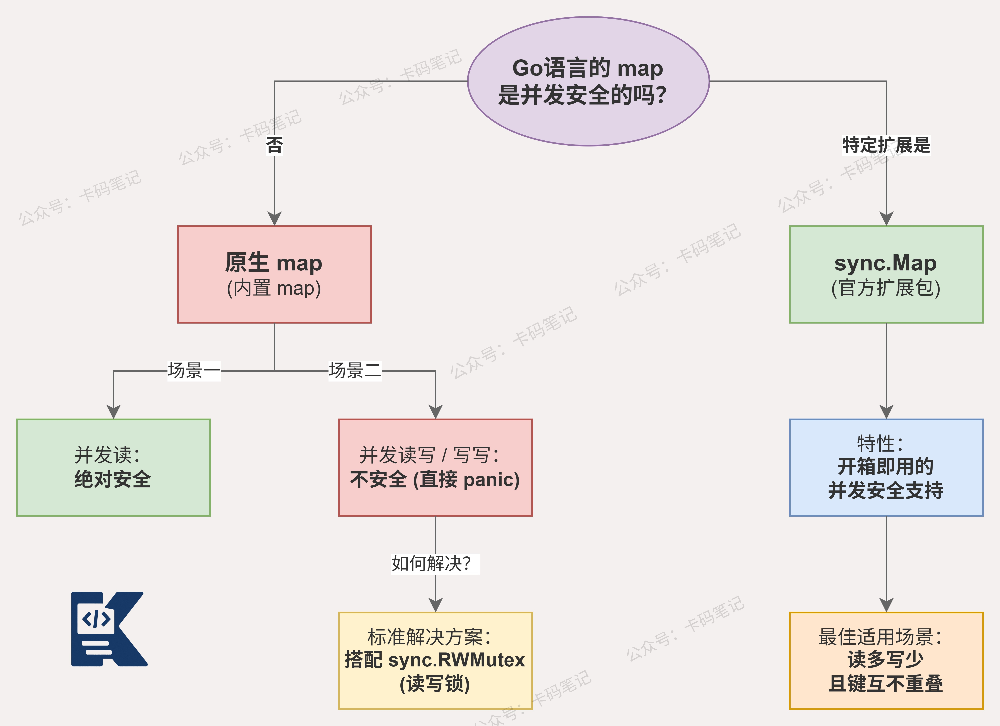

# Go语言中的map是否是并发安全的？

> 来源: https://notes.kamacoder.com/go/go_map_concurrent_safety.html

# `# Go语言中的map是否是并发安全的？ 

Go语言中的map是否是并发安全的？ 

## `# 简要回答 

**Go语言中的原生map不是并发安全的。** 

多个goroutine同时对map进行读写操作，会触发runtime的并发检测机制，直接抛出fatal错误导致程序崩溃，且无法被recover捕获。 

Go官方提供了两种解决方案：使用sync.Mutex或sync.RWMutex对map加锁保护，或者使用标准库中专为并发场景设计的sync.Map。 

## `# 详细回答 

Go的原生map底层使用哈希表实现，设计上并未内置任何锁机制。 

当多个goroutine并发读写同一个map时，runtime会通过一个内置的并发检测标志位检测到冲突。 

一旦检测到并发写操作，程序会直接触发fatal错误，输出concurrent map writes并立即终止，不同于普通panic，这个错误无法被recover拦截。 

针对并发场景，主要有以下解决方案： 
  - **sync.Mutex加锁**：对map的每次读写操作前后加互斥锁，简单粗暴，适合读写比例均衡的场景   - **sync.RWMutex读写锁**：读操作加读锁，写操作加写锁，读多写少的场景性能更优   - **sync.Map**：官方提供的并发安全map，内部通过read和dirty两个结构分离读写，适合读多写少或键值相对稳定的场景 

但使用时需要注意的是，sync.Map并非万能，在写多读少的场景下性能反而不如加锁的普通map。 

选择哪种方案需要结合实际的读写比例和业务场景来判断。 

## `# 知识图解 

 

## `# 知识扩展 

Go团队之所以让map在并发写时直接fatal而非panic，是经过深思熟虑的设计决策。 

fatal无法被recover捕获，这意味着并发map操作的错误不会被业务代码悄悄吞掉，强制暴露问题，避免数据静默损坏。 

### `# 面试官可能会追问 

**Q1：sync.Map的底层原理是什么？** 

A1：**sync.Map**内部维护了两个结构，一个是只读的**read map**，另一个是可写的**dirty map**。 

读操作优先从**read map**中无锁读取，命中则直接返回，性能极高。 

写操作和**read**未命中时，才加锁操作**dirty map**，并通过**misses计数器**判断是否将dirty提升为read，实现读写分离优化。 

**Q2：为什么说sync.Map不适合写多读少的场景？** 

A2：**sync.Map**在每次写入时都需要同时维护**read**和**dirty**两份数据结构，存在额外的**内存开销**和**同步成本**。 

当写操作频繁时，**dirty map**不断被修改，**misses**快速累积触发提升，频繁的提升操作反而带来额外锁竞争。 

此时直接使用**sync.RWMutex**保护普通map，结构更简单，性能反而更好。 

**Q3：Go还有哪些方式可以检测map的并发问题？** 

A3：Go提供了**race detector**工具，在编译和运行时加上`-race`标志即可开启。 

**race detector**基于**happens-before**算法，能在运行时动态检测所有数据竞争，不仅限于map，还覆盖变量、切片等共享数据结构。 

建议在**单元测试**和**CI流水线**中默认开启`-race`，将并发问题消灭在上线之前。
