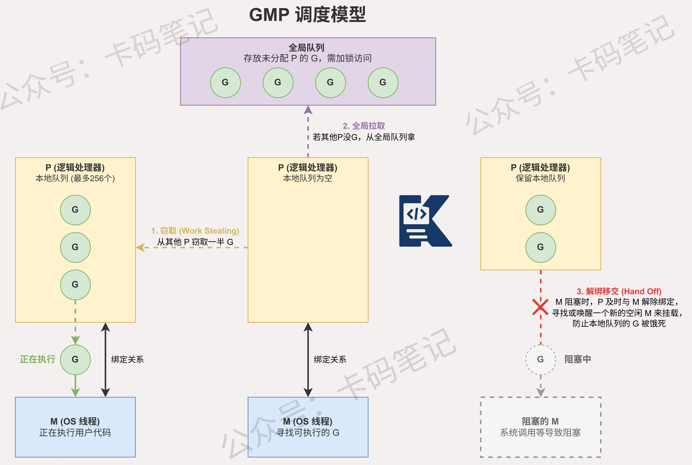

# Go语言的GMP调度模型是什么？G、M、P各自的作用是什么？

> 来源: https://notes.kamacoder.com/go/go_gmp_model.html

# `# Go语言的GMP调度模型是什么？G、M、P各自的作用是什么？ 

简述 Go 的 GMP 调度模型。G、M、P 各自的作用是什么？它们是如何协作的？ 

## `# 简要回答 

GMP是Go运行时的调度模型。 
  - G是goroutine，代表用户态轻量级线程；   - M是machine，对应操作系统线程；   - P是processor，代表调度上下文，持有G的本地队列。 

协作方式：P绑定M执行，从本地队列取G运行；当G阻塞时，M可能脱离P；空闲P会通过work stealing从其他P偷取G；全局队列作为补充。 

这种设计实现了高效的M:N调度模型，减少锁竞争，提升并发性能。 

## `# 详细回答 

**G — Goroutine（协程）** 

G 是 Go 并发的基本单元，本质上是一个用户态协程。每个 G 包含运行栈（初始 2KB，最大 1GB）、程序计数器、状态字段（运行中/可运行/阻塞等）。G 由 Go 运行时管理，创建和销毁成本远低于系统线程。 

**M — Machine（系统线程）** 

M 对应一个真实的操作系统线程，负责执行 G 中的代码。M 的数量不固定，当 G 发生系统调用阻塞时，运行时会创建新的 M 来保证其他 G 继续运行。M 本身无法直接运行 G，必须持有一个 P。 

**P — Processor（逻辑处理器）** 

P 是 GMP 模型的核心枢纽，数量由 `runtime.GOMAXPROCS()` 控制，默认等于 CPU 核数。P 持有一个本地 goroutine 队列（最多 256 个），同时维护内存分配缓存等资源。P 是 M 运行 G 的"执行许可证"。 

**协作流程** 
  - 新建 G 时，优先放入当前 P 的本地队列，满了则放全局队列。   - M 必须绑定 P，才能从 P 的本地队列取 G 执行。   - 本地队列为空时，P 先从全局队列取，再从其他 P 偷取一半 G。   - M 发生阻塞（如系统调用），运行时解绑 P，交给其他 M，防止 CPU 资源闲置。 

这种设计将调度粒度从线程级降低到 P 级，大幅减少锁竞争，是 Go 高并发性能的核心保障。 

## `# 知识图解 

 

## `# 知识扩展 

### `# work stealing 与 hand off 机制详解 

work stealing 是 GMP 中保证 CPU 利用率的关键机制。当某个 P 的本地队列为空时，它不会闲置，而是发起"偷窃"：随机选择另一个 P，将其本地队列后半部分的 G 转移过来。偷取的数量是目标队列长度的一半，这样两个 P 负载趋于均衡。若所有 P 的本地队列都为空，则从全局队列获取，全局队列也为空时，P 进入自旋等待。 

hand off 机制处理 M 阻塞的场景：当 M 执行的 G 发生阻塞型系统调用时，运行时检测到该 M 无法继续调度，立即将 M 与 P 解绑，把 P 分配给其他空闲 M（或新创建一个 M）。被解绑的 M 进入阻塞等待，系统调用返回后再尝试获取一个空闲 P，若没有则将 G 放回全局队列，M 自身进入休眠。两种机制配合，保证了无论 G 是计算密集还是 IO 密集，Go 的 CPU 利用率始终维持在高位。 

## `# 面试官可能会追问 

**Q1：G 阻塞在系统调用时，P 会怎么处理？整个流程是什么？** 

A1：G 阻塞在系统调用时，整个流程分两个阶段。 

阻塞阶段：M 执行 `entersyscall()` 保存当前 G 和 P 的状态，标记 P 为 `_Psyscall` 状态；sysmon 线程定期（10ms 一次）扫描所有 P，若发现 P 处于 `_Psyscall` 超过一个调度周期，则将该 P 抢走分配给其他 M，以维持并行度。 

恢复阶段：系统调用返回，M 执行 `exitsyscall()`，尝试绑定一个 P；若成功则继续运行 G；若失败则将 G 放入全局队列，M 自身进入休眠。整个过程对 G 透明，G 感知不到自己被"暂停"过。 

**Q2：全局队列和本地队列的关系是什么？调度优先级如何？** 

A2：本地队列是每个 P 私有的，读写无需加锁，是高频调度路径； 

全局队列是所有 P 共享的，访问需持有锁，是低频补充路径。 

两者的设计目的是在降低锁竞争的同时保证调度公平性。 

具体规则： 
  - ① 新 G 优先入本地队列，满则将本地队列前半部分批量移入全局队列；   - ② M 执行时每 61 次调度从全局队列取一个 G；   - ③ 本地队列耗尽时依次尝试：全局队列 → work stealing（其他 P）→ netpoller（返回可运行的网络 G）。
