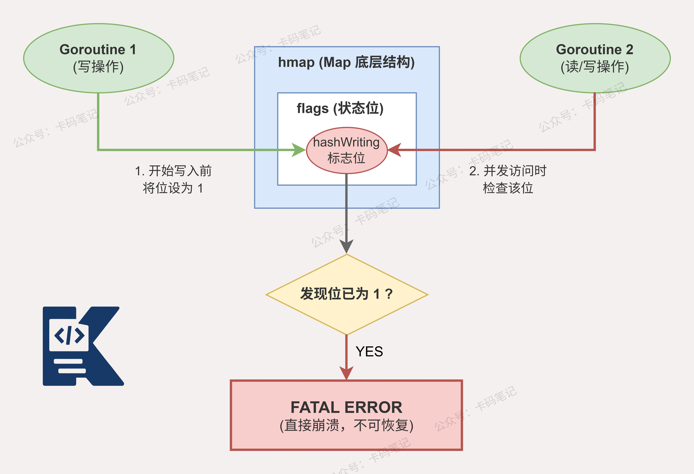

# 并发读写一个普通的map为什么会panic？

> 来源: https://notes.kamacoder.com/go/go_map_concurrent_panic.html

# `# 并发读写一个普通的map为什么会panic？ 

并发读写一个普通的map为什么会panic？ 

## `# 简要回答 

**Go的普通map在并发读写时会触发panic，根本原因是Go运行时内置了并发冲突检测机制。** 

map结构体中有一个`flags`字段，写操作时会设置`hashWriting`标志位，其他goroutine读写时检测到该标志位被置位，就会直接调用`throw`抛出错误。 

## `# 详细回答 

**Go的`map`底层结构是`runtime.hmap`，其中包含一个`flags uint8`字段用于状态标记。** 

并发读写触发panic的核心机制分为以下几步： 
  - **写操作开始时**，运行时会将`flags`字段的`hashWriting`位设置为1，标记当前有写操作正在进行   - **读操作或其他写操作发起时**，运行时会检查`hashWriting`标志位是否被置位   - **一旦检测到冲突**，运行时直接调用`throw`函数，触发不可恢复的`fatal error`，即panic   - **写操作完成后**，运行时清除`hashWriting`标志位，恢复正常状态 

这种检测并非100%可靠，它依赖于时序，极端情况下可能漏检，但只要检测到就必然panic。 

之所以设计成panic而非返回error，是因为数据竞争属于程序逻辑错误，应当在开发阶段暴露，而不是在生产环境中静默产生脏数据。 

解决方案通常有两种：使用`sync.Mutex`或`sync.RWMutex`保护普通map，或者直接使用标准库提供的`sync.Map`。 

## `# 知识图解 

 

## `# 知识扩展 

### `# 面试官可能会追问 

**Q1：sync.Map和加锁的普通map相比，性能优势体现在哪里？** 

A1：`sync.Map`内部采用了**读写分离**的设计，维护了一个`read`只读map和一个`dirty`读写map。 

**读操作**优先访问`read`map，无需加锁，通过原子操作完成，并发读性能极高。 

**写操作**只操作`dirty`map并加锁，当`dirty`中的数据被访问足够多次后，会被**原子提升**为`read`map，实现以空间换时间。 

因此`sync.Map`适合**读多写少**或**key相对固定**的场景，写多场景反而不如加锁的普通map。 

**Q2：除了sync.Map，还有哪些并发安全的map实现方案？** 

A2：第一种是**分片锁map**，将整个map拆分为N个分片，每个分片独立加锁，降低锁粒度，减少竞争，是高并发场景的常见优化手段。 

第二种是**channel串行化**，所有读写操作通过一个goroutine串行处理，利用channel传递请求，天然避免竞争。 

第三种是使用**第三方库**，如`orcaman/concurrent-map`，底层正是基于分片锁思想实现的高性能并发map。 

**实际项目中应根据读写比例和key数量选择最合适的方案。** 

**Q3：Go的race detector能检测到map的并发问题吗？** 

A3：可以，但两者检测机制不同，覆盖范围也不同。 

**race detector**通过`-race`编译标志启用，基于**ThreadSanitizer**实现，能检测所有类型的数据竞争，包括对普通变量、slice、map的并发读写，开销较大，通常只在测试环境使用。 

**map内置的hashWriting检测**是运行时的轻量级检测，无需额外编译标志，但仅针对map操作，且存在漏检可能。 

**在实际使用中我们最好两种手段结合使用**，开发测试阶段开启race detector，运行时依赖内置检测兜底。
