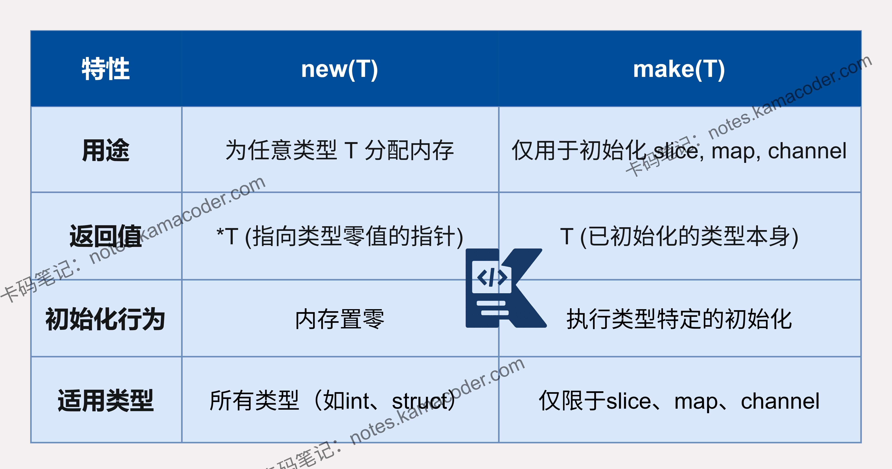
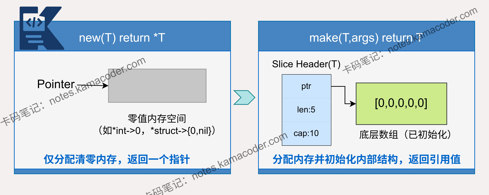

# Go语言中new和make的区别是什么？分别用于什么场景？

> 来源: https://notes.kamacoder.com/go/go_newVSmake.html

# `# Go语言中new和make的区别是什么？分别用于什么场景？ 

注意使用 new 时仅分配内存并返回指针，未初始化底层数组。 

以下为知识星球  (opens new window)录友分享的得物后端面试问题：“**Go语言中new和make有什么区别?分别用于什么场景？**”（下文知识框架部分提供了图例） 

## `# 简要回答 

在 Go 语言中，new 和 make 都是用于**内存分配**的内建函数，但它们的设计目的和适用场景有着根本的不同。 

new 只**分配内存并清零**，返回一个指向该类型零值的**指针**，适用于基本类型和结构体（struct）； 

而 make 不仅**分配内存**，还会进行**初始化**，专门用于创建切片（slice）、映射（map）和通道（channel）这三种内建的引用类型，并返回一个已初始化的、可直接使用的**值**，而非指针。 

## `# 详细回答 

在 Go 语言中，new 和 make 的根本区别在于用途与返回值。 

**new** 是一个通用内存分配器，会在堆上分配一块足够容纳类型 T 的内存空间，并将这块内存的所有位设置为零，最后返回指向这块内存的指针 *T。 
  - **对于值类型**（如基本类型、结构体），会得到一个指向有效零值的指针。   - **对于引用类型**（slice, map, channel），返回的是指向 nil 值的指针。例如，new([]int) 返回一个类型为 *[]int 的指针，但其指向的切片本身是 nil，**无法直接使用**。 

而**make** 是一个专用的构造函数，仅用于切片、映射和通道这三种内建的引用类型。它会执行复杂初始化并直接返回一个已初始化、立即可用的值 ，而非指针。 
  - **对于切片**：make([]T, len, cap) 会分配一个底层数组（容量为 cap），并创建一个**切片头**（包含指向数组的指针、长度和容量）来管理这块数组。   - **对于映射**：make(map[K]V) 会初始化一个哈希表结构，包括创建桶等内部数据结构，使其可以立即接收键值对。   - **对于通道**：make(chan T, size) 会创建通道所需的环形缓冲区以及同步用的互斥锁等结构，使其能够进行协程间的通信。 

因此，选择使用哪个函数取决于具体场景： 

当需要立即可用的切片、映射或通道时，必须使用 make。当需要获取一个指向某类型零值的指针时，则使用 new。 

## `# 知识图解 

 

使用场景对比： 

 

## `# 知识扩展 

### `# Go的零值机制 

在Go中，声明一个变量但未显式初始化时，它会自动被初始化为该类型的零值。 
  - 值类型（如 int , struct）的零值是真切的零（如0, false）。   - 引用类型（如slice , map , chan）的零值是 nil。 

这就解释了**为什么对于切片、映射和通道，我们通常用 make 而不是直接使用 var 声明后的零值？** 
  - var s []int 声明的是一个 nil 切片。可以成功对它调用 append 函数，因为 append 会处理 nil 切片的情况。但如果尝试  s[0] = 1，会触发panic。   - s := make([]int, 0) 创建的是一个已初始化的、非nil的空切片，它拥有完整的底层数据结构，可以直接安全地进行索引操作。 

#### `# 面试官可能会追问： 

Q1：除了返回类型，new 和 make 在底层内存分配上有何不同？ 

A1： 
  - new 仅调用 runtime.newobject 分配一块清零的内存，适用于所有类型，但**不初始化复杂数据结构**。   - make 专用于 slice、map、channel，底层会调用类型特定的构造函数（如 runtime.makeslice、runtime.makemap），不仅分配内存，还**初始化其内部结构**（如切片的底层数组、map 的哈希桶、channel 的缓冲区），使其立即可用。 

Q2：Go的内存分配器如何支持 new 和 make的高效运作？ 

A2：Go采用多级缓存架构（类似 TCMalloc）： 
  - **mcache**：每个P（处理器）的本地缓存，无锁分配小对象（<32KB）。   - **mcentral**：全局中央缓存，按对象大小分类管理内存块（mspan）。   - **mheap**：堆管理器，直接向操作系统申请大内存。 

new 和 make 创建小对象时，优先从 mcache 快速分配；大对象（>32KB）则直接由 mheap 处理。这种设计减少锁竞争，提升并发性能。  

如果你在学习、求职的路上，需要有个高手全程带你，欢迎报名： 
  - 卡码C++训练营  (opens new window)   - 卡码Java、Go训练营  (opens new window)   - 卡码大模型应用开发训练营  (opens new window)
