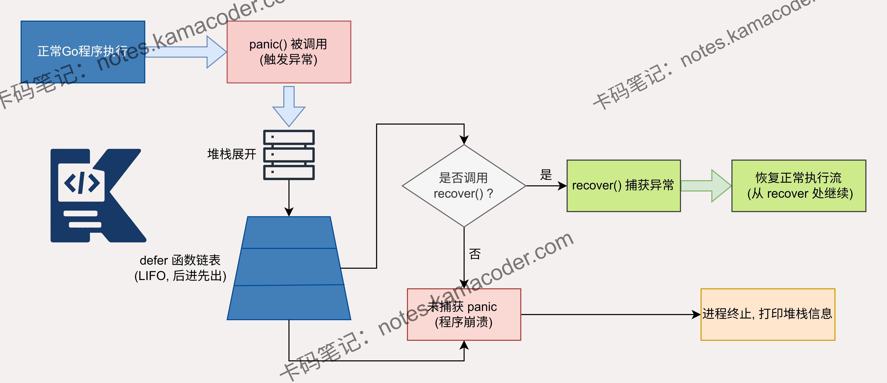

# Go语言中panic和recover的作用及使用场景是什么？

> 来源: https://notes.kamacoder.com/go/go_panicVSrecover.html

# `# Go语言中panic和recover的作用及使用场景是什么？ 

以下为知识星球  (opens new window)录友分享的海尔二面问题：”Go语言中的panic和recover的作用及使用场景是什么？“（下文知识图解部分提供了底层原理图示） 

## `# 简要回答 
  - 

**panic **的作用是**使当前协程的执行被立即中断**。 

它会停止当前函数的执行，开始回溯调用栈，并依次执行所有已注册的 defer 语句。 

如果没有任何 recover 捕获，程序最终会崩溃并打印堆栈跟踪信息。 

主要使用场景有文件未找到、网络超时、输入验证失败等。   - 

**recover** 的作用是用于**捕获同一个协程中发生的 panic，阻止其继续向上传播导致程序崩溃**。 

它只能在 defer 函数中生效。 

主要使用场景有程序启动依赖失败、协程内部致命错误、防止因第三方库的 panic 导致整个服务崩溃等。 

## `# 详细回答 

**panic** 是一个内置函数，用于**中断原有的控制流程**。 

当函数调用 panic 时，正常的执行流程会立即停止。当前函数的延迟函数会正常执行，然后该函数返回给调用者。 

这个过程会一直沿着调用**栈**向上级传递，直到当前协程中的所有函数都返回，最终导致程序崩溃并打印堆栈信息。 

主要的使用场景有： 
  - **不可恢复的运行时错误**： 比如最常见的数组/切片越界、空指针解引用。这些通常是Go运行时自动触发的 panic。   - **核心依赖初始化失败**： 比如程序启动时，必须读取的配置文件不存在、必须连接的数据库连不上。此时强行运行只会引发更多诡异问题，不如直接在 init() 函数或 main() 函数早期调用 panic，让程序尽早暴露问题。   - **严重的逻辑不一致**： 当程序运行到一个绝对不应该到达的状态，例如 switch 语句中遇到了绝对不可能出现的值，且没有合理的降级方案，可以主动 panic。 

**recover** 也是一个内置函数，它的唯一使命就是**重新获取对 panic 协程的控制权**，阻止程序崩溃。 

但 recover 必须在 **defer 函数**中直接调用才有效。 

如果当前协程陷入 panic ，调用 recover 会捕获 panic 抛出的值，恢复正常执行。 

主要的使用场景有： 
  - **Web 框架/网关的全局中间件**： 这是最经典的应用场景。比如在使用 Gin 或 Go-Zero 开发服务时，框架的最外层通常会有一个 Recovery 中间件，利用 defer + recover 兜底，捕获异常，记录日志，并给用户返回一个优雅的 500 HTTP 状态码。   - **守护并发协程**： 在后台执行海量异步任务时，通常会封装一个 SafeGo 函数。在开启新协程时，注入 defer recover()，保证单个后台任务的崩溃不会牵连整个主进程。 

## `# 知识图解 

 

## `# 知识扩展 

### `# 面试官可能会追问： 

Q1：panic 和 error 的区别是什么？ 

A1：panic 用于**处理不可恢复的严重错误**，会导致程序立即终止执行； 

而 error 是 Go 语言中表示**可预期错误**的类型，函数通过返回 error 让调用者处理。 

panic 应该谨慎使用，主要用于程序无法继续运行的情况； 

而 error 则用于表示普通的、可恢复的错误，如文件不存在、网络连接超时等。 

Q2：recover 为什么只能在 defer 函数中使用？ 

A2：因为 **panic 会立即终止当前函数的执行**，只有 **defer 函数会在函数退出前执行**。 

当 panic 发生时，程序会展开调用栈，执行每个函数的 defer 语句。 

因此，recover 必须在 defer 函数中才能捕获 panic，否则在 panic 发生后，函数已经终止执行，无法执行 recover。 

Q3：如何正确使用 recover？ 

A3：正确使用 recover 的方式是**在 defer 函数中调用 recover，并检查其返回值。** 

如果 recover 返回非 nil 值，表示捕获到了 panic。 

通常是在 defer 函数中调用 recover，记录错误信息，进行必要的清理工作，然后决定是否让程序继续执行。 

例如，在 HTTP 服务器中，可以捕获 panic，记录错误日志，并返回 500 错误响应，而不是让整个服务器崩溃。
